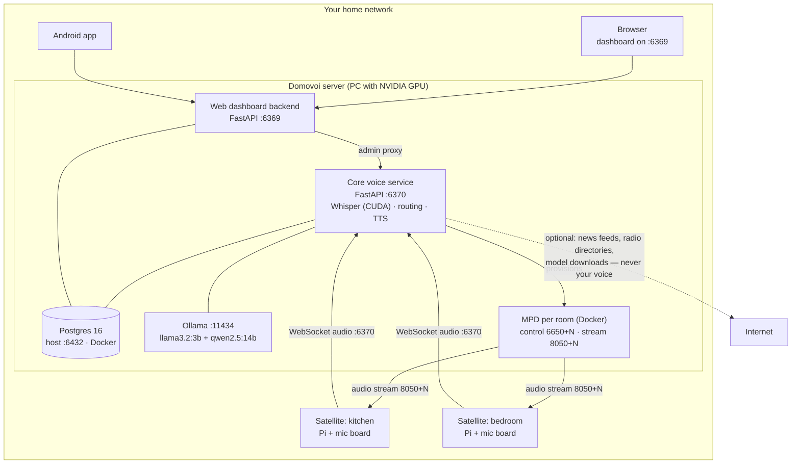

# Domovoi

**A self-hosted, local-first voice assistant for your home.**

Domovoi runs entirely on your own hardware: a server on your network does the
listening, thinking, and speaking, and small Raspberry Pi satellites put a
voice in every room. Your voice never leaves your network — speech recognition
(Whisper on your GPU), language models (Ollama), and text-to-speech all run
locally. When your internet goes out, Domovoi keeps working: every skill
declares up front whether it needs the network, and anything that can run
offline does.

Out of the box it handles music and your media library, timers and reminders,
room-to-room intercom and drop-in, voice notes, per-person voice profiles,
news briefings, podcasts and audiobooks, a calendar, documents, and internet
radio (via the bundled [radio plugin](plugins/radio)). Everything else is a
plugin away — installed from the dashboard as a zip upload or a GitHub URL.

> **Why "Domovoi"?** In Slavic folklore, a *domovoi* is the guardian spirit of
> the household — a small, usually benevolent creature that lives behind the
> stove, watches over the family, and keeps the house in order. It often takes
> the form of a cat. Ours does too: the cat mascot you'll see around the
> dashboard is the house spirit itself, minding your home from inside your
> network — never someone else's cloud.

---

## Table of contents

- [Who it's for](#who-its-for)
- [First install](#first-install)
- [Returning users: moving or reinstalling](#returning-users-moving-or-reinstalling)
- [How the pieces fit together](#how-the-pieces-fit-together)
- [What each interface can do](#what-each-interface-can-do)
- [Plugins](#plugins)
- [Documentation](#documentation)
- [License & credits](#license--credits)

---

## Who it's for

### The everyday household

You want an Alexa-style assistant that doesn't ship audio to a datacenter.
Domovoi gives you that on your own Wi-Fi:

- **Out of the box:** wake-word voice control in any room with a satellite —
  music, timers, reminders, questions, news, intercom ("tell the kitchen
  dinner's ready"), drop-in, voice notes. Domovoi learns who's speaking (say
  "I'm Sarah" once) and can forget you on request. A web dashboard on your
  LAN manages all of it, and an Android app brings the dashboard and a music
  player to your phone.
- **Hardware you need:** one PC with an NVIDIA GPU as the server (Windows is
  the documented first-class host), plus a Raspberry Pi Zero 2 W per room
  with a ReSpeaker mic board and a speaker — roughly the price of a
  commercial smart speaker per room. Details and shopping list:
  [Satellite hardware guide](docs/SATELLITE_HARDWARE.md).
- **The wake word** defaults to the built-in `hey_jarvis` model, and the
  documented path is to train your own **"Hey Domovoi"** from the dashboard:
  record a few clips through the satellite's own mic, train on the server,
  push to the room. No cloud, no third-party service.

### The Home Assistant power user

Already running Home Assistant? Domovoi is not a replacement and doesn't try
to be — it runs alongside HA on the same network and complements HA Voice
with a full media stack (per-room audio, library management, radio,
podcasts/audiobooks), intercom/drop-in, and voice profiles, while HA keeps
owning devices and automations. Setup and patterns:
[Home Assistant guide](docs/HOME_ASSISTANT.md).

---

## First install

> Setting up a system for the first time? This section is the quickstart.
> The **[day-one setup runbook](docs/SETUP_RUNBOOK.md)** walks the same
> ground in order, with the decisions you can't easily reverse, the
> verification gates between steps, and the fleet build-out after.

### Prerequisites

| What | Why |
|---|---|
| A PC with an **NVIDIA GPU** | Whisper speech-to-text runs on CUDA. Windows is the documented, tested host. No NVIDIA GPU? It still runs — see [Running without an NVIDIA GPU](docs/CPU_HOST.md). Prefer Linux? See [Running the server on Linux](docs/LINUX_HOST.md). |
| **Python 3.11+** | The core service and dashboard run natively (they need GPU access, so they're not containerized). |
| **Docker Desktop** | Runs Postgres, database migrations, and per-room audio (MPD) containers. |
| **[Ollama](https://ollama.com)** | Local language models. Domovoi uses two: a small conversational model (`llama3.2:3b`) and a tool-routing model (`qwen2.5:14b`) — pull both. |
| **Git** | To clone the repo. |
| **~20 GB free disk** | For the software and all default models — **plus** room for your own media library. See [Disk footprint](#disk-footprint) below. |

#### Disk footprint

A basic install (no plugins) with every default model runs **~15–20 GB**,
dominated by the two Ollama models:

| Item | Approx. |
|---|---:|
| Ollama `qwen2.5:14b` (tool routing) | ~9 GB |
| Ollama `llama3.2:3b` (Q&A) | ~2 GB |
| Whisper `large-v3` (STT, fp16) | ~1.5 GB |
| Python env — mostly the NVIDIA cuBLAS/cuDNN wheels + torch | ~2.5–4 GB |
| Docker images (Postgres, Flyway, per-room MPD) | ~1 GB |
| Piper voice + wake-word model + sound cache | ~0.3 GB |

**On top of that** sits your own **music/podcast/audiobook library** (your
files, any size) — so provision ~20 GB for Domovoi itself and add whatever
your media needs. Not counted here: Docker Desktop the application (~1–2 GB)
and your GPU drivers, which are prerequisites.

**Shrink it:** swap the tool model to `qwen2.5:7b` (~4.7 GB) to save ~4 GB —
the biggest single win; use a smaller Whisper (`medium` ~0.8 GB, `small`
~0.5 GB) at some accuracy cost; or skip the `voice-profile` extra (drops
torch, loses speaker identification) to save up to ~2.5 GB.

### 1. Install the server

```powershell
git clone https://github.com/coders-farm-official/domovoi
cd domovoi

# Python dependencies (run from the repo root, where pyproject.toml lives)
pip install -e ".[dev,real-clients,voice-profile]"
pip install -e ".[cuda]"            # NVIDIA hosts only — CUDA runtime wheels
pip install --no-deps resemblyzer   # Windows quirk — see domovoi/README.md
                                    # (on Linux: plain `pip install resemblyzer`)

# One-shot bootstrap: starts Postgres, runs migrations, starts the core service
./domovoi/scripts/dev.sh            # bash
./domovoi/scripts/dev.ps1           # PowerShell
```

Prefer to see each step? The manual equivalent:

```powershell
cd domovoi
docker compose up -d postgres        # Postgres 16 on host port 6432
docker compose run --rm flyway       # database migrations
docker compose run --rm flyway-test  # migrate the test DB (so pytest can run)
cd ..
python -m domovoi.main               # core voice service on :6370
```

Then, in a second terminal, start the dashboard:

```powershell
python -m web.backend.main           # web dashboard on :6369
```

### 2. Claim the admin account

On first boot the core service prints an 8-word **setup code** to its console
(and writes it to `~/.domovoi/setup-code.txt`). Open the dashboard at
`http://<server>:6369`, go to **Settings → Configuration → Admin → "set up
admin"**, enter the setup code, and choose an admin password. (The same
prompt also appears automatically the first time you attempt any
admin-gated action.) The code file is deleted the moment setup completes.

Day-to-day features work without logging in — the admin password gates the
risky operations (plugin installs, configuration, credentials). Forgot the
password? Run `python -m domovoi.main --reset-admin` on the server to clear
it and print a fresh setup code.

### 3. Add your first satellite

Flash a Pi, seat the mic board, install the satellite client, point it at
your server (`domovoi_url = "ws://<server>:6370"` in the Pi's
`~/.domovoi/config.toml`), and give it a room name. The full walk-through —
hardware list, soldering notes, audio setup, systemd service — is in the
[Satellite hardware guide](docs/SATELLITE_HARDWARE.md).

Say the wake word. The house spirit is home.

---

## Returning users: moving or reinstalling

Ran Domovoi before and setting up a new machine (or restoring after a wipe)?
Three things hold your state:

1. **The Postgres database** — settings, people and voice profiles, timers,
   reminders, library metadata, play history, plugin data, admin credentials.
   It lives in the Docker volume `domovoi-pgdata`. Either move the volume, or
   `pg_dump` the `domovoi` database on the old machine and restore it on the
   new one (Postgres publishes on host port `6432`, user/db `domovoi`).
2. **`~/.domovoi/` on the server** — downloaded Piper voices, chime sounds,
   trained wake-word models and their training clips, cover art, and your
   podcast/audiobook files. Copy the whole directory across. (Music lives
   wherever your configured music directory points — `~/Music` by default —
   and moves with it.)
3. **`domovoi/.env` in the repo checkout** — settings you changed from the
   dashboard are persisted here. Copy it into the fresh clone before first
   start.

Then start the stack as in [First install](#first-install) — migrations bring
a restored database up to the current schema automatically. Your admin
password rides along in the database; if you restored `~/.domovoi` without
the database, first boot simply prints a new setup code.

**Satellites** don't need reflashing: if the new server keeps the old
hostname/IP, they reconnect on their own; otherwise edit `domovoi_url` in
each Pi's `~/.domovoi/config.toml` (or its Settings tab on the dashboard once
it reconnects). Satellites re-sync sounds and wake-word models from the
server automatically.

---

## How the pieces fit together



Two server processes share one Postgres: the **core** (`:6370`) owns
everything real-time — speech-to-text, intent routing, handlers,
text-to-speech, satellite WebSockets, background workers, the plugin runtime
— while the **dashboard** (`:6369`) serves the web UI and proxies
live-state/admin actions to the core. Each room gets its own MPD music
daemon, provisioned lazily in Docker when the room's satellite first
connects. TTS is local by default — neural **Piper** voices rendered on the
server, so nothing Domovoi says leaves your network. Microsoft's online Edge
voices are available as a deliberate opt-in for anyone who prefers them, and
the engine chain falls back gracefully (`piper → system`, or `edge → piper →
system` if you enable Edge) so the house keeps talking whatever happens.

Deep dive: [Architecture](docs/ARCHITECTURE.md) ·
[UML diagrams](docs/uml/) · [API reference](docs/API_REFERENCE.md)

---

## What each interface can do

| | Voice satellites | Web dashboard | Android app |
|---|---|---|---|
| Hands-free voice, wake word | ✅ the whole point | — | — |
| Barge-in (interrupt Domovoi mid-sentence) | ✅ | — | — |
| Intercom & drop-in between rooms | ✅ initiate & receive | — | ✅ drop into a room from your phone |
| Music playback | ✅ in-room via MPD | ✅ full web player | ✅ native local player |
| Library, playlists, podcasts, audiobooks, news | voice control | ✅ full management | ✅ dashboard parity |
| Save music, podcasts & audiobooks to your device | — | ✅ browser download | ✅ via DownloadManager |
| Calendar, documents, people & voice profiles | voice where it makes sense | ✅ | ✅ |
| Satellite management & per-room settings | — | ✅ edits the Pi's config remotely | ✅ view/manage |
| Custom wake-word recording & training | records the clips | ✅ record → train → push to room | — |
| **Plugin install & administration** | — | ✅ **only here** — admin-gated, two-phase trust screen | — (plugin *screens* appear when installed) |
| Admin setup / login | — | ✅ | ✅ login for gated screens |

The differences are deliberate:

- **Satellites** are ears and a voice — no screens, no admin surface. They're
  the only interface with wake word, barge-in, and *receiving* an intercom
  announcement or drop-in, because that needs an always-listening mic and a
  speaker in the room. (The Android app can *initiate* a drop-in into a room —
  see below — since your phone already has a mic and speaker; it just isn't a
  room others can call into.)
- **The dashboard** is the seat of management. It is the *only* place plugins
  can be installed, and installs are admin-gated behind an explicit trust
  screen. It's also where you record, train, and deploy custom wake words and
  edit any satellite's settings remotely.
- **The Android app** mirrors the dashboard plus a native music player. Its
  screens are **capability-gated**: it asks the server what's installed and
  only renders screens for capabilities that exist — install the radio
  plugin and a Stations screen appears; remove it and the screen goes away.
  From a satellite's page it can also **drop into that room** — your phone
  joins the room's live two-way audio bridge directly, so you can talk to
  whoever's there from anywhere on the network.

---

## Plugins

Plugins extend Domovoi end-to-end: a single package can add voice handlers,
background workers, dashboard pages, Android screens, its own database schema,
and its own settings. The bundled **[radio plugin](plugins/radio)** (publisher:
Coders Farm, MIT) is the reference example — internet radio and FM via
RTL-SDR, with station search, favorites, live tuning, and passive song
detection that feeds the media-acquisition queue.

Installing (dashboard → Plugins, admin login required):

1. **Upload a zip** or **paste a GitHub URL**.
2. Domovoi stages and validates the package, then shows a **trust screen**:
   the permissions the plugin requests (network? subprocess? hardware?), its
   own plain-language warnings, and the resolved dependency tree.
3. You read it and confirm — or don't. Plugins run with real access on your
   server, so only install ones you trust.

Media-provider functionality (pulling from external sources) ships as
separately installed provider plugins — the core stays provider-neutral.

Want to write one? Start at the
[Plugin development guide](docs/PLUGIN_DEVELOPMENT.md).

---

## Documentation

| Doc | What's in it |
|---|---|
| [Setup runbook](docs/SETUP_RUNBOOK.md) | Day-one bring-up in order — server, first satellite, fleet, verification gates |
| [FAQ](docs/FAQ.md) | Quick answers — privacy, hardware, common "can it…?" questions |
| [Glossary](docs/GLOSSARY.md) | The words we use (satellite, handler, capability, band…) |
| [Architecture](docs/ARCHITECTURE.md) | How the system works, for the curious and the contributing |
| [API reference](docs/API_REFERENCE.md) | HTTP + WebSocket endpoints on :6370 and :6369 |
| [Plugin development](docs/PLUGIN_DEVELOPMENT.md) | Manifest, SDK, lifecycle, publishing your own plugin |
| [Contributing](docs/CONTRIBUTING.md) | Dev setup, tests, conventions, how to send changes |
| [Troubleshooting](docs/TROUBLESHOOTING.md) | When the house spirit sulks — fixes for common problems |
| [Home Assistant](docs/HOME_ASSISTANT.md) | Running Domovoi alongside Home Assistant |
| [Security & privacy](docs/SECURITY_PRIVACY.md) | Threat model, what leaves your network (and what never does) |
| [Satellite hardware](docs/SATELLITE_HARDWARE.md) | Parts list and step-by-step Pi satellite build |
| [Running without an NVIDIA GPU](docs/CPU_HOST.md) | CPU-host settings, model sizing, what gets slower and what doesn't |
| [Running the server on Linux](docs/LINUX_HOST.md) | Linux install, what differs from the Windows-first docs, systemd units |
| [UML diagrams](docs/uml/) | Sequence and component diagrams |

---

## License & credits

Domovoi is [MIT licensed](LICENSE) — copyright © 2026
[Coders Farm](https://github.com/coders-farm-official).

Built on the shoulders of excellent open source: Whisper &
faster-whisper, Ollama, Piper, openWakeWord, MPD, Postgres, Flyway, and
FastAPI, among others.

*May your stove stay warm and your wake word never misfire.* 🐈
