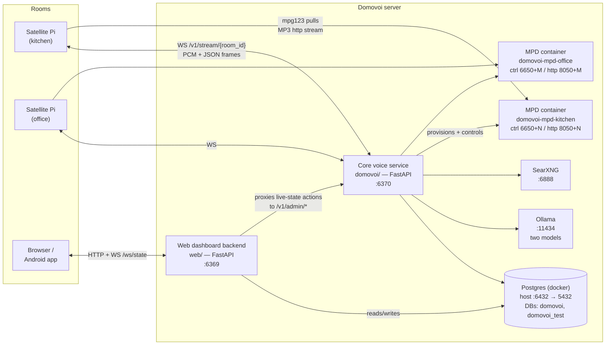

# Domovoi Architecture

This document describes how Domovoi is put together: the processes it runs, the
ports they bind, how a voice command travels from a satellite microphone to a
spoken answer, and the registries and invariants that keep the whole thing
predictable. It is written for people working on Domovoi itself or building
plugins against it.

Deeper diagram-first walkthroughs of individual features live in
[`docs/uml/`](uml/):

| Focus | Doc |
|---|---|
| A voice turn end to end | [uml/voice-turn.md](uml/voice-turn.md) |
| The satellite WebSocket protocol | [uml/satellite-protocol.md](uml/satellite-protocol.md) |
| Plugin install / enable / upgrade lifecycle | [uml/plugin-lifecycle.md](uml/plugin-lifecycle.md) |
| Plugin runtime classes (Handler, Worker, SDK) | [uml/plugins-runtime.md](uml/plugins-runtime.md) |
| Library, playlists, MPD, acquisition queue | [uml/media-and-library.md](uml/media-and-library.md) |
| Admin auth: setup, login, gated requests | [uml/auth.md](uml/auth.md) |

Related reading: [API_REFERENCE.md](API_REFERENCE.md) for endpoint details,
[PLUGIN_DEVELOPMENT.md](PLUGIN_DEVELOPMENT.md) for the plugin author's view,
[SECURITY_PRIVACY.md](SECURITY_PRIVACY.md) for the threat model, and
[SATELLITE_HARDWARE.md](SATELLITE_HARDWARE.md) for the Pi side.

---

## 1. Processes and ports

Domovoi is a small constellation of processes on one server (Windows-first,
CUDA for speech-to-text), plus Raspberry Pi satellites around the house.

| Process | Port | What it is |
|---|---|---|
| **Core voice service** (`python -m domovoi.main`) | **6370** | FastAPI app. STT → intent routing → handlers → TTS, the satellite WebSocket endpoint, background workers, the plugin runtime, admin endpoints. Whisper (faster-whisper, CUDA) runs in-process. |
| **Web dashboard** (`python -m web.backend.main`) | **6369** | A separate FastAPI process. Reads the same Postgres directly; anything touching *live* state (connected satellites, now playing) is proxied to core admin endpoints. Serves the no-build React frontend. **Never imports the plugin runtime.** |
| **Postgres** (docker compose, `domovoi/docker-compose.yml`) | **6432** (host) → 5432 (container) | Databases `domovoi` and `domovoi_test`. The non-default host port lets Domovoi coexist with any Postgres already on 5432. |
| **Per-room MPD** (docker, lazy) | control **6650+N**, http-stream **8050+N** | One MPD daemon per satellite room so queues/volume are independent. Provisioned on first WebSocket connect for an unknown `room_id` by `domovoi/mpd_provisioner.py`; **not** in the compose file. Container `domovoi-mpd-<room>` maps host ports onto in-container 6600/8001. Assignments persist in the `mpd_rooms` table (allocation is `max + 1` from the bases, serialized by a Postgres advisory lock). |
| **Ollama** | 11434 | Two model slots — see below. |
| **SearXNG** | 6888 (default `SEARXNG_URL`) | Local metasearch for the "want me to check that online?" flows. |

**Two Ollama models, not one.** `OLLAMA_MODEL` (default `llama3.2:3b`) answers
conversational Q&A — fast and cheap matters. `OLLAMA_TOOL_MODEL` (default
`qwen2.5:14b`) routes tool-call dispatch — schema adherence matters. They are
deliberately separate knobs.

Core settings load from environment variables and `domovoi/.env` in the repo
checkout — dashboard edits persist back to that file (see
[§8](#8-configuration)). `~/.domovoi/` on the server
holds runtime artifacts and per-plugin config: rendered greeting sounds, Piper
voice models, wake-word models and clips, plugin installs, data, and `.env`
files, plus the one-time setup code. Each Pi keeps its own config in
`~/.domovoi/`.

---

## 2. The voice turn pipeline

A full sequence diagram is in [uml/voice-turn.md](uml/voice-turn.md); the wire
protocol is in [uml/satellite-protocol.md](uml/satellite-protocol.md). In
prose:

1. **The Pi owns wake.** Wake-word detection (openWakeWord, default
   `hey_jarvis`; custom wake words such as "Hey Domovoi" are trained
   in-product), VAD, noise gate, and barge-in detection all run on the
   satellite. Captured audio streams to the core as 16 kHz mono int16 PCM
   between `utterance_start` / `utterance_end` frames on
   `WS /v1/stream/{room_id}`.
2. **STT.** The core transcribes the buffered utterance with Whisper
   (faster-whisper on CUDA; deterministic stub under `USE_STUBS=true`). If the
   Pi flagged `greeting_played`, a wake greeting that bled past the mic
   array's echo cancellation is stripped from the transcript.
3. **Voice identification** (best-effort, pre-router): the utterance is
   embedded and matched against enrolled voice profiles, yielding
   `person_id` + `presence_tier` in the turn's `Context`.
4. **Chat-mode bypass.** If the session is in conversational chat mode, the
   turn skips the command router entirely and goes to the Letta agent (or ends
   the chat on an exit phrase). Command mode pays only one session-context
   read for this check.
5. **Routing** (`domovoi/router.py`) — the stages below.
6. **TTS.** The response text is split into sentences and synthesized through
   the engine chain **edge → piper → system** (per-sentence fallback; a
   sentence rendered at a different native rate is resampled to the announced
   rate). Sentence synthesis is pipelined so the Pi's playback buffer never
   drains between sentences.
7. **Post-turn coordination.** `response_end` carries `expect_followup` /
   `pi_action`; music suppressed by wake capture auto-resumes; intercom
   announcements fan out to target rooms.

### Router stages, in dispatch order

Verified against `domovoi/router.py` and `domovoi/streaming.py`. Each stage
either returns a response (logging the turn with the `matched_path` shown) or
falls through to the next.

| # | Stage | `matched_path` | What happens |
|---|---|---|---|
| 0 | **Pending-confirmation pre-empt** | `confirmation` | If the previous turn parked a `pending_confirmation` in the session context and this turn is a clear yes/no, the answer is dispatched to the owning handler's `handle_confirmation()` — but only for a `kind` the handler declares in `confirmation_kinds` (namespaced `core.<kind>` / `<slug>.<kind>`). One outstanding question per session; the payload is cleared one-shot. Ambiguous answers fall through and the payload survives one more turn. |
| — | *Filler strip* | — | Leading politeness ("please", "can you", "yeah,") is stripped so anchored fast-path regexes still match. Done **after** the yes/no pre-empt (a bare "yes" must still resolve a confirmation) and **before** fast paths. |
| 1 | **Fast paths, by priority band** | `fast` / `fast_offline` | The band-sorted handler registry is scanned; the first fast-path regex to match wins. The **offline gate**: a `requires_network="yes"` handler auto-falls back to `fallback_offline()` while offline; a `"degraded"` handler is gated *per fast path* — only paths marked `offline_ok=False` fall back. |
| 2 | **LLM tool-call** | `llm` / `llm_offline` | The tool-routing Ollama model sees every handler's `tool_schema` and may pick one; the handler's `execute_from_tool()` runs (or `fallback_offline()` if it needs the network and we're offline). |
| 3 | **Auto-search short-circuit** | `auto_search` | For a time-sensitive question category, a *known* speaker who previously opted in to auto-search for that category gets an answer straight from SearXNG — skipping local QA entirely. |
| 4 | **Volatile-question gate** | `volatile_offer` / `qa` | For freshness-critical categories (weather, prices, scores, current events) the local model's confident-but-stale guess is exactly the failure mode, so Domovoi doesn't guess: online it asks "want me to check <subject>?" and parks a `core.self_doubt_offer` confirmation; offline it says plainly that it can't answer. |
| 5 | **QA fallthrough** | `qa` | General Q&A via the local Ollama QA model, with session history and a per-speaker profile prefix (memories, favorites, preferences). The model can flag its own answer for verification; either that flag or a heuristic category appends "Want me to check that online?" (parking `core.self_doubt_offer`). Otherwise the implicit memory extractor may surface one pending "should I remember that?" offer. |

**Every routed turn is persisted** by `router._persist_turn`: one `intents_log`
row (routing decision, latency, presence), one `conversation_log` row (full
user/assistant text), and an append to the session's `recent_turns`. This is
centralized and non-optional — see [Invariants](#9-invariants).

---

## 3. Handler priority bands

Dispatch order is **ascending `priority_band`**; ties break core-before-plugin,
then plugin slug, then handler name (`domovoi/handlers/base.py::registry_sort_key`).
There is no hand-ordered list — every handler carries its own band. The core
map (from `domovoi/handlers/__init__.py`):

| Band | Handler | Why it sits here |
|---|---|---|
| 100 | `dismiss` | Brush-offs win before anything acts |
| 110 | `voice_profile` | "I'm Sarah" before any greedy capture |
| 120 | `wifi` | "Fix the wifi" wins over any future "fix" |
| 130 | `voice` | Device-control cluster near the top |
| 140 | `reminder` | Before timer ("remind" collision) |
| 150 | `calculator` | Digit-anchored, well before media |
| 160 | `timer` | |
| 170 | `clock` | |
| 180 | `repeat` | Clusters with double_check |
| 190 | `double_check` | Owns "verify" / "are you sure" |
| 200 | `dropin` | Immediately before intercom |
| 210 | `intercom` | Before voice_notes ("tell the kitchen X") |
| 220 | `chat_mode` | |
| 230 | `voice_notes` | |
| 240 | `memory` | |
| 250 | `homelab` | |
| 260 | `news` | Before all greedy media |
| 270 | `spoken_audio` | Anchored media before playlist/music |
| 280 | *(radio plugin)* | Before music so "play 97.5 fm" isn't poached |
| 290 | `playlist` | Before music's `^play` catch-all |
| 300 | `music` | Greedy `^play` catch-all |
| 310 | `library` | "Find X in my library" before a greedier "find X" |
| 900 | *(media-provider plugin)* | Greedy `^find` catch-all — LAST band |

Named ranges for plugins: **100–199** brush-off/identity (anchored patterns
only), **200–269** device control & comms, **270–349** anchored media,
**350–899** general plugin space (the default home), **900–999** greedy
catch-alls (required for any unanchored `(.+)$` fast path — enforced at plugin
install time).

Ordering is correctness: a greedy pattern in a low band silently poaches other
handlers' phrasings.

---

## 4. Workers and startup hooks

Background work uses two declarative shapes (`domovoi/workers/base.py`), run by
the `WorkerRunner` singleton (`domovoi/plugins_runtime/workers.py`). Core and
plugin workers are identical in shape; the runner keys everything by **owner**
(a plugin slug, or `core`) so disable/uninstall tears down exactly one owner's
set.

* **`Worker`** (poll shape) — implements only `async tick()`. Declarative
  attributes resolved live each tick: `interval_setting` (the settings field
  holding the cadence — required), `enabled_setting`, `stub_suppressed`
  (skipped entirely under `USE_STUBS=true`), `requires_online` (skip ticks,
  keep cadence, while offline). A raising tick is caught, logged, and counted
  — it never kills the loop.
* **`LongRunWorker`** (persistent-connection shape) — implements
  `async run(shutdown)`. In-loop reconnects are the worker's own job; the
  runner restarts a crashed `run()` with exponential backoff (1 s doubling to
  a 60 s cap, reset after 10 minutes healthy).
* **Startup hooks** — named (`<slug>.<name>`), ordered via `after=`, and
  connectivity-gated: a `requires_online` hook fires immediately when online,
  else on the first `core.connectivity_changed → online` event. Core lifespan
  milestones (e.g. `core.library_index`) are markable so plugin hooks can
  sequence after them.

Worker health (state, last tick, last error, consecutive failures, next
attempt) is surfaced per plugin on `GET /v1/plugins/<slug>/status`.

Everything runs on the **single core event loop** — deliberately. In-memory
state assumptions (registries, `app.state` caches) stay valid because there is
exactly one process and one loop that mutate them.

Core's own workers live in `domovoi/workers/`: the timer watcher, library
indexer + enricher, playback-state sweeper, media-plays pruner, news fetcher,
podcast feed poller, audiobook indexer, memory extractor, wake-word trainer,
and document lock sweeper.

---

## 5. Database ownership

One Postgres instance, two databases (`domovoi`, `domovoi_test`), and a strict
ownership split:

* **Core owns the `public` schema.** Migrations are Flyway
  (`domovoi/db/migrations/`, run via `docker compose run --rm flyway` /
  `flyway-test`), append-only, with `V001__baseline.sql` frozen once cut.
* **Each plugin owns exactly one schema: `plugin_<slug>`.** Plugin migrations
  are plain `V###__name.sql` files run by the core-owned
  `PluginMigrationRunner` (`domovoi/plugins_runtime/migrations.py`), not
  Flyway. The runner:
  * keeps a ledger at `plugin_<slug>.schema_history` (version, filename,
    checksum, applied_at);
  * wraps each file in one transaction with
    `SET LOCAL search_path = plugin_<slug>, public`;
  * applies to **both** databases — prod first, then `domovoi_test`; a fresh
    install is both-or-neither;
  * validates sha256 checksums — an already-applied file that changed on disk
    refuses to run (append-only, no down-migrations);
  * enforces an install-time **SQL lint**: no `CREATE SCHEMA`, no
    `CREATE EXTENSION`, no DDL naming `public.` or a foreign `plugin_*`
    schema, no cross-schema `REFERENCES`. (A tripwire, not a security
    boundary — plugins are trusted code once installed.)

Plugins never run DDL against core tables. Cross-schema references are **soft
refs** (e.g. `media_acquisitions.attach_to_playlist_id` has no FK); consumers
re-check at use time and reconcile periodically.

**Open enums** (`domovoi/registered_values.py`): extensible vocabulary columns
(`intents_log.matched_path`, `library_tracks.source`, `media_plays.source`,
`voices.engine`, `media_acquisitions.status`) carry no CHECK constraint, so
plugins can add values without core DDL. Validation happens app-side against
an in-process registry at write time; the `registered_values` *table* is an
informational mirror for DBAs, never consulted on the hot path.

---

## 6. The extension seams

Four in-process registries form the boundary between core and plugins. All are
process-wide singletons; all record registrations against an owner slug so
plugin disable/uninstall is a clean teardown. The class-level view is in
[uml/plugins-runtime.md](uml/plugins-runtime.md).

### Event bus (`domovoi/events.py`)

Fire-and-forget, with per-subscriber exception isolation — each delivery is
its own asyncio task, so a broken subscriber never blocks the emitter or its
peers. **No delivery guarantee, no cross-event ordering, no replay.** The
`core.*` event catalog (v1) is a closed, versioned set — emitting an unknown
`core.*` name raises; plugin events are the open namespace
`plugin.<slug>.<event>` (the SDK force-prefixes the slug).

The normative consequence: any state kept consistent *only* by a bus
subscription may go stale across a crash. Bus-driven cleanup must pair the
subscription (the fast path) with a **periodic reconciliation sweep** (the
correct path). The bus is latency; the sweep is truth.

### Capability registry (`domovoi/capabilities.py`)

Core never imports provider code. Providers register implementations under
well-known capability slugs; core call sites `resolve()` at use time and
**degrade gracefully when nothing is registered** — absence is a supported
state, never an error. The seams core consumes today:

* `streaming-search-provider` — the music handler's local-miss cascade and
  smart-skip; absent ⇒ "no streaming provider is installed" voice copy.
* `media-acquisition-fulfiller` — presence check for the acquisition queue's
  voice copy (the queue itself always accepts rows).
* `now-playing-matcher` — favorites attribution.

Determinism: an explicit `prefer()` pin wins; otherwise ascending registration
slug.

### Media acquisition queue (`domovoi/acquisitions.py`)

A durable Postgres-backed queue (`media_acquisitions`) for "get this media
into my library" requests. Four producers — voice handlers, the web
add-by-query/url endpoints, chat tools, and plugins — enqueue **structured**
requests (`{kind: query|url, text, metadata, …}`), never a provider wire
format. Registered fulfillers (media-provider plugins) claim rows with
`SELECT … FOR UPDATE SKIP LOCKED` and complete or fail them (retry with
backoff up to `acquisition_max_attempts`, or terminal
`failed`/`unfulfillable`).

Graceful absence: enqueue always succeeds; with no fulfiller enabled, rows sit
`pending` and the user hears *"I've noted that down, but no media provider is
installed to fetch it."* Installing a fulfiller later drains the backlog — a
feature, not a bug. Dedup is three-layered: library fuzzy match (pg_trgm) at
enqueue, live-queue identity via a partial-unique `dedup_key` index, and the
fulfiller's own post-resolve knowledge. Every state change fires
`pg_notify('acquisitions_changed', …)` in the caller's transaction and emits a
`core.acquisition_*` event. Full ER + flow in
[uml/media-and-library.md](uml/media-and-library.md).

### Now-playing registry (`domovoi/now_playing.py`)

Any feature that starts external playback in a room stamps
`(source slug, opaque data)`; the streaming layer, the playback-state sweeper,
the web now-playing card, and favorites all read and clear stamps
**generically** — core never learns a provider's vocabulary. Sources must be
explicitly registered (stamping with an unregistered source raises); one stamp
per room, replace semantics; storage is in-memory on the core process.
Per-source `register_matcher` hooks drive "favorite what's playing"
attribution, walked in ascending slug order.

---

## 7. Realtime: how a DB change reaches the dashboard

The web backend (`web/backend/realtime.py`) runs two cooperating tasks:

* a **poll loop** that snapshots Postgres + the core's admin snapshot every
  1.5 s (`WEB_POLL_INTERVAL_SEC`), diffs against the previous snapshot, and
  pushes change events to subscribed dashboard WebSockets;
* a **LISTEN task** holding one long-lived asyncpg connection that `LISTEN`s
  on every mapped NOTIFY channel and, on a notification, triggers the matching
  snapshot immediately — sub-second freshness for things like acquisition
  status flips.

The contract on the write side is **commit-coupled NOTIFY**: mutation sites
call `SELECT pg_notify('<channel>', '<reason>')` *in the same transaction* as
their UPDATE/INSERT. Postgres delivers NOTIFY only on COMMIT, so a rollback
never produces a phantom event.

Core channels map NOTIFY → realtime like `acquisitions_changed →
acquisitions`, `playlists_changed → playlists`, `library_changed →
library.indexer`, `wake_words_changed → wake_words`, `plugins_changed` (the
plugin registry), and more. Enabled plugins add their own pairs via manifest
`[[realtime]]` entries — the web process wires them from the manifest JSONB in
the `plugins` table and **never imports plugin code**.

The poll loop stays authoritative: LISTEN is an accelerator, not a
replacement. A missed notification is caught by the next 1.5 s poll.

---

## 8. Configuration

Three layers, all visible in code:

1. **`Settings`** (`domovoi/config.py`) — a pydantic `BaseSettings` loaded
   from environment variables and `domovoi/.env` (pinned to an absolute path
   so it loads regardless of cwd). This is the single source of typed config
   for the core; the web process imports the same object for shared values.
2. **`FieldSpec` registry** (`domovoi/config_schema.py`) — the editable-config
   layer for the dashboard's settings UI. Each spec names a real `Settings`
   field (a test asserts they never drift) and adds a label, group, tooltip,
   bounds, a `section` (`common`, or `advanced` behind a warning fold), and a
   **tier** describing how a change applies:
   * `hot` — mutate the live singleton; consumers re-read per tick/call.
   * `reapply` — mutate + run registered reapply hooks (below).
   * `restart` — persisted to `.env` (via `domovoi/config_env_writer.py`) but
     read only at startup; the API reports it in `restart_required` and the UI
     badges it.
3. **Reapply hooks** (`domovoi/reapply.py`) — `tier="reapply"` fields run
   registered callbacks after the settings mutation (reset the TTS client,
   reset the Ollama client, re-set the log level) instead of the endpoint
   hardcoding which subsystem each field pokes. Hooks are deduped per write
   batch, and a hook failure never aborts the write. Plugin config fields go
   through a parallel per-slug registry
   (`domovoi/plugins_runtime/config_bridge.py`, the `ctx.on_reapply` path).

Satellites have their own TOML config (`satellite/config.toml.example`,
installed to `~/.domovoi/config.toml` on the Pi). The dashboard edits it
remotely: the server pushes a `set_config` frame; the Pi merges changes
preserving comments, writes a `.bak`, and self-restarts.

---

## 9. Invariants

These are load-bearing. Tests enforce most of them; breaking any of them is a
bug even if nothing fails immediately.

* **Local-first.** Every handler declares
  `requires_network: "no" | "degraded" | "yes"`. Anything not `"no"` must
  implement `fallback_offline()` — enforced by
  `domovoi/tests/test_registry.py`. The router consults `ctx.online` (fed by
  the connectivity probe) and applies the offline gate described above. The
  house keeps working when the internet doesn't.
* **Intent logging is non-optional.** Every routed turn writes one
  `intents_log` row AND one `conversation_log` row, centrally in
  `router._persist_turn`. No routing path may skip it.
* **The DB is migration-only.** Core: Flyway, append-only, `V001` frozen.
  Plugins: own schema, own runner, checksummed, both DBs. Nobody mutates
  schema at runtime.
* **Tests must use the test DB.** `domovoi/tests/conftest.py` derives
  `<dbname>_test` from `DATABASE_URL` and refuses to run otherwise. It also
  forces `USE_STUBS=true`, making Whisper/Ollama/TTS deterministic fakes.
* **MPD is lazy-provisioned per room** by `domovoi/mpd_provisioner.py`; the
  `mpd_rooms` table is the source of truth for port/container assignments.
  Not in the compose file.
* **Handler ordering is correctness.** Priority bands are explicit; greedy
  catch-all patterns must sit in the last band (900+) or they silently poach
  other handlers' phrasings. Plugin bands are contract-checked at install.
* **DLL bootstrap order (Windows host).** `domovoi/bootstrap.py` registers
  NVIDIA DLL directories **before** anything imports
  `ctranslate2`/`faster-whisper`. Import order in `domovoi/main.py` is
  deliberate; the plugin loader asserts `bootstrap.dlls_registered` before
  importing any plugin module, so a reordering fails loudly at boot.
* **`NullPool` stays** in `domovoi/db/session.py`. One connection per session:
  sidesteps cross-event-loop reuse errors in tests (Windows
  ProactorEventLoop) and stale-socket pain after a Postgres restart. This is
  a low-QPS homelab service; the ~5 ms per-connection overhead is immaterial.
* **Single process, single loop.** Registries, worker state, and `app.state`
  caches are in-memory and not thread-safe by design. Durability belongs in
  Postgres (queue tables, commit-coupled NOTIFY), not in the bus or in RAM.
* **Commit-coupled NOTIFY.** `pg_notify` fires in the same transaction as the
  data change, never after or outside it.
* **Web process stays out of the plugin runtime.** It reads plugin state from
  the `plugins` table (manifest JSONB) and talks to core over HTTP. It never
  imports `domovoi.plugins_runtime` or plugin code.
