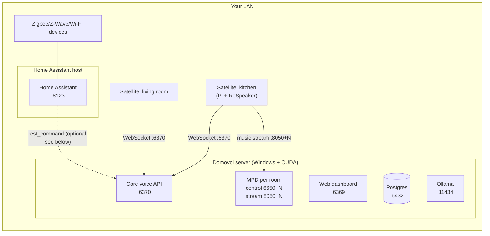

# Domovoi alongside Home Assistant

This guide is for people who already run Home Assistant and want to know
exactly how Domovoi fits next to it — what integrates today, what's roadmap,
and how to run both on the same network without them stepping on each other.

**The honest summary up front:** as of v1, Domovoi has **no built-in Home
Assistant integration**. There is no HA config flow, no MQTT bridge, and no
device-control handler in the core. Domovoi and Home Assistant coexist as
independent LAN services, and they coexist cleanly. Deep device control
("hey, turn off the kitchen lights") is a **future plugin** — the plugin SDK
was explicitly designed to support it (see [Roadmap](#roadmap-the-ha-bridge-plugin)
below), but nobody should buy hardware today expecting it to exist yet.

Related reading: [ARCHITECTURE.md](ARCHITECTURE.md) for how Domovoi is put
together, [SECURITY_PRIVACY.md](SECURITY_PRIVACY.md) before you point HA
automations at Domovoi's API, and [PLUGIN_DEVELOPMENT.md](PLUGIN_DEVELOPMENT.md)
if you want to be the person who builds the bridge plugin.

---

## What Domovoi is, in HA terms

Domovoi is a local-first voice assistant with its own speech stack and its
own satellite hardware:

- **STT** — Whisper, running on the server's GPU (CUDA). Never leaves the box.
- **Intent routing** — a fast-path pattern router backed by two local Ollama
  models (one for conversational Q&A, one for tool-call dispatch).
- **TTS** — a fallback chain (`edge → piper → system`); fully offline if you
  pick Piper. See [SECURITY_PRIVACY.md](SECURITY_PRIVACY.md#what-leaves-your-network--and-how-to-turn-each-thing-off)
  for the cloud caveat on the default engine.
- **Satellites** — Raspberry Pis with a ReSpeaker mic board, running
  openWakeWord on-device. Wake word defaults to `hey_jarvis`; you can record
  and train a custom "Hey Domovoi" model from the dashboard
  ([SATELLITE_HARDWARE.md](SATELLITE_HARDWARE.md#custom-wake-words)).
- **Media** — a per-room music/podcast/audiobook system built on MPD, with a
  library on the server's disk, plus intercom and drop-in between rooms.

If HA is the nervous system of your smart home, Domovoi is the ears, voice,
and record collection.

## Network topology

Both systems on one LAN, zero shared ports:



Domovoi and HA can share one machine or run on separate ones — they have no
port overlap and no service-discovery overlap.

### Port map (verified against the code/compose)

| Port | Owner | Notes |
|---|---|---|
| 8123 | Home Assistant | HA's default; Domovoi never touches it |
| 6369 | Domovoi web dashboard | separate FastAPI process |
| 6370 | Domovoi core voice API | satellites connect here via WebSocket |
| 6432 | Domovoi Postgres (host port) | deliberately **not** 5432, so an HA-adjacent Postgres/Supervisor stack on the same box doesn't collide |
| 6650+N / 8050+N | Per-room MPD (control / HTTP audio stream) | provisioned lazily, one pair per room |
| 11434 | Ollama | standard Ollama port — if HA add-ons also run Ollama on the same host, point both at one instance or move one |
| 6888 | SearXNG (Domovoi's local metasearch container) | used for news feed discovery |
| 6283 | Letta (optional chat-mode agent container) | off by default |

The only realistic collision on a shared machine is **Ollama at 11434** if
you already run it for HA's local LLM features. Either share the one
instance (Domovoi just needs its two models pulled) or run them on separate
hosts.

### mDNS

Domovoi does **not** register any zeroconf/mDNS service types — there is no
zeroconf code in the server or satellite. The only mDNS involved is the
ordinary hostname responder on Raspberry Pi OS: satellites are reachable at
`domovoi-<room>.local` because that's their hostname, the same way any Pi
is. HA's zeroconf discovery will not find Domovoi, and Domovoi will not
pollute HA's discovered-devices list. No conflict, by construction.

## Domovoi vs. HA Voice (Assist)

Both are local voice stacks. They optimize for different things.

| | Domovoi | HA Assist (+ Voice PE / Wyoming satellites) |
|---|---|---|
| Device control | **Not in v1** (roadmap plugin) | The whole point — full entity/service surface |
| Automations | No | Yes, deeply |
| Multi-room music (own library, per-room queues) | Yes — MPD per room, playlists, favorites, voice control | Not a core feature; typically delegated to Music Assistant |
| Podcasts / audiobooks / spoken-audio resume | Yes | No |
| Intercom / drop-in between rooms | Yes (voice-driven and dashboard-driven) | Announce-style TTS exists; no full-duplex drop-in |
| Wake word | openWakeWord on the Pi; **in-product custom wake-word recording + training + push** from the dashboard | openWakeWord/microWakeWord; custom words trained externally |
| Conversational chat mode (multi-turn, no wake word per turn) | Yes (opt-in, local Letta agent on Ollama, needs an AEC-capable mic board) | Conversation agents exist; continued-conversation support varies |
| STT | Whisper (CUDA) on your server | Whisper via Wyoming, quality depends on host |
| LLM | Two local Ollama models (Q&A + tool dispatch) | Optional, pluggable |
| News briefings, timers, reminders, voice notes, memory | Built in | Via integrations/automations, assembly required |
| Hardware | Pi Zero 2 W / Pi 4 + ReSpeaker boards (DIY) | ESP32-S3 (Voice PE) or DIY Wyoming satellites |
| Ecosystem breadth | Small, plugin SDK is new | Enormous |

If you only want "turn on the lights," HA Assist alone is the shorter path.
If you want whole-home voice-driven media, intercom, and a house assistant
with a personality — and you want HA to keep doing what it's best at — run
both. That's the setup Domovoi is designed for.

## Running both without conflict

1. **Ports** — see the table above. Nothing overlaps out of the box.
2. **One mic stack per satellite.** A Domovoi satellite's client owns the
   mic board (wake word, VAD, barge-in, LEDs). Don't also run a Wyoming
   satellite on the same Pi against the same mic — pick one voice system
   per room's microphone. You can absolutely have Domovoi satellites in
   some rooms and HA voice hardware in others.
3. **Hostnames.** Satellites are named `domovoi-<room>` at flash time, so
   they're self-identifying in your router's client list and won't clash
   with HA device names.
4. **Same box is fine.** Domovoi's server is Windows-first (CUDA for
   Whisper); most HA installs are Linux/HAOS, so in practice they usually
   live on different machines anyway. If you do co-host (e.g. HA in a VM),
   only the Ollama note above applies.

### What you can wire up today: HA → Domovoi over HTTP

There's no integration, but Domovoi's core API is plain HTTP on the LAN, so
HA's `rest_command` can drive it. Two useful endpoints (both LAN-trust
"daily tier" — see [SECURITY_PRIVACY.md](SECURITY_PRIVACY.md#the-tiers)):

```yaml
# configuration.yaml
rest_command:
  # Speak a message on one satellite (omit room_id to broadcast to all)
  domovoi_announce:
    url: "http://<domovoi-server>:6370/v1/admin/announce"
    method: POST
    content_type: "application/json"
    payload: '{"room_id": "{{ room }}", "message": "{{ message }}"}'

  # Feed Domovoi a text command as if it had been spoken
  domovoi_intent:
    url: "http://<domovoi-server>:6370/v1/intent"
    method: POST
    content_type: "application/json"
    payload: '{"transcript": "{{ transcript }}", "room_id": "{{ room }}"}'
```

Example automation: "when the washing machine finishes, announce it in the
kitchen" — call `domovoi_announce` with `room: kitchen`. The announce path
is polite about it: a satellite mid-response is skipped rather than clipped,
and music resumes automatically after the announcement.

The reverse direction (Domovoi → HA) is exactly what the bridge plugin is
for, and doesn't exist yet. Don't fake it with brittle glue; the plugin
surface below is the supported path.

## Roadmap: the HA bridge plugin

> **Status: design sketch only. Not shipped, not started, no ETA.** This
> section describes what the plugin SDK was validated against on paper, so
> you know the architecture won't need core changes when it lands — not a
> promise of when.

The plugin architecture design includes a worked Home Assistant plugin as
its "does the SDK generalize beyond media?" proof. The sketch:

- **A `home_assistant` handler** in the device-control priority band, with
  anchored patterns like "turn on/off the ..." and "set the ... to N
  percent", fuzzy-matched against entity friendly names.
- **Its own context axis.** HA is on the LAN, so internet-connectivity
  gating is the wrong question. The plugin registers an `ha_online` context
  provider (probed per turn, briefly cached) and gates on that instead of
  `ctx.online`.
- **Confirmation-gated bulk actions.** Destructive commands ("turn
  everything off") go through the SDK's namespaced confirmation flow
  (`home_assistant.bulk_action`) — Domovoi asks, you say yes, then the HA
  service call fires.
- **An entity cache** in the plugin's own Postgres schema
  (`plugin_home_assistant.entities`), kept fresh by a long-running worker
  holding HA's WebSocket and streaming `state_changed` events, with
  trigram fuzzy matching for voice lookup.
- **A dashboard page** listing devices, live-updated.

Notably, the sketch required **nothing new from core** — context providers,
long-run workers, namespaced confirmations, per-plugin schemas, and the
event bus all already exist in the shipped runtime. If you want to build
it, [PLUGIN_DEVELOPMENT.md](PLUGIN_DEVELOPMENT.md) covers every mechanism
above, and the bundled radio plugin (`plugins/radio`) is the reference
implementation to crib from.

## The recommended split (until the bridge exists)

- **Domovoi**: wake word + voice interaction, music/podcasts/audiobooks per
  room, intercom and drop-in, timers/reminders/news, chat mode.
- **Home Assistant**: device control, automations, dashboards, energy,
  everything device-shaped.
- **The seam**: HA `rest_command` → Domovoi's announce/intent endpoints for
  spoken notifications, and patience (or a pull request) for the rest.

This split has a nice property: each system does the thing it's actually
good at, and neither is in the other's failure domain. Your lights don't
care if the GPU box is down, and your music doesn't care if HA is mid-update.

---

*Questions that didn't fit here probably live in the [FAQ](FAQ.md) or
[TROUBLESHOOTING.md](TROUBLESHOOTING.md).*
