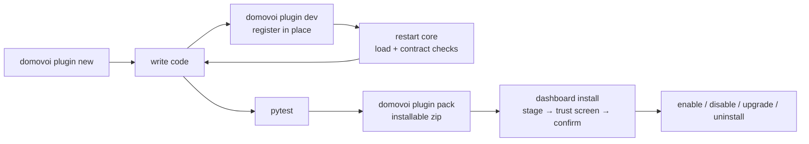
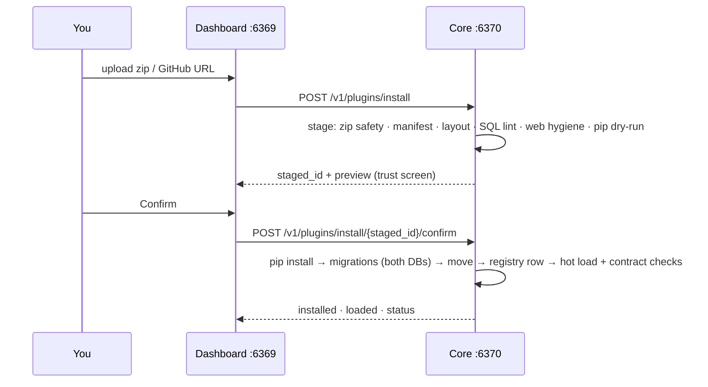

# Plugin Development Guide

Everything you need to build, test, package, and publish a Domovoi plugin.
This is the complete reference — an outside developer should be able to ship a
working plugin with only this document, the SDK docstrings, and the bundled
[radio plugin](../plugins/radio/README.md) as a worked example.

Related reading: [Architecture](ARCHITECTURE.md) ·
[API Reference](API_REFERENCE.md) · [Contributing](CONTRIBUTING.md) ·
[Security & Privacy](SECURITY_PRIVACY.md) · [Glossary](GLOSSARY.md)

---

## Table of contents

1. [Concepts — what a plugin can do](#1-concepts--what-a-plugin-can-do)
2. [Quickstart — a working plugin in ten minutes](#2-quickstart--a-working-plugin-in-ten-minutes)
3. [The manifest, field by field](#3-the-manifest-field-by-field)
4. [The SDK tour](#4-the-sdk-tour)
5. [Worked example — the bundled radio plugin](#5-worked-example--the-bundled-radio-plugin)
6. [Rules and gotchas](#6-rules-and-gotchas)

---

## 1. Concepts — what a plugin can do

A Domovoi plugin is a directory (shipped as a zip) with a TOML manifest, a
Python package, and optional migrations, web assets, and tests. One plugin can
extend every plane of the system:

| Plane | Mechanism | Where it runs |
|---|---|---|
| **Voice** | `Handler` subclasses with anchored-regex fast paths, a priority band, and a declared *corpus* of canonical utterances | core process (`:6370`) |
| **Background work** | poll `Worker`s (`tick()`), `LongRunWorker`s (`run(shutdown)`), and named startup hooks | core process |
| **Data** | the plugin's **own** Postgres schema (`plugin_<slug>`), created and versioned by SQL migrations the runtime applies | Postgres |
| **HTTP (core)** | a FastAPI router mounted at `/v1/plugins/<slug>/...`, admin-gated for mutations by default | core process |
| **Web dashboard** | a second entry module, `web.py`, with its own router at `/api/plugins/<slug>/...`, zero-build JSX pages, sidebar nav entries, badges, and browser-player sources | **separate** web process (`:6369`) |
| **Realtime** | manifest-declared Postgres NOTIFY channels mapped to dashboard websocket channels, with snapshot functions | both |
| **Config** | a pydantic `BaseSettings` model + `FieldSpec` rows that render in the dashboard's Settings page and persist to `~/.domovoi/plugins/<slug>.env` | core process |
| **Capabilities** | `provides` / `consumes` declarations — the seam that lets plugins offer services to core (and to each other) without imports | core process |
| **Events** | subscribe to the `core.*` event catalog; emit your own under `plugin.<slug>.*` | core process |
| **Sounds & assets** | canned TTS clips rendered in the household's voice and mirrored to satellites; static web assets served from `web/static/` | core + web |

Two hard boundaries shape everything:

* **Core and web are separate processes.** `core.py` registers into the voice
  runtime; `web.py` registers into the dashboard. `web.py` may import **only**
  `domovoi.webkit`, the standard library, and your declared requirements —
  never the core runtime and never your own `core.py`. This is checked by an
  AST tripwire at install time and *enforced* by an import guard at runtime.
* **The manifest is a cross-checked declaration; code is authoritative.**
  Handlers, workers, startup hooks, and capabilities you declare must match
  what `register(ctx)` actually registers — any value mismatch (band, network
  tier, worker kind, ...) is a hard load failure that names both values.

### Plugin directory layout

```
myplugin/
├── domovoi-plugin.toml            # the manifest (§3)
├── README.md
├── LICENSE
├── requirements.in                # your direct pins (optional)
├── requirements.lock              # pip-compile --generate-hashes output (required if requirements.in)
├── domovoi_plugin_myplugin/       # the ONLY top-level Python package allowed
│   ├── __init__.py
│   ├── core.py                    # register(ctx) — core-process entry point
│   ├── web.py                     # register_web(ctx) — web-process entry point (optional)
│   └── ...                        # handlers/, workers/, clients/ — your call
├── migrations/                    # V001__name.sql, V002__..., gapless
├── sounds/                        # optional canned-sound assets dir
├── web/static/                    # JSX pages, icons (served at /plugins/<slug>/static)
└── tests/
    └── conftest.py
```

### Lifecycle at a glance



Code changes **always need a core restart** — the loader imports plugin
modules once and Python cannot unload them. Enable/disable is a clean
registration teardown, not a re-import.

---

## 2. Quickstart — a working plugin in ten minutes

Prerequisites: a working Domovoi dev checkout (`pip install -e ".[dev]"` from
the repo root — this installs the `domovoi` console script) and the Postgres
container running (see [CONTRIBUTING](CONTRIBUTING.md#development-setup)).

### 2.1 Scaffold

```bash
domovoi plugin new compliments
```

This creates `compliments/` with a valid manifest, the
`domovoi_plugin_compliments/` package, a stub handler, an empty
`migrations/` dir, and `tests/conftest.py` — manifest and code generated from
one answer set so they can't drift.

### 2.2 The manifest

`compliments/domovoi-plugin.toml` (the scaffold's output, with the corpus and
description filled in):

```toml
[plugin]
slug = "compliments"
name = "Compliments"
version = "0.1.0"
publisher = "you"
license = "MIT"
description = "Pays the household a compliment on request."
domovoi_api = ">=1.0,<2.0"

[entry_points]
core = "domovoi_plugin_compliments.core"

[[handlers]]
name = "compliments"
band = 400
requires_network = "no"
label = "Compliments"
tone = "info"
corpus = ["give me a compliment", "compliment me"]

[permissions]
warnings = []
```

### 2.3 The handler

Replace `domovoi_plugin_compliments/core.py` with a complete implementation.
This follows the exact contract the loader checks: `name` equals
`tool_schema["name"]`, a band in the plugin range, `display` present, anchored
fast paths, and a `register(ctx)` entry point.

```python
"""Core entry point for the compliments plugin."""

import random
import re

from domovoi.sdk import FastPath, Handler, HandlerDisplay, Response

_COMPLIMENT_RE = re.compile(r"^(?:give me a |pay me a )?compliment(?: me)?$")

_LINES = [
    "You keep this house running beautifully.",
    "Whatever you're doing today, you're doing it well.",
    "The cat approves of you, and the cat has standards.",
]


class ComplimentsHandler(Handler):
    name = "compliments"
    priority_band = 400                      # general plugin space
    display = HandlerDisplay(label="Compliments", tone="info")
    requires_network = "no"
    tool_schema = {
        "name": "compliments",
        "description": (
            "Pay the user a compliment. Example: 'give me a compliment'."
        ),
        "parameters": {"type": "object", "properties": {}, "required": []},
    }

    def __init__(self) -> None:
        self.fast_paths = [
            FastPath(_COMPLIMENT_RE, ComplimentsHandler._compliment),
        ]

    async def _compliment(self, m, ctx, session) -> Response:
        return Response(text=random.choice(_LINES))

    async def execute(self, intent, ctx, session) -> Response:
        # LLM tool-call routing lands here when no fast path matched.
        return Response(text=random.choice(_LINES))


def register(ctx):
    ctx.add_handler(ComplimentsHandler())
```

Notes on the shape:

* **Fast paths are anchored** (`^...$`). The router lowercases, strips
  trailing punctuation, and drops leading filler before matching. An
  unanchored `(.+)` capture with fewer than two literal words is classified a
  *greedy catch-all* and must sit in band ≥ 900 — the contract checker
  rejects it anywhere lower.
* Fast-path methods are passed **unbound** (`ComplimentsHandler._compliment`)
  and receive `(self, match, ctx, session)`.
* `requires_network = "no"` means this handler must work fully offline. If
  you declare `"yes"` or `"degraded"`, you must override
  `fallback_offline()` — also contract-checked.
* The `corpus` phrases in the manifest are promises: at every load, the
  runtime routes each phrase through the *merged* handler registry and fails
  the load if your phrase resolves to someone else's handler (or if your
  handler poaches someone else's phrase). See [§6.1](#61-priority-band-etiquette).

### 2.4 Register it for development

```bash
domovoi plugin dev ./compliments
```

`plugin dev` validates the directory (manifest, layout — including the
lockfile check if you declared Python requirements — and web-import
hygiene), applies any migrations, and registers the plugin **in place** in
the `plugins` registry table with `install_source='dev'` — no zip, no copy,
no trust screen, no pip dry-run, no version-monotonicity check. Then:

```bash
python -m domovoi.main       # (re)start the core — plugins load at startup
```

Say (or POST to `/v1/intent`): *"give me a compliment"*.

```bash
curl -X POST http://localhost:6370/v1/intent \
  -H "Content-Type: application/json" \
  -d '{"transcript":"give me a compliment","room_id":"kitchen"}'
```

Iterate with `domovoi plugin dev ./compliments --watch` — it polls for file
changes and re-validates, printing a reminder that code changes need a core
restart (they always do; the loader never re-imports).

### 2.5 Test it

The scaffold's `tests/conftest.py` provides a `stub_sdk` fixture built from
`domovoi.sdk.testing.make_stub_sdk` — a fully stubbed `PluginSDK` double with
an in-memory event bus, recording `playback` / `acquisition` / `sessions`
doubles, and togglable connectivity. Handler and worker-`tick()` tests need
**no database and no running core**:

```python
# tests/conftest.py — generated by `domovoi plugin new`
import sys
from pathlib import Path

import pytest

from domovoi.sdk.testing import make_stub_sdk

sys.path.insert(0, str(Path(__file__).parents[1]))


@pytest.fixture
def stub_sdk():
    return make_stub_sdk("compliments")
```

```python
# tests/test_handler.py
from domovoi_plugin_compliments.core import ComplimentsHandler


async def test_compliment_fast_path(stub_sdk):
    handler = ComplimentsHandler()
    pattern, method = handler.fast_paths[0]      # FastPath supports 2-tuple unpacking
    m = pattern.match("give me a compliment")
    assert m is not None
    resp = await method(handler, m, None, None)
    assert resp.text
```

Run with `pytest` from the plugin directory. The stub tier records what your
code *asked for* — e.g. `stub_sdk.playback.calls`,
`stub_sdk.acquisition.enqueued`, `stub_sdk.sessions.confirmations` — so
assertions read naturally. For DB-backed tiers (your migrations applied to
the test DB, the real loader with contract checks, a mounted web router),
copy the fixture patterns from
[`plugins/radio/tests/conftest.py`](../plugins/radio/tests/conftest.py),
which builds `plugin_db`, `db_session`, `radio_sdk`, `loaded_plugin`, and
`web_client` from core primitives.

### 2.6 Pack it

```bash
domovoi plugin pack ./compliments
# packed compliments v0.1.0 -> .../compliments-0.1.0.zip
```

`pack` runs full validation first — including the hashed-lockfile check if
you declared Python requirements — then zips the tree (skipping
`__pycache__`, `.git`, and pytest/mypy caches). Use `-o path.zip` to choose
the output name.

### 2.7 Install via the dashboard

Open the dashboard (`http://<your-server>:6369`) → **Plugins** → install, and
either upload the zip or paste a GitHub URL
(`https://github.com/<owner>/<repo>[@ref]`). Installation is two-phase:

1. **Stage & preview** — the core validates everything (zip safety caps,
   manifest, layout, migration SQL lint, web-import hygiene, an *inert* pip
   dry-run of the lockfile) and returns a preview: publisher, permissions and
   warnings, direct + transitive requirements, handlers and bands, migration
   count, and the trust statement.
2. **Confirm** — only after you accept the trust screen does anything
   execute: pip install (hash-verified, wheels only), migrations on both
   prod and test DBs, move into `~/.domovoi/plugins/installed/<slug>/`, a
   registry row, then a hot load with the full contract checks.

Install, enable/disable, upgrade, and uninstall are all admin-gated — you'll
need the admin session from first-run setup (see
[Security & Privacy](SECURITY_PRIVACY.md)).



---

## 3. The manifest, field by field

The manifest is `domovoi-plugin.toml` at the plugin root. Parsing fails on
the **first** violation with a human-readable message; the same validation
runs in `domovoi plugin dev`, `pack`, and the install pipeline.

### `[plugin]` — identity (all required unless noted)

| Field | Rules |
|---|---|
| `slug` | `^[a-z][a-z0-9_]{1,31}$`. Reserved: `core`, `domovoi`, `admin`, `test`, `public`. The slug names your package (`domovoi_plugin_<slug>`), schema (`plugin_<slug>`), routes, env prefix, log file — everything. |
| `name` | Display name, ≤ 64 chars. |
| `version` | **Strict semver `X.Y.Z`** (no pre-release/build tags). Upgrades must be version-monotonic; downgrading requires `force` and is refused outright across an applied migration. |
| `publisher` | Shown on the install preview. Bundled radio declares `"Coders Farm"`. |
| `license` | SPDX-style string. |
| `description` | One or two sentences — shown on the install preview. |
| `domovoi_api` | A comma-separated specifier set evaluated against the core SDK version (currently `1.1.0`). Supported operators: `>=`, `<=`, `==`, `!=`, `>`, `<`, `~=`. An unsatisfiable range fails the parse with a "targets a different Domovoi release" message. Recommended: `">=1.0,<2.0"`. |
| `homepage` | Optional URL. |

### `[entry_points]`

| Field | Rules |
|---|---|
| `core` | Required, and must be **exactly** `domovoi_plugin_<slug>.core`. The module must exist and expose `register(ctx)` (sync or async). |
| `web` | Optional; if present must be exactly `domovoi_plugin_<slug>.web`, the file must exist, and it must expose `register_web(ctx)`. Subject to the web-import-hygiene tripwire (§6.2 below). |

### `[capabilities]`

```toml
[capabilities]
provides = ["now-playing-source:radio", "now-playing-matcher"]
consumes = ["media-acquisition-queue"]
consumes_optional = []
```

* `provides` — capability names your `register(ctx)` **actually registers**.
  Nothing registers "implicitly at first use": if you declare it, code must
  register it, and vice versa (registered-but-undeclared is a warning).
  Colon-namespaced names come from dedicated SDK calls
  (`now-playing-source:<slug>` from `sdk.now_playing.register_source`,
  `now-playing-matcher` from `register_matcher`,
  `media-acquisition-fulfiller` from `sdk.acquisition.register_fulfiller`);
  plain names come from `ctx.add_capability(name, impl)`.
* `consumes` — hard requirements. Install fails if a name is neither a core
  capability nor provided by an enabled plugin, and the error lists what *is*
  available. Core capability slugs (always satisfied):
  `media-acquisition-queue`, `event-bus`, `playback`, `library`, `sessions`,
  `realtime-notify`, `canned-sounds`.
* `consumes_optional` — the dashboard can surface absence, but nothing fails.

### `[requirements]`

```toml
[requirements]
python = ["httpx==0.28.1", "numpy==2.1.2"]
lockfile = "requirements.lock"
system = [
  { tool = "ffmpeg", required = true,  help = "Stream sampling." },
  { tool = "rtl_fm", required = false, help = "FM tuning needs an RTL-SDR dongle." },
]
```

* `python` — **exact pins only** (`name==version`; extras like
  `pkg[extra]==1.0` are fine). Any non-pinned spec is rejected at parse time.
* `lockfile` — defaults to `requirements.lock` whenever `python` is
  non-empty, and the file **must exist**, must carry `--hash=` entries, and
  must contain every direct pin at the declared version. Generate it from a
  `requirements.in` listing your direct pins:

  ```bash
  pip-compile --generate-hashes --output-file=requirements.lock requirements.in
  ```

  Install runs `pip install --require-hashes --only-binary=:all:` against
  this file — **sdists never install** (a dependency that only ships an
  sdist fails the staged dry-run with a "publish wheels or vendor it"
  message). The dry-run itself is inert and runs in a throwaway subprocess
  *before* the trust screen, so no build backend ever executes.
* `system` — external tools probed with `shutil.which` at load. A missing
  `required = true` tool never blocks install or crashes the load — the
  plugin loads **degraded** with your `help` text surfaced on the dashboard.

### `[[handlers]]` — one table per handler

| Field | Rules |
|---|---|
| `name` | Required; must match a handler `register(ctx)` registers, whose `Handler.name` and `tool_schema["name"]` are identical. |
| `band` | Required integer in **100–999** (0–99 is core-reserved). Cross-checked against `Handler.priority_band` — a mismatch is a hard failure. |
| `requires_network` | `"no"` (default) \| `"degraded"` \| `"yes"`. Cross-checked against code. |
| `chat_exposed` | Default `false`. Cross-checked. Opt in only when the action fits an organic conversational moment. |
| `label` | Required; cross-checked against `HandlerDisplay.label`. |
| `tone` | UI tone slug (`neutral` \| `media` \| `device` \| `info` \| `comms`); default `neutral`. |
| `icon` | Optional asset path (point into your `web/static/`). |
| `corpus` | Canonical utterances this handler must win — fed into the collision test at every load, yours and everyone else's. |

### `[[workers]]` — one table per worker or startup hook

| Field | Rules |
|---|---|
| `name` | Must match the worker's `name` attribute (or the startup hook's `name=`). |
| `kind` | `"poll"` \| `"longrun"` \| `"startup"`. Cross-checked against what the code registered. |

### `[config]`

| Field | Rules |
|---|---|
| `env_prefix` | Defaults to `<SLUG>_`. Your settings model's `env_prefix` should match; values persist to `~/.domovoi/plugins/<slug>.env` and OS env vars shadow the file. |

### `[permissions]` — the honesty contract

```toml
[permissions]
network = true
subprocess = true
hardware = true
warnings = [
  "Samples short clips of whatever station is tuned and can send them to an online song-identification service.",
]
```

Four booleans (`network`, `subprocess`, `hardware`,
`filesystem_outside_data`, all default `false`) plus free-text `warnings`.
These are **not** a sandbox — an installed plugin runs with full access to
the server (the install preview says exactly that). They are the trust
screen: write them as if the user's trust depends on them, because it does.
See [§6.8](#68-trust-and-permissions-honesty).

### `[web]`

```toml
[web]
scripts = ["web/static/stations.jsx"]

[[web.pages]]
route = "stations"
page = "StationsPage"
nav_label = "Stations"
nav_icon = "web/static/icon.svg"
nav_order = 50
badge = { endpoint = "/api/plugins/radio/badge", key = "favorites" }

[[web.player_sources]]
kind = "radio"
stream_url_template = "/api/plugins/radio/stations/{id}/stream"
```

* `scripts` — zero-build JSX files, Babel-compiled by the dashboard shell and
  wrapped in an IIFE. Export pages **only** through the namespaced registry:
  `window.DomovoiPlugins.<slug>.pages.<PageName>` — never a bare global.
* `[[web.pages]]` — sidebar entries. `page` names a key in that registry;
  `nav_order` slots among core pages (core publishes its own orders; default
  50); `badge` polls an endpoint and renders `payload[key]` as a count.
* `[[web.player_sources]]` — teaches the browser player how to stream your
  `kind` of media (the template is a dashboard-relative URL).

Static assets under `web/static/` are served at
`/plugins/<slug>/static/...` (containment-checked).

### `[[realtime]]`

```toml
[[realtime]]
notify_channel = "plugin_radio_stations_changed"   # must start with plugin_<slug>_
realtime_channel = "radio.stations"
snapshot = "snapshot_stations"
```

Each entry maps a Postgres NOTIFY channel (which **must** start with
`plugin_<slug>_`) to a dashboard websocket channel. `snapshot` names a
callable in your `web.py`'s module-level `SNAPSHOTS` dict; the web process
calls it (with a plugin-schema-scoped session) on NOTIFY *and* on its poll
loop, and broadcasts the return value verbatim. Keep snapshots cheap and
idempotent. Many-to-one mapping (several NOTIFY channels → one realtime
channel) is fine.

### `[[media_libraries]]` — browsable roots for the Files tab

Declare one or more directories your plugin owns as first-class libraries in
the dashboard's **Files** tab (and the Android Files screen). Each entry rides
your manifest into the `plugins.manifest` JSONB — **no registry or DDL change** —
and the web process resolves it to an absolute root, validates it, and lists it
alongside the core media libraries and removable drives. The web process reads
only the JSONB; it never imports your plugin code.

```toml
[[media_libraries]]
id         = "roms"          # ^[a-z][a-z0-9_]{0,31}$, unique within the plugin
label      = "ROM library"
icon       = "puzzle"        # optional lucide glyph (default "puzzle")
base       = "config"        # install_dir | data_dir | music_dir | absolute | config
path       = "library_dir"   # base=config → the config KEY; otherwise a rel/abs path
separator  = ";"             # base=config only: split a multi-path value into siblings
read_only  = false           # false → editable + importable; true → browse/download only
extensions = []              # optional listing filter ([] = all)
```

`base` maps to a fixed, safe vocabulary so both processes agree without importing
plugin code:

| `base` | resolves to | notes |
|---|---|---|
| `install_dir` | `<install_dir>/<path>` | read-only plugin assets shipped in the package |
| `data_dir` | `~/.domovoi/plugins/data/<slug>/<path>` | your plugin's private data dir |
| `music_dir` | `<core music_dir>/<path>` | under a core media root |
| `absolute` | `<path>` (with `~` expanded) | any host path |
| `config` | value of the named key in `~/.domovoi/plugins/<slug>.env`, split on `separator` | user-configured media path(s); each resolved value becomes its own sibling library |

Every resolved root — regardless of `base` — passes the same `validate_root()`
gate the Files surface applies to core roots: it must exist, be a directory, not
be a filesystem/drive root, and not resolve to a Domovoi secret dir. A root that
fails validation (or a `config` key that is unset) is skipped silently, so a
mis-set value can only ever expose a valid, non-sensitive directory or nothing.
Disabled/errored/uninstalled plugins drop out of the registry automatically.

`read_only = false` makes the library **editable** (upload/delete) and an
**import destination**; `read_only = true` is browse + download only. Plugin
libraries never expose the OnlyOffice/Collabora "Edit" affordance (that is
`core:documents` only) and do not trigger a core reindex.

A static root (`install_dir` / `data_dir` / `absolute`) that does not exist at
install time produces a **warning**, never a hard failure — `config`-based roots
resolve at runtime and are not checked at install.

### `[satellite]` — payloads installed on the satellites

Optional. What this plugin wants present ON every satellite (not the
server): synced files, apt packages, pinned pip requirements, a root
post-install script. Payloads reach devices two ways with one declaration:
live satellites mirror them over `GET /v1/satellite-plugins/*` during a
dashboard **Upgrade satellite** (conservative prune on disable), and
prepared SD media bakes them in offline.

```toml
[satellite]
apt_packages = ["libfoo2"]                # root: apt-get install on the satellite
pip_requirements = ["somepkg==1.2.3"]     # exact pins, like [requirements].python
pip_lockfile = "satellite-requirements.lock"   # hashed; REQUIRED with pips
files_dir = "satellite_payload"           # dir synced verbatim to
                                          # ~/.domovoi/plugin_payloads/<slug>/
post_install = "satellite_payload/post_install.sh"  # runs AS ROOT on the satellite
max_payload_mb = 64                       # hard size cap on files_dir
```

**The honesty contract:** `apt_packages` or `post_install` require
`permissions.satellite_root = true` **and** at least one
`permissions.warnings` entry — a plugin running root code on every
satellite must say so, and the installer surfaces it at confirm time.
`files_dir` alone (plain file sync) needs no permission. Directory
validation: `files_dir` exists, no symlinks, under the cap;
`post_install` exists inside the plugin root and starts with a shebang.
Scripts run with `DOMOVOI_PLUGIN_SLUG` / `DOMOVOI_PLUGIN_DIR` env via the
sudoers-allowlisted `domovoi-apply-payload` helper; output lands in the
device's `~/.domovoi/payload_apply.log`. Security posture:
[SECURITY_PRIVACY.md](SECURITY_PRIVACY.md).

### `[android]`

`capabilities = ["stations"]` — free-form strings the Android app gates
features on. See [API Reference](API_REFERENCE.md).

### `[assets]`

`migrations_dir` (default `"migrations"`) and `sounds_dir` (default
`"sounds"`).

### Directory-level validation (runs with the manifest everywhere)

* The **only** top-level Python package allowed is `domovoi_plugin_<slug>/`,
  and it must contain `__init__.py` and `core.py` (plus `web.py` if
  declared).
* Migration filenames must match `V###__name.sql` and form a **gapless**
  sequence from `V001`.
* The declared lockfile must exist with hashes (see above).

---

## 4. The SDK tour

One import surface:

```python
from domovoi.sdk import (
    PluginSDK, Handler, HandlerDisplay, FastPath, Response,
    Worker, LongRunWorker, FieldSpec, CannedSound, open_endpoint,
)
```

`PluginSDK` instances are **injected** — your `register(ctx)` receives a
`PluginContext` whose `ctx.sdk` is your facade. You never construct one.
`domovoi.sdk.API_VERSION` (currently `"1.1.0"`) is the semver your
`domovoi_api` range is checked against.

### 4.1 `register(ctx)` — the PluginContext

Everything registered through `ctx` is recorded against your slug, which is
what makes disable/uninstall a clean teardown:

| Call | Effect |
|---|---|
| `ctx.add_handler(handler)` | Register a voice handler (slug is stamped on it). |
| `ctx.add_worker(worker)` | Register a poll or long-run worker; the runner owns start/stop. |
| `ctx.add_startup_hook(fn, *, name, requires_online=False, after=None)` | Named async hook. `requires_online=True` defers until connectivity; `after="core.db_ready"` orders against core milestones or your own hooks. |
| `ctx.add_router(router)` | FastAPI router mounted at `/v1/plugins/<slug>` behind the enable gate and the default-DENY auth gate (below). |
| `ctx.add_capability(name, impl)` | Provide a capability under a plain name. |
| `ctx.add_config(SettingsModel, fieldspecs)` | Register your settings; the validated live instance lands on `ctx.sdk.config`. |
| `ctx.on_reapply(field_name, cb)` | Callback after a `tier="reapply"` config field is written. |
| `ctx.on_disable(cb)` | Async teardown callback, first thing run on disable/uninstall. |
| `ctx.add_canned_sounds(sounds)` | Shortcut for `sdk.assets.add_canned_sounds`. |
| `ctx.add_context_provider(key, fn)` | Contribute a key to the per-turn Context extras (keys are exclusive across plugins). |

`register` may be sync or async. Do **not** import heavy libraries at module
import time — there's a 10-second import budget, and initializing CUDA during
import is a hard contract failure (it breaks the Windows DLL bootstrap
order). Load numpy/torch/etc. lazily inside handler and worker bodies.

### 4.2 Handlers (`domovoi.sdk.Handler`)

The full contract (see `domovoi/handlers/base.py`):

```python
class Handler(ABC):
    name: str                     # == tool_schema["name"]; STABLE identifier
    priority_band: int            # required, no default
    tool_schema: dict             # LLM tool-call schema
    fast_paths: list[FastPath]    # anchored regex → method
    requires_network: Literal["no", "degraded", "yes"] = "no"
    display: HandlerDisplay       # required — label/tone/icon
    confirmation_kinds: tuple[str, ...] = ()   # "<slug>.<kind>" namespaced
    chat_exposed: bool = False

    async def execute(self, intent, ctx, session) -> Response: ...
    async def execute_from_tool(self, args, ctx, session) -> Response: ...   # chat mode
    async def fallback_offline(self, intent, ctx, session) -> Response: ...  # required unless "no"
    async def handle_confirmation(self, kind, data, affirmative, ctx, session) -> Response: ...
```

* **Dispatch order** is ascending band; ties break core-first, then plugin
  slug, then handler name — fully deterministic.
* **Offline gating**: `"yes"` handlers are auto-fallen-back to
  `fallback_offline()` while offline. `"degraded"` handlers gate per fast
  path: `FastPath(pattern, method, offline_ok=False)` marks a path the router
  auto-falls-back while offline; the default is `True`. Setting `offline_ok`
  on a `"no"`/`"yes"` handler's path is a contract failure.
* **Confirmations**: to park a yes/no question, declare
  `confirmation_kinds = ("<slug>.<kind>",)` and call
  `sdk.sessions.request_confirmation(...)`; the router resumes you via
  `handle_confirmation` with a kind guaranteed to be one you declared.
* `Handler.name` lands in `intents_log` — treat it as a stable identifier and
  never rename it cosmetically.

### 4.3 Workers and startup hooks

```python
from domovoi.sdk import Worker, LongRunWorker

class MyPoller(Worker):
    name = "my_poller"                       # manifest cross-check key
    enabled_setting = "poller_enabled"       # field on your settings (None = always on)
    interval_setting = "poll_interval_sec"   # REQUIRED for poll workers
    stub_suppressed = True                   # skipped entirely under USE_STUBS
    requires_online = False                  # True: skip ticks offline, keep cadence

    async def tick(self) -> None: ...
```

The runner owns the loop: `tick()` exceptions are caught, logged, counted
(`consecutive_failures`), and surfaced on the status endpoint — they never
kill the loop. Interval and enabled settings are re-read **every tick**, so
"hot" config fields apply without a restart.

`LongRunWorker.run(shutdown)` is for persistent connections; do your own
in-loop reconnects, and the runner restarts you on unhandled exceptions with
exponential backoff (1 s doubling to a 60 s cap, reset after 10 minutes
healthy).

Startup hooks are named, ordered with `after=` (against your own hooks or
core milestones like `core.db_ready`), and connectivity-gated with
`requires_online=True` (fires immediately if online, else on the first
`core.connectivity_changed → online`). A failed hook logs and marks itself
`failed` — it never crashes boot.

### 4.4 Database — `sdk.db`

```python
async with sdk.db.session_scope() as s:
    rows = await s.execute(text("SELECT ... FROM my_table WHERE ..."))
```

Sessions arrive with `search_path = plugin_<slug>, public` set for the
transaction, so SQL against your own tables is unqualified. Core tables go
through the SDK APIs, not raw SQL (convention enforced by review — and the
migration lint makes the schema boundary hard, see [§6.3](#63-per-schema-db-only)).

One caveat from the bundled radio plugin: the **router** hands handlers a
session with the *core* default search_path — inside handler bodies,
schema-qualify your tables (`plugin_radio.radio_stations`) or open your own
`sdk.db.session_scope()`.

### 4.5 Playback — `sdk.playback`

```python
resp = await sdk.playback.play_url(
    room_id, stream_url,
    title=station.name,          # station-name-as-title convention
    artist=None,
    source="radio",              # must be a REGISTERED now-playing source
    now_playing_data={"station_id": station.id},
    record_play=True,
    play_ref=None,
)
return resp    # return AS-IS — music_action="start" + stream URL drive the satellite handshake
```

`play_url` encapsulates the incident-hardened play choreography: queue in the
room's MPD (paused, title/artist stamped), place the now-playing stamp,
record a `media_plays` history row (best-effort), and return a `Response`
carrying `music_action="start"` and the room's MPD HTTP stream URL. The
streaming layer runs the `music_start` → `music_ready` handshake from those
fields — **return the Response unchanged** (you may overwrite `.text`).
On MPD failure you get a Response with no `music_action` and a spoken
fallback. Also: `stop(room_id)`, `mpd_client_for(room_id)` (escape hatch),
`mpd_stream_url_for(room_id)`, and `update_library_all_rooms()` (each
per-room MPD has its own database and Docker Desktop drops host inotify —
after writing files you must tell every daemon to rescan).

### 4.6 Library — `sdk.library`

For media providers:

* `await sdk.library.ingest_track(session, *, file_path, title, artist,
  source, source_id, added_via, attach_to_playlist_id=None, metadata=None)`
  — the one write path: Windows-strict sanitize/rename to
  `MUSIC_DIR/<artist>/<title>.mp3` **before** the insert, upsert on
  `(source, source_id)` then `file_path`, soft playlist attach, MPD update
  fan-out, commit-coupled `library_changed` NOTIFY, and a
  `core.library_track_added` bus event. `added_via` must be `'voice'` or
  `'manual'`; `source` is an open enum registered on first use.
* `find_fuzzy_match(session, title, artist)` — pg_trgm "do we already have
  this song?" dedup.
* `search(session, query, limit=10)` — case-insensitive substring search
  (the offline-fallback path).
* `get_by_source_id(session, source, source_id)`.
* `path_for_mpd_file(mpd_file)` — the only MPD-relative-URI →
  host-absolute-path bridge.
* `parse_title_artist(raw_title)` — `"Artist - Title (modifier)"` splitting.
* `record_media_play(session, *, room_id, source, title, artist, ref=None)`
  — a "Recently played" row; never raises.
* `await sdk.library.musicbrainz()` — the core MusicBrainz client.

### 4.7 Acquisitions — `sdk.acquisition`

The durable "get me this media" queue (`public.media_acquisitions`). Two
roles:

**Requesters** enqueue and never know who (if anyone) fulfills:

```python
result = await sdk.acquisition.enqueue(
    session,
    kind="query",                      # "query" | "url"
    text="tom waits hold on",          # the request text
    metadata={"title": ..., "artist": ...},
    origin_ref=f"plugin_{slug}:mytable:{row_id}",   # your correlation key
    dedup_key=normalized_identity,     # prevents double-queueing
)
# result.outcome / result.user_message / result.acquisition
```

`requested_by` defaults to `plugin:<slug>`. With no fulfiller installed the
row simply sits `pending` and `result.user_message` carries the canonical
graceful-absence copy ("I've noted that down, but no media provider is
installed to fetch it."). Watch `core.acquisition_completed` /
`core.acquisition_failed` events and correlate by `origin_ref` — **and**
pair the subscription with a periodic reconciliation sweep, because the bus
is fire-and-forget (see [§6.4](#64-the-offline-contract-and-the-bus-is-not-durable)).

**Fulfillers** (provider plugins) register and drain:

```python
sdk.acquisition.register_fulfiller(kinds={"query", "url"}, url_matcher=my_url_predicate)
# in a worker tick:
acq = await sdk.acquisition.claim_next(session)
...
await sdk.acquisition.complete(session, acq.id, ...)   # or .fail(...)
```

Also: `completed_for_origin(session, ...)` (the sweep helper),
`availability()`, `friendly_absence_message(kind)`.

### 4.8 Sessions and confirmations — `sdk.sessions`

Session context is namespaced: your keys live at
`context["plugins"]["<slug>"][...]` and are reachable only through this API.
Every method accepts a session UUID *or* a room-id string (resolved to the
room's most recent session, created if needed):

```python
await sdk.sessions.set_key(session, room_id, "last_station_id", 42)
val = await sdk.sessions.get_key(session, room_id, "last_station_id", default=None)
await sdk.sessions.clear_namespace(session, room_id)
await sdk.sessions.clear_namespace_everywhere(session)     # bulk teardown

await sdk.sessions.request_confirmation(
    session, room_id,
    kind="radio.station_choice",       # MUST be "<slug>.<kind>" and declared on the handler
    handler="radio",
    data={"candidates": [...]},        # must be JSON-serializable
    prompt="Did you mean KEXP or KEXP 2?",
)
```

### 4.9 Events — `sdk.events`

```python
sub = sdk.events.subscribe("core.library_track_deleted", my_async_callback)
sdk.events.emit("station_favorited", {"station_id": 42})   # → plugin.<slug>.station_favorited
```

Emits are force-prefixed `plugin.<slug>.`; subscriptions are torn down with
the plugin. The v1 `core.*` catalog (emitting an unknown `core.*` name
raises; payload shapes are versioned API):

```
core.turn_completed          core.acquisition_enqueued    core.session_connected
core.media_play_recorded     core.acquisition_completed   core.session_disconnected
core.library_track_added     core.acquisition_failed      core.plugin_installed
core.library_track_deleted   core.now_playing_stamped     core.plugin_enabled
core.entity_deleted          core.now_playing_cleared     core.plugin_disabled
core.playlist_deleted        core.connectivity_changed    core.plugin_uninstalled
                                                          core.plugin_upgraded
```

The bus is in-process, fire-and-forget, per-subscriber exception-isolated:
**no delivery guarantee, no ordering across events, no replay.** Durability
belongs in queue tables, and bus-driven cleanup must be paired with a sweep
([§6.4](#64-the-offline-contract-and-the-bus-is-not-durable)).

### 4.10 Capabilities — `sdk.capabilities`

```python
provider = sdk.capabilities.resolve("streaming-search-provider")
if provider is None:
    ...  # absence is a supported state, never an error
```

`resolve` returns the single preferred implementation (an explicit
preference wins, otherwise ascending registration slug — deterministic);
`get_all(name)`, `names()`, `providers_for(name)`, `absent(name)` round out
the surface. Well-known names consumed by core today:
`streaming-search-provider` (MusicHandler's local-miss cascade; a `Protocol`
with `search`, `stream`, `likely_same`) and `media-acquisition-fulfiller`.

### 4.11 Now playing — `sdk.now_playing`

```python
sdk.now_playing.register_source("radio")            # → provides "now-playing-source:radio"
sdk.now_playing.register_matcher("radio", matcher)  # → provides "now-playing-matcher"
sdk.now_playing.stamp(room_id, "radio", {"stream_url": url, "title": name})
sdk.now_playing.get(room_id)
sdk.now_playing.clear(room_id, source=None)
```

Stamping with an unregistered source raises. By convention the stamp data
carries `stream_url` (the sweeper's freshness key) and `title` (the
dashboard card). A *matcher* is an async callable
(`session, *, mpd_file=None, title=None, **_`) that attributes a room's
playing stream to your media kind — return a dict
(`{"kind": ..., ...}`) or `None` to pass to the next matcher.

### 4.12 Realtime — `sdk.realtime`

```python
async with sdk.db.session_scope() as s:
    ...  # your writes
    await sdk.realtime.notify(s, "stations_changed", "favorited")
    # fires pg_notify('plugin_<slug>_stations_changed', 'favorited') on YOUR open transaction
```

Never call `pg_notify` yourself from core-process code — `notify` formats the
channel and rides the caller's transaction, so the NOTIFY is commit-coupled
mechanically. The web side derives the same `plugin_<slug>_` prefix from your
manifest `[[realtime]]` entries, so the two ends can't drift.

### 4.13 Config — `sdk.config`, `FieldSpec`, `sdk.core_config`

Ship a pydantic `BaseSettings` (env prefix `<SLUG>_`) plus `FieldSpec` rows:

```python
from domovoi.sdk import FieldSpec

class MySettings(BaseSettings):
    model_config = SettingsConfigDict(env_prefix="MYPLUGIN_", extra="ignore")
    poll_interval_sec: float = 60.0
    api_key: str = ""

FIELDSPECS = [
    FieldSpec(name="poll_interval_sec", label="Poll interval",
              help="Seconds between checks.", group="General", kind="int"),
    FieldSpec(name="api_key", label="API key",
              help="Token for the upstream service.", group="General",
              kind="secret"),
]
# in register(ctx):
ctx.add_config(MySettings, FIELDSPECS)
```

`FieldSpec`: `name` (must be a real field of the model), `label`, `help`,
`group`, `tier` (`"hot"` default \| `"reapply"` \| `"restart"`), `kind`
(`"text"` \| `"int"` \| `"float"` \| `"bool"` \| `"select"` \| `"secret"`),
`choices` (required for `select`). Secrets are masked in every read and
redacted from validation errors. FieldSpecs may not target satellite config
fields. Values persist to `~/.domovoi/plugins/<slug>.env`; **OS environment
variables shadow the file**.

`sdk.core_config` is a read-only whitelist of core facts: `bot_name`,
`music_dir`, `podcasts_dir`, `audiobooks_dir`, `mpd_host`,
`mpd_port_base_control`, `mpd_port_base_http`, `mpd_http_base`, `use_stubs`,
`log_level`. Anything else raises — and it's read-only.

### 4.14 Sounds, HTTP, state, logging

* `sdk.assets.add_canned_sounds([CannedSound(key="tuned", text="Tuned.")])`
  — clips render in the household's active voice(s) as
  `<slug>_<key>.mp3` and ride the `/v1/sounds` manifest channel to
  satellites. Keys are `[a-z0-9_]`.
* `sdk.http.client(**httpx_kwargs)` — an `httpx.AsyncClient` with the product
  User-Agent preset (`domovoi/<version> (+github.com/coders-farm-official/domovoi)`)
  and a 15 s default timeout. Use it for all outbound HTTP — several
  upstream services require a descriptive UA.
* `sdk.state` — a per-plugin in-memory dict (single-process by design) for
  sharing live objects (the radio plugin parks its SDR tuner here). Cleared
  on disable.
* `sdk.log` — the `plugin.<slug>` logger; see
  [§6.6](#66-observability).
* `sdk.data_dir` / `sdk.ensure_data_dir()` —
  `~/.domovoi/plugins/data/<slug>` for files you own. Uninstall-purge
  deletes it; uninstall-keep preserves it.
* `sdk.connectivity.online` — the shared connectivity probe's current view.

### 4.15 Core-process HTTP routers and `open_endpoint`

Routers added with `ctx.add_router` mount at `/v1/plugins/<slug>/...` behind
two gates: a 404 gate while disabled, and **default-DENY auth for
mutations** — every non-GET route requires an admin session unless you opt
out:

```python
from domovoi.sdk import open_endpoint

@router.post("/tune")
@open_endpoint          # genuinely daily-use action; listed on the install preview
async def tune(...): ...
```

GETs are open by default (add `Depends(admin_required)` from
`domovoi.plugin_http` to gate one). Don't register a route at `/status` —
core already serves `GET /v1/plugins/{slug}/status` and it would shadow
yours (the radio plugin uses `/state` for exactly this reason).

### 4.16 The web entry point — `register_web(ctx)`

Runs in the separate dashboard process. Your `web.py` receives a
`WebPluginContext`:

* `ctx.add_router(router)` — mounts at `/api/plugins/<slug>/...` (404-gated
  while disabled).
* `ctx.db_session_scope()` — async context manager yielding a session with
  `search_path` preset to your schema.
* `ctx.core` — a typed `CoreClient` for calling the core service (`:6370`):
  `await ctx.core.get(path)`, `await ctx.core.post(path, json=...)`,
  `await ctx.core.post_admin(path, request=incoming_request)` (forwards the
  incoming request's admin credential — the web process holds no ambient
  admin credential). Relative paths resolve to `/v1/plugins/<slug>/...`.
* `ctx.http(**kwargs)` — UA-preset httpx client factory.
* `ctx.log` — the `webplugin.<slug>` logger.

Module-level `SNAPSHOTS = {"snapshot_stations": snapshot_stations, ...}`
wires your manifest `[[realtime]]` declarations. Import rules are strict:
`domovoi.webkit` only (plus stdlib and declared requirements), never your own
`core.py` — tripwired at install, enforced at runtime by a `sys.meta_path`
guard.

---

### 4.17 Speech -- `sdk.speech` (SDK 1.1)

```python
reached = await sdk.speech.announce(room_id, "The summary is ready: ...")
if not reached:
    ...  # nobody connected in that room -- park it for the dashboard instead
```

Out-of-turn spoken announcements -- for work that finishes AFTER your
handler's Response was spoken (a background summarization, a long
download, a print completing). Rides the same fan-out as the core's
timers and `/v1/admin/announce`: a Pi mid-response is skipped (its
in-flight TTS would clip the announcement) and resumable music is
auto-restored afterwards. `room_id=None` broadcasts to every connected
room. Returns the room_ids actually reached and never raises on
delivery problems -- branch on the returned list. Don't spam it: an
announcement interrupts the household; reserve it for things a person
asked for or needs to know now.

---

## 5. Worked example — the bundled radio plugin

[`plugins/radio/`](../plugins/radio/) is the reference plugin, published by
Coders Farm, bundled and enabled by default. It exercises every extension
plane; read its [README](../plugins/radio/README.md) for the user-facing
story. Here is the developer's tour, file by file.

### 5.1 Manifest choices ([`domovoi-plugin.toml`](../plugins/radio/domovoi-plugin.toml))

* **Both entry points**: `core = "domovoi_plugin_radio.core"`,
  `web = "domovoi_plugin_radio.web"`.
* **Capabilities**: provides `now-playing-source:radio` and
  `now-playing-matcher` (both registered by dedicated SDK calls in
  `core.py`, so the contract cross-check passes); consumes
  `media-acquisition-queue` — a core service, always satisfied. Nothing in
  `consumes_optional`: detection→download simply degrades when no fulfiller
  is enabled.
* **Requirements**: five exact pins (`shazamio`, `numpy`, `scipy`,
  `librosa`, `httpx`) with a hashed `requirements.lock` regenerated from
  `requirements.in`; system tools `ffmpeg` (required — missing ⇒ plugin
  loads *degraded*) and `rtl_fm` (optional hardware).
* **One handler** at band **280** — the anchored-media neighborhood, between
  spoken-audio (270) and playlists (290), deliberately *ahead of* the music
  handler's greedy `^play (.+)$` at 300 so "play 97.5 fm" is claimed first.
  `requires_network = "degraded"`, `chat_exposed = true`, corpus
  `["play 97.5 fm", "tune to the news station"]`.
* **Six `[[workers]]`**: four `poll` (`radio_sampler`, `radio_icy_poller`,
  `radio_detections_reaper`, `track_fingerprinter`) and two `startup`
  (`fcc_import`, `simulcast_backfill`) — the startup entries cross-check
  against named startup hooks, not Worker classes.
* **Honest permissions**: `network`, `subprocess`, `hardware` all `true`,
  with four plain-English warnings (audio clips can go to an online
  song-identification service; it can request downloads; it queries external
  directories; it runs ffmpeg/rtl_fm).
* **Web**: one script (`stations.jsx`), one page (`StationsPage`, nav label
  "Stations", a favorites-count badge), one player source (`kind = "radio"`
  with a stream proxy template).
* **Three `[[realtime]]` entries** — note the many-to-one mapping:
  `plugin_radio_stations_changed` *and* `plugin_radio_now_playing_changed`
  both feed the `radio.stations` realtime channel via `snapshot_stations`.

### 5.2 `core.py` — registration order and couplings

`register(ctx)` wires, in order:

1. **Config first** (`ctx.add_config(RadioSettings, RADIO_FIELDSPECS)`) —
   workers and the handler read `sdk.config`, so it must exist before them.
2. **Now-playing plane**: `sdk.now_playing.register_source("radio")` and
   `register_matcher("radio", ...)` — explicit calls the manifest's
   `provides` are contract-checked against. The matcher attributes a room's
   stream to a station two ways: byte-equality on `stream_url` (online
   stations play their persisted URL verbatim), then
   station-name-as-MPD-title (the FM/SDR pipeline's URL is transient, but
   `play_url` stamped the station name as the title — the convention pays
   off here).
3. **The handler**: `ctx.add_handler(RadioHandler(sdk))` — the SDK is passed
   through the constructor; the handler never reaches for globals.
4. **Workers**: four `ctx.add_worker(...)` calls. Each worker binds its
   cadence and kill-switch to settings fields
   (`interval_setting = "sampler_inner_loop_sec"`,
   `enabled_setting = "sampler_enabled"`), so dashboard edits apply live.
   The reaper sets `enabled_setting = None` — its reconciliation-sweep half
   must always run.
5. **Startup hooks**: `fcc_import` and `simulcast_backfill`, both
   `requires_online=True, after="core.db_ready"`. When SDR is enabled, a
   third hook (`sdr_probe`) probes the dongle and, on failure, removes the
   tuner from `sdk.state` so the handler degrades to a friendly explainer.
6. **Core router** (`ctx.add_router(...)`): the FCC import runs as a
   *background job* behind `POST /v1/plugins/radio/fcc-import` (admin-gated
   by default — no opt-outs here) with a GET for progress polling; plus
   `/state` for live tuner/job state (deliberately not `/status`, which core
   owns).
7. **Event traffic in both directions**: it subscribes to
   `core.library_track_deleted` for soft-ref hygiene (delete orphaned
   fingerprints, null `library_track_id` on detections), and it *publishes*
   `plugin.radio.detection_recorded` after each committed detection — the
   observation broadcast other plugins can subscribe to and act on.
8. **`ctx.on_disable`**: stops the SDR pipeline cleanly.

Import discipline: nothing in `core.py` imports numpy/scipy/librosa/shazamio
— the heavy audio deps load lazily inside worker and client bodies, keeping
the import budget honest.

### 5.3 The handler (`handlers/radio.py`)

A study in band etiquette. Every fast path leads with a distinctive verb —
`stream X`, `tune to X`, `play 97.5 fm`, `stop streaming` — never a bare
`play X` (the music handler's territory). The frequency regex even matches
AM phrasings it will *refuse*, so the user hears a helpful message instead of
falling through to the music handler. Per-path offline behavior:
`stop` and `play <freq> fm` are `offline_ok=True` (SDR + MPD are local);
`stream` and `tune` are `offline_ok=False`, so offline they auto-fallback to
`fallback_offline()`, which tries FM-via-SDR — the half of the feature that
genuinely works without internet. Multi-candidate "stream X" parks a
mediated confirmation with the namespaced kind `radio.station_choice`.

Playback goes through `sdk.playback.play_url(..., source="radio")`, online
and FM alike — station name stamped as title, now-playing stamped, history
recorded, satellite handshake fields populated, one call.

### 5.4 Workers and the detection pipeline

`workers/sampler.py` grabs short clips with ffmpeg from due favorited
stations and runs a two-tier identify chain: local library fingerprints
first (free, offline), then the online song-identification service.
`workers/icy_poller.py` reads now-playing titles straight from stream
metadata (cheap, `requires_online=True`). Both funnel through
`workers/detection_store.py`, which inserts the detection row and checks
whether the library already has the song; after commit the worker emits a
`plugin.radio.detection_recorded` bus event carrying the full observation
(ids, artist/title, source, `in_library`, a `likely_song` verdict). That is
the plugin's whole job: **observe and report**. It never initiates
downloads — any plugin interested in acting on a detection subscribes to
the event and makes its own decisions.

`workers/detections_reaper.py` is the pattern to copy: its tick prunes old
detections **and** runs the reconciliation sweep that clears library soft
refs that no longer resolve. The bus is latency; the sweep is truth.

### 5.5 Migrations (`migrations/V001__radio_schema.sql`)

Three tables in `plugin_radio` — `radio_stations`, `radio_detections`,
`track_fingerprints` — plus targeted indexes. The rules it demonstrates:

* Unqualified names (the runner sets `search_path = plugin_radio, public`).
* **No foreign keys into core tables**: `library_track_id` is a soft
  reference (bare `BIGINT`) cleaned up by events + the sweep. Intra-schema
  FKs are fine (`radio_detections → radio_stations ON DELETE CASCADE`).
* Closed, plugin-owned value sets keep a `CHECK` (`source IN
  ('online','fm')`); sets that have already churned once are app-validated
  instead (`fingerprint_source`).

### 5.6 `web.py` and the dashboard page

The web router serves search (proxying the station directory), station CRUD,
a detections feed with cursor pagination, the sidebar badge, and a browser
stream proxy (so the dashboard player dodges CORS/mixed-content — with
honest 409s for FM stations the browser can't reach). Live-core actions
(FCC import, simulcast resolve) are **proxied to the plugin's own core
endpoints** through the context's `CoreClient` — the web process never
imports core code. Writes fire commit-coupled NOTIFYs on the
`plugin_radio_stations_changed` channel; `SNAPSHOTS` exposes the two
snapshot functions the manifest names. The JSX page registers itself only as
`window.DomovoiPlugins.radio.pages.StationsPage` and builds its player queue
items against the manifest's `player_sources` template.

### 5.7 Tests (`tests/`)

A dozen test files spanning every tier: pure parsers (no fixtures), handler
tests on `stub_sdk`, worker ticks with stubbed I/O, migration + manifest +
loader contract tests, the now-playing matcher against the test DB, and web
API tests against a mounted router with a fake web context. The plugin's
suite runs as part of the repo-wide `pytest` (see
`testpaths` in `pyproject.toml`).

---

## 6. Rules and gotchas

### 6.1 Priority-band etiquette

* Bands **100–999** are yours; 0–99 is core-reserved. The named ranges (the
  full core map lives in `domovoi/handlers/__init__.py`):

  | Range | Purpose |
  |---|---|
  | 100–199 | brush-off / identity (anchored only) |
  | 200–269 | device control & comms |
  | 270–349 | anchored media (radio sits at 280; playlists 290; music's greedy `^play (.+)$` at 300) |
  | 350–899 | general plugin space — the default home (the scaffold picks 400) |
  | 900–999 | greedy catch-alls — **required** for any unanchored `(.+)$` fast path |
* An unanchored `(.+)` capture with fewer than two literal anchor words is
  mechanically classified a **greedy catch-all** and must sit in band
  ≥ 900. This is the "prove you don't poach `play X`" rule.
* **The corpus collision test is your safety net and your fence.** At every
  load, the core's canonical corpus (one utterance per ordering guarantee:
  "play the beatles" → music, "set a timer for 5 minutes" → timer, ...) plus
  every enabled plugin's declared corpus is routed through the merged
  registry dry-run. If any phrase stops resolving to its owner and your
  handlers are involved, your load fails with the exact utterance and both
  handler names. Declare corpus phrases for anything you'd be upset to lose.

### 6.2 The two-process rule

`web.py` (and everything it imports inside your package) may import only
`domovoi.webkit`, stdlib, and your declared requirements — never
`domovoi.*` runtime modules and never your own `core.py`. The install-time
AST tripwire catches the honest mistakes; the web process's `sys.meta_path`
import guard blocks the rest at runtime, however the import is spelled.
Anything needing live core state gets proxied over HTTP to your own core
endpoints.

Note this guard is an **architectural invariant, not a security boundary.**
Plugin code is unsandboxed (see [Security & Privacy](SECURITY_PRIVACY.md)) —
a determined plugin can do anything its process can, guard or no guard. The
guard exists to stop the two processes from *accidentally* re-coupling as the
codebase grows, which is what would quietly break the "web reads the DB,
never imports core runtime" split.

### 6.3 Per-schema DB only

Your migrations run with `search_path = plugin_<slug>, public` and are
SQL-linted at install and at every apply. The lint rejects:

* `CREATE SCHEMA` (the runner owns your schema) and `CREATE EXTENSION`
  (extensions are core-only; `pg_trgm` ships in core V001);
* DDL naming `public.` anything;
* references to a foreign `plugin_*` schema;
* cross-schema `REFERENCES` — use soft refs + events + a sweep instead.

The lint is a tripwire, not a security boundary — the real contract is
review and the migration runner. Migrations are **append-only**: files are
checksummed into `plugin_<slug>.schema_history`, and an already-applied file
that changed on disk refuses to load. No down-migrations, ever. Each apply
targets both the prod DB and its `_test` sibling; on a fresh install a
failure anywhere drops the brand-new schema everywhere (both-or-neither).

### 6.4 The offline contract, and the bus is not durable

Domovoi is local-first. Declare `requires_network` honestly, implement
`fallback_offline()` for anything that isn't `"no"`, use per-path
`offline_ok` on `"degraded"` handlers, and let workers declare
`requires_online` so ticks skip cleanly. Check `sdk.connectivity.online`
before optional network work.

Separately: any state kept consistent *only* by an event-bus subscription is
allowed to go stale across a crash. Pair every cleanup/correlation
subscription with a periodic reconciliation sweep in a worker tick — bounded
staleness is one sweep interval. The radio detections reaper is the model.

### 6.5 Namespace everything

The runtime forces most of this, but know the shapes:

| Thing | Namespace |
|---|---|
| Python package | `domovoi_plugin_<slug>` (exact — layout-validated) |
| Postgres schema | `plugin_<slug>` |
| Events you emit | `plugin.<slug>.<event>` (force-prefixed) |
| NOTIFY channels | `plugin_<slug>_<suffix>` (manifest-validated; `sdk.realtime` formats it) |
| Confirmation kinds | `<slug>.<kind>` (enforced at set time and contract-checked) |
| Session context | `context["plugins"]["<slug>"]` (only reachable via `sdk.sessions`) |
| Env vars / config | `<SLUG>_*` → `~/.domovoi/plugins/<slug>.env` |
| Canned sounds | `<slug>_<key>.mp3` |
| Core routes | `/v1/plugins/<slug>/...`; web routes `/api/plugins/<slug>/...` |
| Data dir | `~/.domovoi/plugins/data/<slug>` |

### 6.6 Observability

* **Per-plugin logs**: `sdk.log` propagates into the core log *and* tees
  into `~/.domovoi/logs/plugin_<slug>.log` (rotating, 5 MB × 3), which the
  dashboard's plugin detail page tails. Turn one plugin up to DEBUG with the
  env var `LOG_LEVEL_PLUGIN_<SLUG>` without drowning the core log.
* **Status endpoint**: `GET /v1/plugins/<slug>/status` returns the registry
  row plus live handler registrations and per-worker/per-hook state —
  `state`, `last_tick_at`, `last_error`, `consecutive_failures`,
  `next_attempt_at` for workers; `pending`/`fired`/`failed` for hooks.
* **Routing dry-run**: the corpus collision check *is* a routing dry-run —
  it replicates the router's normalization and band-ordered scan without
  dispatching, and runs at install, enable, and every boot. Load errors land
  on the registry row (`status='load_error'`, `last_error`) and surface in
  the dashboard.
* `GET /v1/plugins` and `GET /v1/capabilities` are open reads for anything
  you want to script.

### 6.7 Versioning and compatibility

* `domovoi_api` is checked against the SDK's `API_VERSION` at parse time —
  an incompatible plugin is refused before anything runs. The versioned
  surface covers `PluginSDK` and every API class it exposes, the Handler
  ABC, capability protocols, the core event catalog payloads, the manifest
  schema, and the band ranges.
* Your own `version` must be strict semver and move forward: same-version
  reinstall is refused, downgrades need `force`, and a downgrade across an
  applied migration is refused even with force (migrations never run
  backwards).
* Upgrades tear down the old version, move it aside, and run the normal
  install pipeline; on failure the old version is restored — but migrations
  the new version already applied **stay applied**, so each released version
  should be one-version backward compatible with its own schema.
* Dev-mode plugins refuse the upgrade endpoint — just restart.

### 6.8 Trust and permissions honesty

There is no sandbox. The install preview states it plainly: an installed
plugin runs with full access to the Domovoi server. Your `[permissions]`
booleans and `warnings` are the user's only advance notice of what you do —
write them the way the radio plugin does (naming the online service audio
gets sent to, the subprocesses run, the directories queried). A plugin
caught understating its behavior is a plugin nobody should install.

### 6.9 Uninstall data policy

Uninstall asks **keep** (default) or **purge**:

* *keep* — your Postgres schema and `~/.domovoi/plugins/data/<slug>` survive.
  Reinstalling later runs migration catch-up against the kept schema and the
  user's data is back.
* *purge* — `DROP SCHEMA plugin_<slug> CASCADE` plus the data dir.

Python dists are refcounted: only dists *newly installed by your plugin* and
not declared by any other installed plugin are pip-uninstalled. Bundled
plugins are tombstoned rather than deleted (and never auto-re-register).
Design your tables so *keep* is meaningful — user-created data (favorites,
history) is why the default is keep.

### 6.10 Assorted sharp edges

* **Code changes need a core restart.** Enable/disable re-runs `register()`
  against the cached module; it never re-imports. Same for upgraded web
  modules in the dashboard process — it shows a "restart the web process"
  toast.
* **Import budget**: > 10 s to import your core entry module, or initializing
  CUDA during import, fails the load. Lazy-load heavy libraries.
* **Windows is a first-class host.** No emoji/arrows in console output
  (cp1252 consoles crash on them); zip entries with backslashes, absolute
  paths, `..`, symlinks, case-collisions, or reserved device names
  (`con`, `nul`, ...) are rejected at install.
* **Zip caps**: 100 MB compressed, 500 MB extracted, 10,000 entries. The
  manifest must sit at the zip root or inside a single top-level directory
  (the GitHub archive shape — so `codeload` zips install as-is).
* **Hand-copying into `~/.domovoi/plugins/installed/` is not an install
  path** — unregistered dirs are ignored and flagged on the dashboard. Use
  `domovoi plugin dev` or the install flow.
* **`sdk.state` is per-process memory.** It's the right home for live
  objects, and the wrong home for anything that must survive a restart.
* **Snapshot functions must be cheap and safe to call every poll tick** —
  and never include anything elapsed-seconds-shaped, or the dashboard will
  re-render forever.
