# Security & Privacy

Domovoi is a house guardian, so let's be straight about what it actually
guards — and what it doesn't. This page is the threat model in plain words,
what the admin password really protects, exactly what data lives where,
what leaves your network (and how to turn each thing off), and an honest
list of the hardening work that was **deliberately deferred** in v1.

Everything below is written against the shipped code, not aspiration. Where
v1 accepts a risk, it says so out loud.

Related: [ARCHITECTURE.md](ARCHITECTURE.md) for the process/port layout,
[FAQ.md](FAQ.md) for the short versions, and
[PLUGIN_DEVELOPMENT.md](PLUGIN_DEVELOPMENT.md) for the plugin runtime this
page keeps being blunt about.

---

## The threat model, in one paragraph

Domovoi assumes **your LAN is your household**. Anything on the network can
read what this Domovoi is — and a device the household enrolled can use the
daily features, talk to it, play music, announce to a room, the same way
anyone in your house can. Two credentials sit on top of the LAN: a
per-household **device token** (one shared secret every household client
presents — the dashboard, the app, the satellites — which those daily
actions require) and a single **admin tier** (one password, set on first
run) that gates the dangerous stuff: anything that executes code, reaches a
credential, or changes what the server or a satellite runs. There are no
per-user accounts, no roles, and — in v1 — no TLS. Domovoi is **not designed
to be exposed to the internet**. Don't port-forward 6369 or 6370. If a
hostile device is already inside your Wi-Fi, the honest answer is that it
can listen to unencrypted LAN traffic — including the household token as a
real client presents it — and then do anything on the daily tier; the admin
tier is what keeps it from going further.

## The tiers

```mermaid
flowchart TB
    subgraph daily["Daily tier — any LAN host, no auth"]
        d1["Reads: health, time, handlers,<br/>capabilities, the file-sync channels"]
        d2["Dashboard read-only pages"]
    end
    subgraph fetch["Outbound-fetch tier — rate-limited"]
        f1["Add media by URL without admin:<br/>URL must match an installed provider's<br/>allowlist + 10 requests/min per source"]
        f2["Every URL the server fetches:<br/>http(s) only, never an address<br/>inside the house or on the box"]
    end
    subgraph device["Device tier — X-Device-Token (or admin Bearer)"]
        v1["The household token every dashboard, phone<br/>and satellite presents"]
        v2["A turn (/v1/intent), announce, drop-in"]
        v3["Play/queue music, the room queue,<br/>volume, add-by-query"]
        v4["Documents, Files, Images and Videos:<br/>list, read, upload, move, import"]
        v5["Subscribe to a podcast, poll feeds now,<br/>attach or re-test a news feed"]
    end
    subgraph admin["Admin tier — password + Bearer token"]
        a1["Plugin install / enable / disable /<br/>uninstall / upgrade (code execution)"]
        a2["Config read & write (carries secrets)"]
        a3["Satellite code push (makes a Pi run new code),<br/>satellite restart / display / config rewrite"]
        a4["Git pull, clip re-render, library sweeps,<br/>wake-word recording and model push"]
        a5["Satellite log pull (a room transcript)"]
        a6["Chat-tool resync, session management"]
    end
    daily --> fetch --> device --> admin
```

### Device tier (the household token)

One 256-bit secret per install, minted at the first boot of either process
into the `household_device_tokens` table and mirrored to
`~/.domovoi/device-token.txt` (mode 0600, next to the setup code). Clients
send it as the `X-Device-Token` header; an admin Bearer always passes the
same gate, so an operator never needs both. An admin reads it from the
dashboard (`GET /api/auth/device-token`, or `GET /v1/admin/device-token` on
the core) to enrol a new phone, and rotates it from the `/rotate` sibling —
after which every household client has to be re-enrolled. It is rotated
automatically the moment first-run setup completes, so a token that was
readable during the open pre-setup window does not survive it. The gate
(`require_device`) keeps the pre-setup grace: a fresh install still works
before setup.

The ordinary actions now sit behind it: a text or voice turn
(`POST /v1/intent`), announcements and drop-in, playback and the room
queue, per-room volume, add-by-query. So do the media surfaces: reading
the Documents folder, and browsing / downloading / uploading / moving /
importing across Files, Images and Videos. So do the routes that make
the server go and fetch something a caller chose — podcast subscribe
and poll, news feed attach and re-test. A client that presents nothing
gets `401`; the dashboard cookie alone gets `403`, because rendering a page
is not the same as acting in a room. The web dashboard forwards whatever
the browser presented on every hop to the core, so signing in is enough
there; the Android app and the satellites carry the token itself.

**Reads the browser fetches by URL.** An ``, a `<video src>` and a
`window.open` cannot set a header, so the READ half of this tier
(`require_device_read`) also accepts the dashboard's session cookie and the
same token as a `?device_token=` query parameter. Nothing that writes looks
at the query — a token in a URL lands in history and logs, which is a
reasonable price for rendering a thumbnail and not for changing a file.

**What a device id means now.** Files writes still name a `device_id`, and
the admin block list (`files_device_blocks`) still matches on it or on the
device's registered name — but only requests that already carry the
household token (or an admin Bearer) reach that check at all. So an
unpaired device can't write regardless of what it calls itself, while
within the household the id stays self-asserted and the block stays
*household policy* rather than a security boundary, exactly as the room
queue's does.

**How a client gets it.** The dashboard keeps the token in `localStorage`,
per server, and sends it on every request; a refusal that names the header
opens a *pair this browser* prompt (the token is pasted once, and the
refused request is replayed), and an admin login pairs the browser without
a prompt by reading `GET /api/auth/device-token`. An admin sees the token
under **Settings → Devices → Household token**, with copy and rotate.
The Android app asks for it once under **Settings → Connection**, stores it
in `EncryptedSharedPreferences` (outside Android backups) and sends it on
every HTTP request, on `/ws/state` and on the drop-in call socket; a
refusal returns the app to that pairing screen. Rotating the token from
either surface invalidates the old one everywhere: every browser and phone
has to be paired again.

### Trusting a server before talking to it

Both clients discover Domovoi servers by sweeping the LAN for anything that
answers `/api/health`. Choosing one is consequential — the dashboard runs
that server's plugin scripts in its own origin and posts the admin password
to it at login — so choosing is a deliberate step: the picker shows the
address it found and asks *trust this server?* before anything is stored.
Until that confirmation nothing is persisted, no plugin JS is fetched or
executed, no credential is sent, and on Android no capability or plugin
route is loaded. Same-origin (the box that served the dashboard) is trusted
by construction. Verifying a server's identity cryptographically (and TLS
with pinning) stays on the hardening backlog.

### Daily tier (LAN-trust)

The reads that tell a client what this Domovoi is and let a satellite sync
itself — health, time, handlers, capabilities, the sounds / satellite-code
/ wake-model channels, the dashboard's state snapshot — answer anything on
the LAN. So does everything on a fresh install, until first-run setup
completes: the pre-setup grace is what lets you set the thing up.

Acting in a room is one step up, on the device tier above: your household
shouldn't log in to ask for a song, but the ask should come from a device
the household enrolled. The accepted risk is now narrower and still real —
one shared household secret, no per-device identity, and anything holding
it can do everything on that tier. Keep your Wi-Fi password good; use a
guest VLAN for devices you don't trust.

The video satellite's kiosk page (`display.html` + the now-playing reads
and transport actions it uses) rides this same tier by design — the device
renders it unattended, with no interactive login. Per-device read tokens
for kiosk clients sit in the hardening backlog alongside TLS.

**Device identity is self-asserted, and the room-queue blocklist depends on
it.** A browser or phone introduces itself with an id it generates locally
(`POST /api/devices/register`), and the server takes that at face value —
one household token says the device belongs to the house, not which device
it is. So the queue and files blocklists (see the table below) are
*household policy*: they apply where the dashboard and the app ask, they
reliably keep a known device out of a room's queue, and someone determined
can claim a different id. What changed is that the core's own queue routes
now want the household token too, so a blocked device can no longer simply
call port 6370 and skip the surface that asked. Binding a device id to a
per-device token belongs with the kiosk read tokens in the hardening
backlog.

**Links that come from outside are opened only when they are web links.**
Feed articles (News) and a provider plugin's now-playing `source_url` are
data the household did not write. The core stores an article link only when
it is an absolute `http(s)://` URL — anything else is dropped at ingest and
the story is kept without a link — and both clients re-check the scheme on
their own before acting: the dashboard renders a hyperlink only for
`http(s)`, and the Android app hands a link to the system browser only when
it is `http(s)`, never any other kind of intent.

### Outbound-fetch tier

Several features make the server fetch a **caller-chosen URL**: media
acquisition (`POST /v1/admin/music/add-by-url`), a podcast feed and its
episode files, a news feed, an internet radio stream (the browser proxy and
the song sampler), a model pull. A server that fetches what it is told to
is a server-side request-forgery surface — the thing it can reach that you
cannot is *everything else in your house*, plus its own admin endpoints on
localhost. Two rules apply.

**Who may ask** (`domovoi/admin_auth.py::check_outbound_fetch`, for
add-by-URL):

- An admin session passes outright.
- Without one, the URL must match an **installed media-provider plugin's
  allowlist** (its registered `url_matcher`), **and** the caller is limited
  to **10 URL requests per 60 seconds per source IP**.
- Anything else is refused.

Podcast subscribe/poll and news feed attach/re-test sit on the device tier;
model pull, cancel and delete on the admin tier.

**Where the server will go** (`domovoi/net_safety.py`, used by every
fetcher — the podcast poller, the news fetcher, the radio stream proxy and
sampler, the model pull):

- `http` and `https` only. Not `file:`, not `concat:`, nothing else — the
  radio sampler additionally passes `-protocol_whitelist http,https,tcp,tls`
  to ffmpeg so the tool itself won't open anything else either.
- Every hostname is resolved, and the URL is refused when **any** address it
  resolves to is loopback, link-local (including `169.254.169.254`), RFC
  1918, CGNAT, an IPv6 ULA, multicast or unspecified. The shorthand
  spellings resolvers accept (`127.1`, `0x7f000001`, `2130706433`) and the
  IPv6 forms that wrap an IPv4 (`::ffff:10.0.0.1`, 6to4, NAT64) are read as
  the address they denote, not as text.
- Redirects are followed **one hop at a time** (five at most), each target
  re-checked before it is opened — a public URL cannot bounce the server
  into your LAN.
- Every fetcher caps how many bytes it will read, so a "feed" that is really
  a firehose stops instead of filling the disk.

Endpoints that only *store* a URL for later (subscribe to a feed, favorite a
station) apply the same rules, minus the "must resolve right now" part, so a
household that is offline can still save one; the fetch itself resolves and
re-checks. None of this replaces network segmentation — it is the server
declining to be your attacker's proxy.

### Admin tier

Everything that executes code or rewrites configuration. Details next.

### What the server publishes to the LAN

Only three kinds of port face the LAN: the core (`6370`), the dashboard
(`6369`) and each room's MPD **stream** port (`8050`, `8051`, …) that the
satellites fetch audio from. Everything else the stack runs — Postgres
(`6432`), Letta (`6283`), SearXNG (`6888`) and each room's MPD **control**
port (`6650`, `6651`, …) — is published on `127.0.0.1` only, so a device
on your Wi-Fi cannot open the database, drive the chat agent or control a
room's player directly; it has to go through the core or the dashboard
and whatever tier those apply. A per-room MPD container created before the
loopback bind existed is recreated on the core's next start (its data
volume is kept; that room's playback stops once).

### Uploads and dependencies

Browser uploads into the library (`POST /api/music/library/upload`) accept
zip archives; an archive is refused with `413` before anything is inflated
when it declares more than 5000 members, a member over 1 GiB, or more than
4 GiB in total. The third-party packages that parse what comes in over the
network (`starlette`, `python-multipart`, `requests`, `pillow`) carry
one-way version floors in `pyproject.toml`, and `requirements.lock` pins
the exact, hash-checked set a deployment installs — see
[CONTRIBUTING.md](CONTRIBUTING.md#development-setup).

## What the admin password actually gates

Verified against `domovoi/admin_auth.py`, `domovoi/auth.py`, and the route
declarations in `domovoi/main.py`, `domovoi/plugins_runtime/installer.py`,
and the web backend. The list is deliberately short — the point of the
admin tier is code execution and configuration, not day-to-day use.

| Surface | Endpoints | Behavior before first-run setup |
|---|---|---|
| **Plugin management** (install pipeline = code execution) | `POST /v1/plugins/install`, `/v1/plugins/install/{staged_id}/confirm`, `/v1/plugins/{slug}/enable`, `/disable`, `/uninstall`, `/upgrade` | **Fails closed** — 501 until an admin password exists. Local development uses the `domovoi plugin dev` CLI, which never crosses HTTP. |
| **Configuration** (values include plugin secrets, so *reads* are gated too) | Core: `GET/POST /v1/admin/config`. Dashboard: `GET/PATCH /api/config/editable` (which forwards your credentials to the core — both processes enforce the gate independently). | **Writes fail closed** — 501 until an admin password exists (a write can point the core at another database or change what it runs). Reads keep the pre-setup grace so a fresh install can finish setup. |
| **Service restart** (bounces `domovoi-core` + `domovoi-web`) | Core: `POST /v1/admin/version/restart`. Dashboard: `POST /api/config/version/restart`. | **Fails closed** — 501 until setup. |
| **Satellite code push** (makes a Pi download and run fresh code) | Core: `POST /v1/admin/satellite/upgrade`. Dashboard: `POST /api/satellites/{room_id}/upgrade`. | **Fails closed** — 501 until setup. |
| **Satellite pairing reset / preseed / delete** (lets the next device re-pair as a room; mints a room's token; frees a room name) | Core: `DELETE /v1/admin/satellites/{room_id}/pairing`, `POST .../pairing/preseed`, `DELETE /v1/admin/satellites/{room_id}`. Dashboard: `POST /api/satellites/{room_id}/pairing/reset`, `POST /api/satellites/pending/{id}/adopt`, `DELETE /api/satellites/{room_id}`. | **Fails closed** — 501 until setup. |
| **Satellite media preparation** (builds the code and the first-boot scripts a Pi will run as root) | Dashboard: the whole `/api/satellites/media/*` router. Reads (`/status`, `/targets`, `/jobs`, `/jobs/{id}/download`, `/jobs/{id}/credentials`) take an admin **read** — the artifact is the code a satellite will run, `/jobs` lists the ids that name it, and `/targets` enumerates the drives plugged into this server. Writes (`/prepare`, `/cancel`, `/cache/refresh`) stay Bearer-only. | Pre-setup grace. The **downloadable zip carries no plaintext passwords**: `userconf.txt` holds the console password's hash, and the setup-AP key and console login are shown once in the dashboard from process memory. A card written directly to a **drive** still carries `domovoi/ap.json` and `domovoi/console.json` — stage 1 reads the first to raise its setup network, and anyone holding the card can read either anyway. |
| **Device token** (the household credential) | Core: `GET /v1/admin/device-token` (Bearer or cookie), `POST /v1/admin/device-token/rotate`. Dashboard: `GET/POST /api/auth/device-token[/rotate]`. | **Fails closed** — 501 until setup (and the token is rotated when setup completes). |
| **Chat-tool resync** (regenerates and uploads tool source to the chat agent) | `POST /v1/admin/chat/resync` | Pre-setup grace. |
| **Room-queue device blocks** (takes queue editing away from a named device) | Dashboard: `POST /api/music/queue-blocks`, `DELETE /api/music/queue-blocks/{id}`; reads via `GET /api/music/queue-blocks` and `GET /api/devices`. | Pre-setup grace. Gated so a block can't be lifted from the device it was applied to — not because the block itself is a security boundary (it isn't; see the daily tier above). |
| **Documents** (the operator's own `~/Documents`, not a shared media library) | Dashboard: `POST /api/documents/create`, `/delete`, `/upload`, `/download-zip`, `PUT /api/documents/text/{path}`, `PUT /api/documents/sheet/{path}`, `POST /api/documents/drawings/write`, and the same writes through `/api/files` when the target library is `core:documents`. The **reads** (`GET /api/documents`, `/text`, `/sheet`, `/raw`, `/export/*`) are device tier. | Pre-setup grace. A folder of personal files is a tier above the music library: the household may read it, only the operator changes it or takes a zip of it. |
| **File deletion and whole-directory downloads** (the verbs that destroy something, or hand back a tree in one request) | Dashboard: `POST /api/files/delete`, and `GET /api/files/download` when the path is a **directory** (the server-built zip). Browsing, downloading a single file, uploading, moving and importing under `/api/files`, and the `/api/images` / `/api/videos` serves, are **device tier**: a paired phone shouldn't need the admin password to drop a file into the music folder. | Pre-setup grace. |
| **Files device blocks** (takes uploading / moving / importing away from a named device; it can still browse and download) | Dashboard: `POST /api/files/device-blocks`, `DELETE /api/files/device-blocks/{id}`; reads via `GET /api/files/device-blocks`. | Pre-setup grace. Same reasoning as the queue blocks: gated so it can't be lifted from the blocked device, household policy rather than a security boundary. |
| **Voices, greetings and wake words** (what every satellite says, in whose voice, and what it listens for; a Piper upload puts a model file on the server) | Dashboard: every `POST` / `PATCH` / `DELETE` under `/api/greetings`, `/api/voices` and `/api/wake-words` (including clip selection and deletion and the record / score / push proxies). Reads stay open. | Pre-setup grace. The core's own `/v1/admin/wake/*` and `/v1/admin/sounds/regenerate` stay daily tier (below); the dashboard is where the registry is edited, so that is where the gate sits. |
| **Auth/session management** | `POST /api/auth/logout`, `DELETE /api/auth/sessions/{token_hash}`, `POST /api/auth/password` | n/a — these only exist once setup is done. |

Everything else under `/v1/admin/...` — announce, drop-in, music playback,
satellite restart and volume, wake-word clip recording, sound regeneration,
library reindex — is **daily tier**. The `admin` in the path means "used by
the dashboard," not "requires the admin password."

The rows marked **fails closed** are the *security tier*
(`require_admin_security`): the same posture plugin management has always
had. Before setup the setup code protects *who becomes admin*; the security
tier makes sure nothing that changes what the server runs or trusts can
happen *meanwhile*. `python -m domovoi.main --reset-admin` returns the
install to the pre-setup state and therefore reopens only the daily surface.
`domovoi/tests/test_route_auth_matrix.py` walks every mutating route of both
processes and fails when one has no gate and is not allowlisted with a
reason, so a new route cannot quietly ship open.

### How the credential works

- **First run: the setup code.** On boot with no admin credential, the core
  writes an **8-word code** (256-word list, 64 bits of entropy) to
  `~/.domovoi/setup-code.txt` on the server (**mode 0600** — owner-readable
  only) **and prints it to the server console**. `POST /api/auth/setup`
  requires that code before it will accept your chosen admin password —
  this is **proof of possession of the server machine**, and it closes the
  race where some other LAN host claims the admin tier before you do. The
  code is **valid for 24 hours** from when it was written: a restart inside
  that window re-uses the same code rather than invalidating the one you
  already wrote down; a restart after it prints a fresh one. The code file
  is deleted the moment setup completes.
- **The password** is hashed with **argon2id**; only the hash is stored (a
  single row in Postgres). Minimum 10 characters. **Changing it revokes
  every other session** — only the session that made the change stays
  logged in.
- **Sessions** are 256-bit bearer tokens; the database stores **only the
  sha256** of each token, with a **30-day sliding expiry** (using it renews
  it) under a **90-day absolute cap** (a session older than that is refused
  however recently it was used). You can list and revoke sessions from the
  dashboard settings.
- **Login is throttled** per source IP: exponential backoff starting at 1 s
  and doubling per consecutive failure, capped at 5 minutes. The attempt is
  counted **before** the password is verified, so concurrent attempts from
  one source cannot slip through together. Failed setup codes count against
  the same backoff. The throttle is in-memory (a server restart resets it —
  accepted: argon2id keeps offline guessing expensive, and the setup code is
  single-use). Dashboard callers are throttled by their own address: the
  core trusts `X-Forwarded-For` only from loopback, where the web process
  runs.
- **CSRF stance:** login also sets a `SameSite=Strict`, `HttpOnly` cookie —
  but the cookie can only *render* authenticated GET state. **Every
  mutation requires the `Authorization: Bearer` header** (the dashboard
  holds the token in JS memory). A cross-site POST carries nothing that
  authorizes it.
- **Forgot the password?** `python -m domovoi.main --reset-admin` on the
  server clears the credential and every session and prints a fresh setup
  code. Requires being at the machine — same proof-of-possession logic.

## Plugin trust model — read this before installing anything

This is the part where we are exactly as honest as the code is.

**Plugins are arbitrary Python running inside the Domovoi core process.**
There is no sandbox. The install confirmation screen shows you the trust
statement verbatim, and it means every word:

> "This plugin runs with full access to your Domovoi server. It can read
> and modify your library, database, configuration, and anything else this
> machine can reach. Only install plugins from publishers you trust."

What the install flow *does* do (verified in
`domovoi/plugins_runtime/installer.py`):

- **Two-step install.** Staging (zip validation with symlink/path-traversal
  rejection, manifest parse, an **inert pip dry-run** that resolves the full
  transitive dependency set without installing anything) is separated from
  **confirm**, which is when code actually lands. Nothing executes until you
  confirm.
- **The lockfile can only name distributions on the configured package
  index.** Every line is parsed as an exact `name==version` pin plus
  `--hash=` options; global pip options, direct URLs (`name @ https://…`,
  `file://…`, VCS specs) and local paths are refused with a `422` before
  pip runs. The trust screen shows where each resolved distribution would
  be fetched from and flags any origin outside the configured index.
- **The trust screen** shows: publisher, version, license, the manifest's
  declared permissions and warnings, **the satellite payload in its own
  panel** (the apt packages, the root post-install script by path, the
  pinned pips, and the file count and size — what `apply-payload` will run
  as root on every satellite), **every HTTP route the plugin opted out of
  the admin gate** (found by scanning the staged source for
  `@open_endpoint`, so the list does not depend on the publisher's
  goodwill), direct **and transitive** Python dependencies with the origin
  each resolves from, the handlers it registers, how many database
  migrations it ships, and the trust statement above. A package the
  scanner cannot parse is refused rather than previewed incompletely.
- **Downgrades require `force`** — installing an older version than what's
  present is refused by default, because it may reintroduce fixed
  vulnerabilities.
- **Database containment:** each plugin gets its own Postgres schema, and
  its migration files run **as a per-plugin `NOLOGIN` role** with the
  search path pinned to that schema — a migration cannot read or write
  core tables (an unqualified name never falls through to `public`, and
  the role holds no privilege there), cannot `COPY` to a file or program,
  alter the server, or create roles, whatever it says; a lint refuses the
  obvious attempts before Postgres has to. That confinement covers the
  install/upgrade step. The plugin's *runtime* code is still in-process,
  unsandboxed Python running as the application's database user — the
  boundary against malice remains the publisher you trust.
- **Plugin HTTP routes are admin-gated by default in both processes.** A
  plugin's routers on the core (`/v1/plugins/<slug>/…`) and on the web
  dashboard (`/api/plugins/<slug>/…`) sit behind the same rule: every
  non-GET route requires an admin session (Bearer-only — the dashboard
  cookie alone answers `403`, no credential answers `401`) unless the
  plugin author decorated that route `@open_endpoint`, and every such
  opt-out is listed on the trust screen. A plugin cannot ship a mutation
  the LAN can call unnoticed. The bundled radio plugin opts nothing out.

And the crucial caveat: **the manifest's permission flags and warnings are
honesty devices, not enforcement.** A flag like `network = true` is the
publisher *declaring* what the plugin does so the trust screen can show
you; nothing stops a malicious plugin from doing things it didn't declare.
The trust decision is about the **publisher**, full stop. The bundled
`plugins/radio` plugin is published by Coders Farm and lives in this repo
where you can read every line — that's the standard to hold third-party
plugins to.

## Stored files are data, never pages of the dashboard

A file in a media library is content the household put there — and the
dashboard is served from the same origin as the routes that hand it back,
with the operator's session alongside. Two rules keep one from becoming
the other:

- **A document the browser would execute is downloaded, not rendered.**
  `GET /api/documents/raw/{path}` and `GET /api/images/raw` serve HTML,
  XHTML and SVG as `Content-Disposition: attachment` with
  `X-Content-Type-Options: nosniff` (believe the declared type, don't
  guess from the bytes) and `Content-Security-Policy: sandbox` (if it is
  rendered anyway, render it in an opaque origin). PDFs, pictures and
  everything else still open inline — that's what "open in a new tab" is
  for. The classifier is `web/backend/api/inline_serve.py`, and it looks
  at the extension as well as the media type, because a host with a thin
  mimetypes registry reports `application/octet-stream` for a `.html`.
- **Rendered markdown is sanitised before it reaches the page.** The
  document editor's preview runs `marked` output through
  `web/static/sanitize_html.js`, an allowlist-and-escape pass that keeps
  markdown's own elements, drops every `on*` attribute, drops
  `<script>`/`<style>`/`<iframe>` with their contents, and accepts only
  relative, `http(s)`, `mailto` and inline raster-image URLs in `href` /
  `src` (entity-decoded first, so `java&#115;cript:` is refused too).
  Without the sanitiser loaded there is no preview at all.
  `domovoi/tests/test_markdown_preview_sanitised.py` renders the real
  pipeline and asserts on what the preview would put in the page.

## Data at rest

All of it on hardware you own. Locations, verified against the code:

| Where | What |
|---|---|
| **Postgres** (`domovoi` DB, in Docker, published on `127.0.0.1:6432` only — unreachable from the LAN; password generated per install by `python -m domovoi.env_bootstrap`, rotation in [LINUX_HOST.md](LINUX_HOST.md#two-more-linux-notes)) | Every routed voice turn: one `intents_log` row and one `conversation_log` row — i.e. **transcripts of what your household says to Domovoi** live here. Also: media play history (default 90-day retention), news items (default 90-day retention), plugin registry, admin credential hash + session token hashes, per-plugin schemas. |
| **`~/.domovoi/` on the server** | `setup-code.txt` (only until setup completes; mode 0600), `device-token.txt` (the household device token; mode 0600), `logs/`, `plugins/<slug>.env` (**plugin config including secrets, in plain text** — protect this directory with filesystem permissions), `wake_clips/` (**recordings of your voice** made when you train a custom wake word), `wake_models/` (trained `.onnx` models), `piper_voices/` (downloaded TTS models). |
| **Media directories on the server** | Your music (`~/Music` by default) and documents (`~/Documents` by default), plus flat podcast and audiobook directories under the config dir (`~/.domovoi/podcasts` and `~/.domovoi/audiobooks` by default; all paths configurable). |
| **`domovoi/.env` in the repo checkout** | Settings changed from the dashboard's Settings page, persisted as plain text — **including secrets** (e.g. `ACOUSTID_API_KEY`). Protect it like `~/.domovoi/plugins/`. |
| **`~/.domovoi/` on each Pi** | `config.toml`, synced sound clips, synced wake models, small state sidecars (`voice`, `wake`, last-synced version, and the `pairing_token` WS-auth secret — mode 0600), and a tarball backup of the previous satellite code kept for upgrade rollback. |
| **RAM on each Pi** (not on disk) | The satellite's last 10 MB of its own log output, which **includes a `heard: <transcript>` line for every utterance** — so it holds recent spoken content. Kept in memory only (a log ring is the write pattern that kills SD cards) and lost on restart. Readable through the dashboard's per-satellite **Logs** tab, gated at the same admin-read tier as a config read for exactly that reason. Journald on the Pi keeps its own durable copy, subject to your `systemd` retention. |

Nothing is stored anywhere else. Backup story = back up Postgres, the
directory trees above, and `domovoi/.env` — see the
[FAQ's backup answer](FAQ.md#how-do-i-back-up-and-restore).

## What leaves your network — and how to turn each thing off

Local-first is the default posture: **Whisper (STT), Ollama (both LLMs),
Piper (TTS), MPD, and the optional Letta chat agent all run on your
hardware and send nothing out.** The complete list of things that *can*
create outbound traffic:

| Traffic | When | Off switch |
|---|---|---|
| **Edge TTS** — response text is sent to Microsoft's cloud TTS service | **Only if you opt in.** The default engine is `piper` (`tts_engine = "piper"`), which is fully local, so out of the box nothing Domovoi says leaves the network. Switch to `edge` and every spoken response's text — which often echoes what you asked — transits a cloud service. | Leave `tts_engine` at `"piper"`. If you switch to `edge` for the nicer voices, know that this is the one thing the default config deliberately avoids. |
| **Piper voice download** — one-time fetch of a voice model from Hugging Face | First use of a Piper voice you don't have locally | Pre-place the `.onnx` in `~/.domovoi/piper_voices/`; after that, nothing to fetch. |
| **News** — RSS feed fetches, plus SearXNG queries for feed discovery (the SearXNG container is local, but it forwards queries to public search engines) | Daily pre-fetch (default 5 a.m.) and when you ask for news | `news_enabled = false` (master switch); per-person topic fetch is separately opt-in (`news_auto_fetch`). |
| **Podcasts** — the subscribed feeds and the episode files they point at | Only for shows you subscribed to, when the poller runs (off by default) or you press "poll now" | `podcast_feed_poller_enabled = false` (the default); unsubscribe from a show to stop fetching it. |
| **Library enricher** — audio fingerprints (Chromaprint → AcoustID) and metadata lookups (MusicBrainz) to identify/clean up untagged music files | Background, when unenriched tracks exist | `library_enricher_enabled = false`. Note: fingerprints of your files go out; the files themselves never do. |
| **Satellite setup AP** — a portal-onboarded satellite hosts a WPA2 network with a per-device key until it is provisioned | Only while unprovisioned; it drops the moment credentials are accepted | The key is printed on the device. Plain HTTP over WPA2 is deliberate: a self-signed certificate would train customers through a security warning while typing their Wi-Fi password. The house PSK goes phone→device and never transits the server. The portal's server-address field takes a `ws://`/`wss://` address on an RFC 1918 range or a `.local` name only (the satellite hands its pairing token to whatever it dials), its form body is capped at 8 KB and refused with a 413 before it is read, and the confirmation page shows the resolved address. The network name is checked on both join paths (1-32 bytes, no control characters, no quote or brace) before it touches a root-owned configuration; the wpa_supplicant fallback (used only where NetworkManager is absent) writes `ssid=` as hex and `psk=` as the derived key, and never the passphrase. |
| **Satellite approval** — a portal-onboarded satellite waits for a human before it is paired | Every first connection from a device presenting a setup code | Approve on the dashboard only when the code matches what setup showed. This is what replaces trust-on-first-use for that path; `SATELLITE_PAIRING_STRICT` still governs tokenless connects. |
| **Version check / pull** — `git fetch`/`pull` against the GitHub repo | Only when an admin clicks check/update in the dashboard | Don't click it. Nothing runs automatically. The follow-up **restart** is local only (it bounces systemd units, reaches no network) and is admin-gated; it can only work if you granted the sudoers line in [LINUX_HOST.md](LINUX_HOST.md). |
| **Media acquisition** — provider plugins fetching from external sources; add-by-URL fetches the URL you gave | When you ask for something the library doesn't have, or add by URL | Don't install provider plugins / uninstall them; add-by-URL is governed by the outbound-fetch tier above. |
| **Radio streams** | While you're listening to an internet station (bundled radio plugin) | Don't play internet radio; FM/SDR paths in the same plugin are local RF. |
| **Wake-word base models** — one-time openWakeWord model download during satellite provisioning | Provisioning a Pi | One-time, on the Pi, at build time. |

Turn off Edge TTS, news, and the enricher, skip provider plugins, and
Domovoi's steady-state outbound traffic is **zero**.

## Satellite pairing (WS auth)

The satellite WebSocket (`/v1/stream/{room_id}`) authenticates each device
with a **pairing token** — this closes the hole where any LAN host could
connect claiming to be one of your rooms (e.g. `kitchen`) and be treated as
that room's satellite, and via drop-in listen in on it.

**The model is lenient trust-on-first-use (TOFU).** Each satellite generates
a random per-device token on first boot (`secrets.token_hex(32)`, stored in
`~/.domovoi/pairing_token`, mode 0600) and sends it in its `hello` frame. The
server stores **only the sha256** of the token (in the `satellite_pairings`
table — the raw token never leaves the Pi) and binds the room to it the first
time it sees one. After that, the five cases are:

| `hello` presents | server has | outcome |
|---|---|---|
| a token | no pairing row | **PAIR** — claim the room for this token, accept |
| a token | matching hash | accept (bump `last_seen_at`) |
| a token | a *different* hash | **REFUSE** — impostor / wrong token; error frame + close |
| no token | a pairing row | **REFUSE** — a paired room requires its token |
| no token | no pairing row | accept (older/unpaired) **unless strict, below** |

So any room that has *ever* paired is protected against impersonation: a
tokenless impostor, or one with the wrong token, is refused before its `hello`
is honored — a warning is logged, an
`{"type":"error","reason":"pairing_rejected"}` frame is sent, and the socket
is closed. **No audio is ever relayed to it and it can never join a drop-in**,
so it cannot listen in or speak into the room. A room that has never paired
still accepts a tokenless connection, so **existing tokenless satellites keep
working with zero changes** — the default is zero-breakage.

**The first-connect race (the TOFU caveat).** Because the *first* token wins,
there is a one-time window: for a room that has never paired, whoever
connects first — your real satellite or an attacker already on your LAN who
raced it — claims the room. This is the standard trust-on-first-use trade:
after the legitimate device pairs, the impostor is locked out; but if an
attacker pairs *first*, your real satellite is the one refused (and you'd
notice — the room won't work — and reset the pairing). Pairing narrows the
threat from "any LAN host, any time" to "an attacker who is already on your
LAN at the exact moment a room first pairs." On a trusted home LAN that
window is normally the moment you provision the Pi.

**Strict mode.** Set `SATELLITE_PAIRING_STRICT=true` (default `false`; also
editable from the dashboard's satellite Settings → Security, restart-tier) to
require a token for **every** room — a tokenless `hello` for an unpaired room
is then refused too. This removes the first-connect race for *new* rooms (an
unpaired room can't be claimed tokenlessly), at the cost of breaking any
older tokenless satellite. Turn it on only once every satellite in your
fleet has paired.

**The hello gate.** Pairing is checked on the `hello` frame, so the server
does nothing for a room until an accepted `hello` has arrived: no MPD
container or `mpd_rooms` row, no entry on the Satellites page, no `ready`.
A socket that opens `/v1/stream/<room>` and then says nothing is closed
after `SATELLITE_HELLO_TIMEOUT_SEC` (default 5 s) with nothing created; one
that sends any other frame first is refused the same way. Without this,
any LAN host could mint rooms (and their MPD ports) by opening a bare
socket, or bump a live satellite out of its slot, without ever presenting
a token.

**Re-pairing.** Re-flashing a Pi, swapping the device, or moving a room to
new hardware gives that room a new token that won't match — so the device is
refused until you clear the old pairing. **Reset pairing** from the dashboard
(Satellites → room → Overview → Reset pairing) deletes the room's pairing row
so the next connect re-pairs. That reset is **admin-gated** (Bearer-only,
`require_admin_mutation`) — it's a security operation, since it lets the next
device claim the room.

**Pre-seeded pairing (USB adoption).** The plug-in-and-adopt flow removes
the first-connect race entirely for adopted rooms: at adopt time the core
generates the room's token and stores its sha256 (`POST
/v1/admin/satellites/{room}/pairing/preseed`, admin-gated like the reset),
and the raw token is written once into the device's provision file — so the
device's very first `hello` matches as an already-paired room (case 2, not
a trust-on-first-use claim). This also works under strict mode. Trade-offs
to know: the Wi-Fi password and the raw token sit in cleartext on the FAT
gadget volume for the seconds between adopt and the device applying them
(consistent with the LAN-cleartext posture above — the device deletes the
file before ever re-exposing the volume, and destroys the whole image after
success); the raw token appears once in the preseed HTTP response on the
LAN (same exposure as every admin call until TLS lands); and neither secret
is ever logged on either side. A force re-adopt **rotates** the token, so
the previous device for that room stops matching — deliberate, and the UI
warns before doing it. The scanner treats a removable volume as a setup
volume only when its label is `DOMOVOI-SET` **and** it carries a parseable
`device-info.json` — on Linux the label is read from udev's `by-label`
entry or `lsblk`, so a stick that merely carries the file is not offered
for adoption (the `SATELLITE_ADOPTION_SCAN_DIRS` dev harness is the one
path that skips the label).

**Known limitation — connect-time disruption.** The pairing check runs on the
`hello` frame, but the socket is accepted and the room's in-memory session
slot is claimed a moment earlier, on connect (this ordering is load-bearing:
the server sends `ready` and becomes reachable for broadcasts immediately,
before the satellite has said anything). So an attacker who knows a room's id
can, by repeatedly connecting and being refused, briefly bump the real
satellite out of the broadcast registry — a nuisance denial-of-service on that
room's intercom/timer announcements until it reconnects. They still **cannot
eavesdrop or inject audio** (that needs a validated `hello`), so this is an
availability nuisance, not a confidentiality break. Closing it fully means
gating the session registration on the pairing check, which would change the
connect handshake; it's a candidate follow-up if the nuisance ever matters on
your network.

**Plugin payloads run as root on satellites.** A plugin declaring
`[satellite]` apt packages or a post-install script runs **arbitrary root
code on every satellite** (via the sudoers-allowlisted
`domovoi-apply-payload` helper). This is gated by the plugin's
`permissions.satellite_root` + a mandatory warnings entry surfaced at
install-confirm time — and the trust screen itself lists the packages,
the script and the payload size, not just the flag — transfer is
sha256-manifest-verified, and only
admin-enabled plugins' payloads flow — but there is **no sandbox**, by
design and named honestly. Treat "installed a plugin with
`satellite_root`" as "trusted its publisher with your satellites".

**The satellite service account — what it can and cannot do.** On a card
from media prep, the account the client runs as (`domovoi`) is **not in the
`sudo` group**, Pi OS's `010_pi-nopasswd` drop-in is masked by the
bootstrap, and its root access is exactly the lines in
`/etc/sudoers.d/domovoi-satellite`: `wpa_cli … reassociate`, `nmcli device
connect wlan0`, `systemctl --no-block restart` of its own two units,
`domovoi-apply-payload`, `domovoi-sync-time` and `xvf_host`. Every one of
those targets is a root-owned path the account cannot edit, and every
script root runs on the device (stage 1, stage 2 as
`/usr/local/sbin/domovoi-stage2`, the two helpers, `domovoi-status`) lives
outside the account's home. `domovoi-apply-payload` reads the request file
only for *which* plugin slugs to apply; it copies each slug's files out of
the account's mirror into a root-owned staging directory of its own,
skipping anything that is not a regular file, runs the post-install script
from there, and writes its log (`/var/log/domovoi-payload-apply.log`) and
state (`/var/lib/domovoi/plugin_payload_state.json`) to root-owned paths
it chose itself. `sudo -n true` as the service account fails. The client's
unit runs under `ProtectSystem=strict`: the file system is read-only to it
except `~/.domovoi`, `~/domovoi` and `/tmp` (`NoNewPrivileges` is
deliberately not set, nor anything that implies it — sudo has to gain
privileges for the helpers to work; `domovoi-apply-payload` re-runs itself
as a transient unit to get out of the read-only view before it touches
apt). The kiosk unit on a video satellite carries the same directive with
the home directory writable.

What that does **not** buy, stated plainly: a plugin with `satellite_root`
still runs root code, because that is what the permission means — the
account is prevented from *choosing* what root runs, not from *receiving*
it from the server it trusts. And `domovoi-provisioning.service` (root,
every boot until the unit is adopted, a no-op afterwards) still starts
`python -m satellite.provisioning_mode` from the account's own venv and
code tree; moving that onto a root-owned copy is the remaining item. The
console login media prep prints on the label is this same account: it
gives an operator a shell and the logs, not root. Root on a shipped unit
means the card in another machine, or a re-flash — and these guarantees
hold only for cards prepared after this change (an earlier Pi keeps its
`sudo` membership until it is re-prepped and re-flashed).

**This does not add encryption.** Pairing authenticates *which device is this
room*; it does not encrypt the audio. Combined with the deferred TLS item
below, satellite audio still crosses the LAN in the clear — the pairing token
itself is sent (and only its hash stored), so on a hostile LAN a passive
sniffer could capture a token in transit. Pairing raises the bar from "walk
up and impersonate any room" to "already-on-the-wire at pairing time or
sniffing the token," but the LAN is still the trust boundary.

## HARDENING BACKLOG — deferred in v1, on purpose

These are not oversights; they're documented scope decisions. Plain
statements of each, with the risk you accept by running v1:

### 1. No TLS on admin flows (or anything else)

All HTTP — including **first-run setup, admin login, and every
Bearer-authenticated request** — runs over **plain HTTP on the LAN**. The
session cookie is deliberately not marked `Secure` (it would never be sent).

**Risk accepted:** anyone who can capture packets on your network (a
compromised machine, a hostile Wi-Fi client, a bad AP) can read the admin
password as you set or enter it, and can lift a live bearer token and
replay it for its 30-day sliding lifetime. On a healthy WPA2/WPA3 home LAN
the capture bar is real but not high — a compromised laptop on the same
network clears it.

**Until it lands:** treat the admin password as LAN-visible-in-transit —
don't reuse a password you care about elsewhere. Note that a satellite
pairing token is likewise sniffable in transit on a hostile LAN even though
the server only stores its hash. Do admin work from a machine you trust on a
network segment you trust, and never expose either port past your router.

TLS is the top of the post-v1 hardening list. (Satellite pairing tokens,
previously deferred alongside it, shipped — see "Satellite pairing (WS auth)"
above.)

**The Android app's side of this.** The app accepts plain HTTP (and `ws://`)
only towards the home network — RFC 1918 addresses, loopback, link-local,
the emulator host, and names under `.local`, `.home.arpa`, `.internal`,
`.lan` and `.home`; any other server address must be `https://`, and a
plain-http address outside that set is refused before a connection is
attempted, with a message that says so. The platform half is
`android/app/src/main/res/xml/network_security_config.xml` (system trust
store only; the TOFU pin for the server certificate lands there when TLS
does); since Android's config cannot express an IP range, the whole rule is
enforced in `net/CleartextPolicy.kt` on the app's single HTTP client. The
app also opts out of device backups (`allowBackup="false"`), so nothing it
stores — server address, device id, and the pairing token once it exists —
is copied to a cloud or `adb` backup.

---

*If something here worries you, [FAQ.md](FAQ.md) has the shorter
reassurances and [TROUBLESHOOTING.md](TROUBLESHOOTING.md) the practical
fixes. If you find a vulnerability, please report it privately via GitHub
security advisories on the repo rather than a public issue.*
