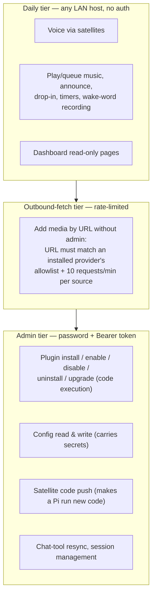

# Security & Privacy

Domovoi is a house guardian, so let's be straight about what it actually
guards — and what it doesn't. This page is the threat model in plain words,
what the admin password really protects, exactly what data lives where,
what leaves your network (and how to turn each thing off), and an honest
list of the hardening work that was **deliberately deferred** in v1.

Everything below is written against the shipped code, not aspiration. Where
v1 accepts a risk, it says so out loud.

Related: [ARCHITECTURE.md](ARCHITECTURE.md) for the process/port layout,
[FAQ.md](FAQ.md) for the short versions, and
[PLUGIN_DEVELOPMENT.md](PLUGIN_DEVELOPMENT.md) for the plugin runtime this
page keeps being blunt about.

---

## The threat model, in one paragraph

Domovoi assumes **your LAN is your household**. Anyone who can reach the
server over the network can use the daily features — talk to it, play
music, announce to a room — the same way anyone in your house can talk to
it. On top of that sits a single **admin tier** (one password, set on first
run) that gates the dangerous stuff: anything that executes code or changes
configuration. There are no per-user accounts, no roles, and — in v1 — no
TLS. Domovoi is **not designed to be exposed to the internet**. Don't
port-forward 6369 or 6370. If a hostile device is already inside your Wi-Fi,
the honest answer is that it can use Domovoi's daily features and can
listen to unencrypted LAN traffic; the admin tier is what keeps it from
going further.

## The tiers

### Daily tier (LAN-trust)

Voice, music control, intercom, announcements, timers, reminders, news —
all usable by anything on the LAN with no credentials. This is a feature:
your household shouldn't log in to ask for a song. It's also the accepted
risk: a guest (or a compromised IoT gadget) on your Wi-Fi can do these
things too. Keep your Wi-Fi password good; use a guest VLAN for devices you
don't trust.

The video satellite's kiosk page (`display.html` + the now-playing reads
and transport actions it uses) rides this same tier by design — the device
renders it unattended, with no interactive login. Per-device read tokens
for kiosk clients sit in the hardening backlog alongside TLS.

### Outbound-fetch tier

One endpoint makes the server fetch a **caller-chosen URL**
(`POST /v1/admin/music/add-by-url`, used for media acquisition). That's a
server-side request-forgery surface, so it gets its own rules (verified in
`domovoi/admin_auth.py::check_outbound_fetch`):

- An admin session passes outright.
- Without one, the URL must match an **installed media-provider plugin's
  allowlist** (its registered `url_matcher`), **and** the caller is limited
  to **10 URL requests per 60 seconds per source IP**.
- Anything else is refused.

### Admin tier

Everything that executes code or rewrites configuration. Details next.

## What the admin password actually gates

Verified against `domovoi/admin_auth.py`, `domovoi/auth.py`, and the route
declarations in `domovoi/main.py`, `domovoi/plugins_runtime/installer.py`,
and the web backend. The list is deliberately short — the point of the
admin tier is code execution and configuration, not day-to-day use.

| Surface | Endpoints | Behavior before first-run setup |
|---|---|---|
| **Plugin management** (install pipeline = code execution) | `POST /v1/plugins/install`, `/v1/plugins/install/{staged_id}/confirm`, `/v1/plugins/{slug}/enable`, `/disable`, `/uninstall`, `/upgrade` | **Fails closed** — 501 until an admin password exists. Local development uses the `domovoi plugin dev` CLI, which never crosses HTTP. |
| **Configuration** (values include plugin secrets, so *reads* are gated too) | Core: `GET/POST /v1/admin/config`. Dashboard: `GET/PATCH /api/config/editable` (which forwards your credentials to the core — both processes enforce the gate independently). | Pre-setup grace: works on a fresh install so you can finish setup. |
| **Satellite code push** (makes a Pi download and run fresh code) | Core: `POST /v1/admin/satellite/upgrade`. Dashboard: `POST /api/satellites/{room_id}/upgrade`. | Pre-setup grace. |
| **Satellite pairing reset** (lets the next device re-pair as a room) | Core: `DELETE /v1/admin/satellites/{room_id}/pairing`. Dashboard: `POST /api/satellites/{room_id}/pairing/reset`. | Pre-setup grace. |
| **Chat-tool resync** (regenerates and uploads tool source to the chat agent) | `POST /v1/admin/chat/resync` | Pre-setup grace. |
| **Auth/session management** | `POST /api/auth/logout`, `DELETE /api/auth/sessions/{token_hash}`, `POST /api/auth/password` | n/a — these only exist once setup is done. |

Everything else under `/v1/admin/...` — announce, drop-in, music playback,
satellite restart and volume, wake-word clip recording, sound regeneration,
library reindex — is **daily tier**. The `admin` in the path means "used by
the dashboard," not "requires the admin password."

### How the credential works

- **First run: the setup code.** On boot with no admin credential, the core
  writes an **8-word code** (256-word list, 64 bits of entropy) to
  `~/.domovoi/setup-code.txt` on the server **and prints it to the server
  console**. `POST /api/auth/setup` requires that code before it will
  accept your chosen admin password — this is **proof of possession of the
  server machine**, and it closes the race where some other LAN host claims
  the admin tier before you do. The code file is deleted the moment setup
  completes; a restart before setup re-uses the same code rather than
  invalidating the one you already wrote down.
- **The password** is hashed with **argon2id**; only the hash is stored (a
  single row in Postgres). Minimum 10 characters.
- **Sessions** are 256-bit bearer tokens; the database stores **only the
  sha256** of each token, with a **30-day sliding expiry** (using it renews
  it). You can list and revoke sessions from the dashboard settings.
- **Login is throttled** per source IP: exponential backoff starting at 1 s
  and doubling per consecutive failure, capped at 5 minutes. Failed setup
  codes count against the same backoff. The throttle is in-memory (a server
  restart resets it — accepted: argon2id keeps offline guessing expensive,
  and the setup code is single-use).
- **CSRF stance:** login also sets a `SameSite=Strict`, `HttpOnly` cookie —
  but the cookie can only *render* authenticated GET state. **Every
  mutation requires the `Authorization: Bearer` header** (the dashboard
  holds the token in JS memory). A cross-site POST carries nothing that
  authorizes it.
- **Forgot the password?** `python -m domovoi.main --reset-admin` on the
  server clears the credential and every session and prints a fresh setup
  code. Requires being at the machine — same proof-of-possession logic.

## Plugin trust model — read this before installing anything

This is the part where we are exactly as honest as the code is.

**Plugins are arbitrary Python running inside the Domovoi core process.**
There is no sandbox. The install confirmation screen shows you the trust
statement verbatim, and it means every word:

> "This plugin runs with full access to your Domovoi server. It can read
> and modify your library, database, configuration, and anything else this
> machine can reach. Only install plugins from publishers you trust."

What the install flow *does* do (verified in
`domovoi/plugins_runtime/installer.py`):

- **Two-step install.** Staging (zip validation with symlink/path-traversal
  rejection, manifest parse, an **inert pip dry-run** that resolves the full
  transitive dependency set without installing anything) is separated from
  **confirm**, which is when code actually lands. Nothing executes until you
  confirm.
- **The trust screen** shows: publisher, version, license, the manifest's
  declared permissions and warnings, direct **and transitive** Python
  dependencies, the handlers it registers, how many database migrations it
  ships, any HTTP endpoints it exposes without auth, and the trust
  statement above.
- **Downgrades require `force`** — installing an older version than what's
  present is refused by default, because it may reintroduce fixed
  vulnerabilities.
- **Database containment by convention:** each plugin gets its own Postgres
  schema and runs its own migrations there; plugins never run DDL against
  core tables. This is an architectural boundary against *accidents*, not
  against malice — in-process code could ignore it.

And the crucial caveat: **the manifest's permission flags and warnings are
honesty devices, not enforcement.** A flag like `network = true` is the
publisher *declaring* what the plugin does so the trust screen can show
you; nothing stops a malicious plugin from doing things it didn't declare.
The trust decision is about the **publisher**, full stop. The bundled
`plugins/radio` plugin is published by Coders Farm and lives in this repo
where you can read every line — that's the standard to hold third-party
plugins to.

## Data at rest

All of it on hardware you own. Locations, verified against the code:

| Where | What |
|---|---|
| **Postgres** (`domovoi` DB, host port 6432, in Docker) | Every routed voice turn: one `intents_log` row and one `conversation_log` row — i.e. **transcripts of what your household says to Domovoi** live here. Also: media play history (default 90-day retention), news items (default 90-day retention), plugin registry, admin credential hash + session token hashes, per-plugin schemas. |
| **`~/.domovoi/` on the server** | `setup-code.txt` (only until setup completes), `logs/`, `plugins/<slug>.env` (**plugin config including secrets, in plain text** — protect this directory with filesystem permissions), `wake_clips/` (**recordings of your voice** made when you train a custom wake word), `wake_models/` (trained `.onnx` models), `piper_voices/` (downloaded TTS models). |
| **Media directories on the server** | Your music (`~/Music` by default) and documents (`~/Documents` by default), plus flat podcast and audiobook directories under the config dir (`~/.domovoi/podcasts` and `~/.domovoi/audiobooks` by default; all paths configurable). |
| **`domovoi/.env` in the repo checkout** | Settings changed from the dashboard's Settings page, persisted as plain text — **including secrets** (e.g. `ACOUSTID_API_KEY`). Protect it like `~/.domovoi/plugins/`. |
| **`~/.domovoi/` on each Pi** | `config.toml`, synced sound clips, synced wake models, small state sidecars (`voice`, `wake`, last-synced version, and the `pairing_token` WS-auth secret — mode 0600), and a tarball backup of the previous satellite code kept for upgrade rollback. |

Nothing is stored anywhere else. Backup story = back up Postgres, the
directory trees above, and `domovoi/.env` — see the
[FAQ's backup answer](FAQ.md#how-do-i-back-up-and-restore).

## What leaves your network — and how to turn each thing off

Local-first is the default posture: **Whisper (STT), Ollama (both LLMs),
Piper (TTS), MPD, and the optional Letta chat agent all run on your
hardware and send nothing out.** The complete list of things that *can*
create outbound traffic:

| Traffic | When | Off switch |
|---|---|---|
| **Edge TTS** — response text is sent to Microsoft's cloud TTS service | **Only if you opt in.** The default engine is `piper` (`tts_engine = "piper"`), which is fully local, so out of the box nothing Domovoi says leaves the network. Switch to `edge` and every spoken response's text — which often echoes what you asked — transits a cloud service. | Leave `tts_engine` at `"piper"`. If you switch to `edge` for the nicer voices, know that this is the one thing the default config deliberately avoids. |
| **Piper voice download** — one-time fetch of a voice model from Hugging Face | First use of a Piper voice you don't have locally | Pre-place the `.onnx` in `~/.domovoi/piper_voices/`; after that, nothing to fetch. |
| **News** — RSS feed fetches, plus SearXNG queries for feed discovery (the SearXNG container is local, but it forwards queries to public search engines) | Daily pre-fetch (default 5 a.m.) and when you ask for news | `news_enabled = false` (master switch); per-person topic fetch is separately opt-in (`news_auto_fetch`). |
| **Library enricher** — audio fingerprints (Chromaprint → AcoustID) and metadata lookups (MusicBrainz) to identify/clean up untagged music files | Background, when unenriched tracks exist | `library_enricher_enabled = false`. Note: fingerprints of your files go out; the files themselves never do. |
| **Version check / pull** — `git fetch`/`pull` against the GitHub repo | Only when an admin clicks check/update in the dashboard | Don't click it. Nothing runs automatically. |
| **Media acquisition** — provider plugins fetching from external sources; add-by-URL fetches the URL you gave | When you ask for something the library doesn't have, or add by URL | Don't install provider plugins / uninstall them; add-by-URL is governed by the outbound-fetch tier above. |
| **Radio streams** | While you're listening to an internet station (bundled radio plugin) | Don't play internet radio; FM/SDR paths in the same plugin are local RF. |
| **Wake-word base models** — one-time openWakeWord model download during satellite provisioning | Provisioning a Pi | One-time, on the Pi, at build time. |

Turn off Edge TTS, news, and the enricher, skip provider plugins, and
Domovoi's steady-state outbound traffic is **zero**.

## Satellite pairing (WS auth)

The satellite WebSocket (`/v1/stream/{room_id}`) authenticates each device
with a **pairing token** — this closes the hole where any LAN host could
connect claiming to be one of your rooms (e.g. `kitchen`) and be treated as
that room's satellite, and via drop-in listen in on it.

**The model is lenient trust-on-first-use (TOFU).** Each satellite generates
a random per-device token on first boot (`secrets.token_hex(32)`, stored in
`~/.domovoi/pairing_token`, mode 0600) and sends it in its `hello` frame. The
server stores **only the sha256** of the token (in the `satellite_pairings`
table — the raw token never leaves the Pi) and binds the room to it the first
time it sees one. After that, the five cases are:

| `hello` presents | server has | outcome |
|---|---|---|
| a token | no pairing row | **PAIR** — claim the room for this token, accept |
| a token | matching hash | accept (bump `last_seen_at`) |
| a token | a *different* hash | **REFUSE** — impostor / wrong token; error frame + close |
| no token | a pairing row | **REFUSE** — a paired room requires its token |
| no token | no pairing row | accept (older/unpaired) **unless strict, below** |

So any room that has *ever* paired is protected against impersonation: a
tokenless impostor, or one with the wrong token, is refused before its `hello`
is honored — a warning is logged, an
`{"type":"error","reason":"pairing_rejected"}` frame is sent, and the socket
is closed. **No audio is ever relayed to it and it can never join a drop-in**,
so it cannot listen in or speak into the room. A room that has never paired
still accepts a tokenless connection, so **existing tokenless satellites keep
working with zero changes** — the default is zero-breakage.

**The first-connect race (the TOFU caveat).** Because the *first* token wins,
there is a one-time window: for a room that has never paired, whoever
connects first — your real satellite or an attacker already on your LAN who
raced it — claims the room. This is the standard trust-on-first-use trade:
after the legitimate device pairs, the impostor is locked out; but if an
attacker pairs *first*, your real satellite is the one refused (and you'd
notice — the room won't work — and reset the pairing). Pairing narrows the
threat from "any LAN host, any time" to "an attacker who is already on your
LAN at the exact moment a room first pairs." On a trusted home LAN that
window is normally the moment you provision the Pi.

**Strict mode.** Set `SATELLITE_PAIRING_STRICT=true` (default `false`; also
editable from the dashboard's satellite Settings → Security, restart-tier) to
require a token for **every** room — a tokenless `hello` for an unpaired room
is then refused too. This removes the first-connect race for *new* rooms (an
unpaired room can't be claimed tokenlessly), at the cost of breaking any
older tokenless satellite. Turn it on only once every satellite in your
fleet has paired.

**Re-pairing.** Re-flashing a Pi, swapping the device, or moving a room to
new hardware gives that room a new token that won't match — so the device is
refused until you clear the old pairing. **Reset pairing** from the dashboard
(Satellites → room → Overview → Reset pairing) deletes the room's pairing row
so the next connect re-pairs. That reset is **admin-gated** (Bearer-only,
`require_admin_mutation`) — it's a security operation, since it lets the next
device claim the room.

**Pre-seeded pairing (USB adoption).** The plug-in-and-adopt flow removes
the first-connect race entirely for adopted rooms: at adopt time the core
generates the room's token and stores its sha256 (`POST
/v1/admin/satellites/{room}/pairing/preseed`, admin-gated like the reset),
and the raw token is written once into the device's provision file — so the
device's very first `hello` matches as an already-paired room (case 2, not
a trust-on-first-use claim). This also works under strict mode. Trade-offs
to know: the Wi-Fi password and the raw token sit in cleartext on the FAT
gadget volume for the seconds between adopt and the device applying them
(consistent with the LAN-cleartext posture above — the device deletes the
file before ever re-exposing the volume, and destroys the whole image after
success); the raw token appears once in the preseed HTTP response on the
LAN (same exposure as every admin call until TLS lands); and neither secret
is ever logged on either side. A force re-adopt **rotates** the token, so
the previous device for that room stops matching — deliberate, and the UI
warns before doing it.

**Known limitation — connect-time disruption.** The pairing check runs on the
`hello` frame, but the socket is accepted and the room's in-memory session
slot is claimed a moment earlier, on connect (this ordering is load-bearing:
the server sends `ready` and becomes reachable for broadcasts immediately,
before the satellite has said anything). So an attacker who knows a room's id
can, by repeatedly connecting and being refused, briefly bump the real
satellite out of the broadcast registry — a nuisance denial-of-service on that
room's intercom/timer announcements until it reconnects. They still **cannot
eavesdrop or inject audio** (that needs a validated `hello`), so this is an
availability nuisance, not a confidentiality break. Closing it fully means
gating the session registration on the pairing check, which would change the
connect handshake; it's a candidate follow-up if the nuisance ever matters on
your network.

**Plugin payloads run as root on satellites.** A plugin declaring
`[satellite]` apt packages or a post-install script runs **arbitrary root
code on every satellite** (via the sudoers-allowlisted
`domovoi-apply-payload` helper). This is gated by the plugin's
`permissions.satellite_root` + a mandatory warnings entry surfaced at
install-confirm time, transfer is sha256-manifest-verified, and only
admin-enabled plugins' payloads flow — but there is **no sandbox**, by
design and named honestly. Corollary: the satellite's service account is
root-equivalent on its own device (it already executes server-synced code
and holds the apply-payload sudoers line) — treat "installed a plugin with
satellite_root" as "trusted its publisher with your satellites".

**This does not add encryption.** Pairing authenticates *which device is this
room*; it does not encrypt the audio. Combined with the deferred TLS item
below, satellite audio still crosses the LAN in the clear — the pairing token
itself is sent (and only its hash stored), so on a hostile LAN a passive
sniffer could capture a token in transit. Pairing raises the bar from "walk
up and impersonate any room" to "already-on-the-wire at pairing time or
sniffing the token," but the LAN is still the trust boundary.

## HARDENING BACKLOG — deferred in v1, on purpose

These are not oversights; they're documented scope decisions. Plain
statements of each, with the risk you accept by running v1:

### 1. No TLS on admin flows (or anything else)

All HTTP — including **first-run setup, admin login, and every
Bearer-authenticated request** — runs over **plain HTTP on the LAN**. The
session cookie is deliberately not marked `Secure` (it would never be sent).

**Risk accepted:** anyone who can capture packets on your network (a
compromised machine, a hostile Wi-Fi client, a bad AP) can read the admin
password as you set or enter it, and can lift a live bearer token and
replay it for its 30-day sliding lifetime. On a healthy WPA2/WPA3 home LAN
the capture bar is real but not high — a compromised laptop on the same
network clears it.

**Until it lands:** treat the admin password as LAN-visible-in-transit —
don't reuse a password you care about elsewhere. Note that a satellite
pairing token is likewise sniffable in transit on a hostile LAN even though
the server only stores its hash. Do admin work from a machine you trust on a
network segment you trust, and never expose either port past your router.

TLS is the top of the post-v1 hardening list. (Satellite pairing tokens,
previously deferred alongside it, shipped — see "Satellite pairing (WS auth)"
above.)

---

*If something here worries you, [FAQ.md](FAQ.md) has the shorter
reassurances and [TROUBLESHOOTING.md](TROUBLESHOOTING.md) the practical
fixes. If you find a vulnerability, please report it privately via GitHub
security advisories on the repo rather than a public issue.*
