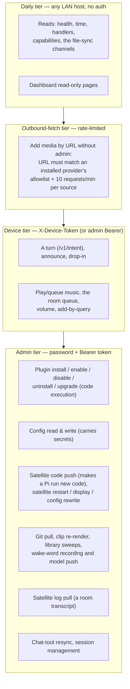

# Security & Privacy

Domovoi is a house guardian, so let's be straight about what it actually
guards — and what it doesn't. This page is the threat model in plain words,
what the admin password really protects, exactly what data lives where,
what leaves your network (and how to turn each thing off), and an honest
list of the hardening work that was **deliberately deferred** in v1.

Everything below is written against the shipped code, not aspiration. Where
v1 accepts a risk, it says so out loud.

Related: [ARCHITECTURE.md](ARCHITECTURE.md) for the process/port layout,
[FAQ.md](FAQ.md) for the short versions, and
[PLUGIN_DEVELOPMENT.md](PLUGIN_DEVELOPMENT.md) for the plugin runtime this
page keeps being blunt about.

---

## The threat model, in one paragraph

Domovoi assumes **your LAN is your household**. Anything on the network can
read what this Domovoi is — and a device the household enrolled can use the
daily features, talk to it, play music, announce to a room, the same way
anyone in your house can. Two credentials sit on top of the LAN: a
per-household **device token** (one shared secret every household client
presents — the dashboard, the app, the satellites — which those daily
actions require) and a single **admin tier** (one password, set on first
run) that gates the dangerous stuff: anything that executes code, reaches a
credential, or changes what the server or a satellite runs. There are no
per-user accounts, no roles, and — in v1 — no TLS. Domovoi is **not designed
to be exposed to the internet**. Don't port-forward 6369 or 6370. If a
hostile device is already inside your Wi-Fi, the honest answer is that it
can listen to unencrypted LAN traffic — including the household token as a
real client presents it — and then do anything on the daily tier; the admin
tier is what keeps it from going further.

## The tiers

### Device tier (the household token)

One 256-bit secret per install, minted at the first boot of either process
into the `household_device_tokens` table and mirrored to
`~/.domovoi/device-token.txt` (mode 0600, next to the setup code). Clients
send it as the `X-Device-Token` header; an admin Bearer always passes the
same gate, so an operator never needs both. An admin reads it from the
dashboard (`GET /api/auth/device-token`, or `GET /v1/admin/device-token` on
the core) to enrol a new phone, and rotates it from the `/rotate` sibling —
after which every household client has to be re-enrolled. It is rotated
automatically the moment first-run setup completes, so a token that was
readable during the open pre-setup window does not survive it. The gate
(`require_device`) keeps the pre-setup grace: a fresh install still works
before setup.

The ordinary actions now sit behind it: a text or voice turn
(`POST /v1/intent`), announcements and drop-in, playback and the room
queue, per-room volume, add-by-query. A client that presents nothing gets
`401`; the dashboard cookie alone gets `403`, because rendering a page is
not the same as acting in a room. The web dashboard forwards whatever the
browser presented on every hop to the core, so signing in is enough there;
the Android app and the satellites carry the token itself.

### Daily tier (LAN-trust)

The reads that tell a client what this Domovoi is and let a satellite sync
itself — health, time, handlers, capabilities, the sounds / satellite-code
/ wake-model channels, the dashboard's state snapshot — answer anything on
the LAN. So does everything on a fresh install, until first-run setup
completes: the pre-setup grace is what lets you set the thing up.

Acting in a room is one step up, on the device tier above: your household
shouldn't log in to ask for a song, but the ask should come from a device
the household enrolled. The accepted risk is now narrower and still real —
one shared household secret, no per-device identity, and anything holding
it can do everything on that tier. Keep your Wi-Fi password good; use a
guest VLAN for devices you don't trust.

The video satellite's kiosk page (`display.html` + the now-playing reads
and transport actions it uses) rides this same tier by design — the device
renders it unattended, with no interactive login. Per-device read tokens
for kiosk clients sit in the hardening backlog alongside TLS.

**Device identity is self-asserted, and the room-queue blocklist depends on
it.** A browser or phone introduces itself with an id it generates locally
(`POST /api/devices/register`), and the server takes that at face value —
one household token says the device belongs to the house, not which device
it is. So the queue and files blocklists (see the table below) are
*household policy*: they apply where the dashboard and the app ask, they
reliably keep a known device out of a room's queue, and someone determined
can claim a different id. What changed is that the core's own queue routes
now want the household token too, so a blocked device can no longer simply
call port 6370 and skip the surface that asked. Binding a device id to a
per-device token belongs with the kiosk read tokens in the hardening
backlog.

### Outbound-fetch tier

One endpoint makes the server fetch a **caller-chosen URL**
(`POST /v1/admin/music/add-by-url`, used for media acquisition). That's a
server-side request-forgery surface, so it gets its own rules (verified in
`domovoi/admin_auth.py::check_outbound_fetch`):

- An admin session passes outright.
- Without one, the URL must match an **installed media-provider plugin's
  allowlist** (its registered `url_matcher`), **and** the caller is limited
  to **10 URL requests per 60 seconds per source IP**.
- Anything else is refused.

### Admin tier

Everything that executes code or rewrites configuration. Details next.

## What the admin password actually gates

Verified against `domovoi/admin_auth.py`, `domovoi/auth.py`, and the route
declarations in `domovoi/main.py`, `domovoi/plugins_runtime/installer.py`,
and the web backend. The list is deliberately short — the point of the
admin tier is code execution and configuration, not day-to-day use.

| Surface | Endpoints | Behavior before first-run setup |
|---|---|---|
| **Plugin management** (install pipeline = code execution) | `POST /v1/plugins/install`, `/v1/plugins/install/{staged_id}/confirm`, `/v1/plugins/{slug}/enable`, `/disable`, `/uninstall`, `/upgrade` | **Fails closed** — 501 until an admin password exists. Local development uses the `domovoi plugin dev` CLI, which never crosses HTTP. |
| **Configuration** (values include plugin secrets, so *reads* are gated too) | Core: `GET/POST /v1/admin/config`. Dashboard: `GET/PATCH /api/config/editable` (which forwards your credentials to the core — both processes enforce the gate independently). | **Writes fail closed** — 501 until an admin password exists (a write can point the core at another database or change what it runs). Reads keep the pre-setup grace so a fresh install can finish setup. |
| **Service restart** (bounces `domovoi-core` + `domovoi-web`) | Core: `POST /v1/admin/version/restart`. Dashboard: `POST /api/config/version/restart`. | **Fails closed** — 501 until setup. |
| **Satellite code push** (makes a Pi download and run fresh code) | Core: `POST /v1/admin/satellite/upgrade`. Dashboard: `POST /api/satellites/{room_id}/upgrade`. | **Fails closed** — 501 until setup. |
| **Satellite pairing reset / preseed / delete** (lets the next device re-pair as a room; mints a room's token; frees a room name) | Core: `DELETE /v1/admin/satellites/{room_id}/pairing`, `POST .../pairing/preseed`, `DELETE /v1/admin/satellites/{room_id}`. Dashboard: `POST /api/satellites/{room_id}/pairing/reset`, `POST /api/satellites/pending/{id}/adopt`, `DELETE /api/satellites/{room_id}`. | **Fails closed** — 501 until setup. |
| **Device token** (the household credential) | Core: `GET /v1/admin/device-token` (Bearer or cookie), `POST /v1/admin/device-token/rotate`. Dashboard: `GET/POST /api/auth/device-token[/rotate]`. | **Fails closed** — 501 until setup (and the token is rotated when setup completes). |
| **Chat-tool resync** (regenerates and uploads tool source to the chat agent) | `POST /v1/admin/chat/resync` | Pre-setup grace. |
| **Room-queue device blocks** (takes queue editing away from a named device) | Dashboard: `POST /api/music/queue-blocks`, `DELETE /api/music/queue-blocks/{id}`; reads via `GET /api/music/queue-blocks` and `GET /api/devices`. | Pre-setup grace. Gated so a block can't be lifted from the device it was applied to — not because the block itself is a security boundary (it isn't; see the daily tier above). |
| **File deletion** (the one Files verb that destroys something) | Dashboard: `POST /api/files/delete`. Everything else under `/api/files` — browse, download, upload, move, import — and the `/api/images` / `/api/videos` file serves are **daily tier**: a phone shouldn't need the admin password to drop a file into the music folder. | Pre-setup grace. |
| **Files device blocks** (takes uploading / moving / importing away from a named device; it can still browse and download) | Dashboard: `POST /api/files/device-blocks`, `DELETE /api/files/device-blocks/{id}`; reads via `GET /api/files/device-blocks`. | Pre-setup grace. Same reasoning as the queue blocks: gated so it can't be lifted from the blocked device, household policy rather than a security boundary. |
| **Voices, greetings and wake words** (what every satellite says, in whose voice, and what it listens for; a Piper upload puts a model file on the server) | Dashboard: every `POST` / `PATCH` / `DELETE` under `/api/greetings`, `/api/voices` and `/api/wake-words` (including clip selection and deletion and the record / score / push proxies). Reads stay open. | Pre-setup grace. The core's own `/v1/admin/wake/*` and `/v1/admin/sounds/regenerate` stay daily tier (below); the dashboard is where the registry is edited, so that is where the gate sits. |
| **Auth/session management** | `POST /api/auth/logout`, `DELETE /api/auth/sessions/{token_hash}`, `POST /api/auth/password` | n/a — these only exist once setup is done. |

Everything else under `/v1/admin/...` — announce, drop-in, music playback,
satellite restart and volume, wake-word clip recording, sound regeneration,
library reindex — is **daily tier**. The `admin` in the path means "used by
the dashboard," not "requires the admin password."

The rows marked **fails closed** are the *security tier*
(`require_admin_security`): the same posture plugin management has always
had. Before setup the setup code protects *who becomes admin*; the security
tier makes sure nothing that changes what the server runs or trusts can
happen *meanwhile*. `python -m domovoi.main --reset-admin` returns the
install to the pre-setup state and therefore reopens only the daily surface.
`domovoi/tests/test_route_auth_matrix.py` walks every mutating route of both
processes and fails when one has no gate and is not allowlisted with a
reason, so a new route cannot quietly ship open.

### How the credential works

- **First run: the setup code.** On boot with no admin credential, the core
  writes an **8-word code** (256-word list, 64 bits of entropy) to
  `~/.domovoi/setup-code.txt` on the server (**mode 0600** — owner-readable
  only) **and prints it to the server console**. `POST /api/auth/setup`
  requires that code before it will accept your chosen admin password —
  this is **proof of possession of the server machine**, and it closes the
  race where some other LAN host claims the admin tier before you do. The
  code is **valid for 24 hours** from when it was written: a restart inside
  that window re-uses the same code rather than invalidating the one you
  already wrote down; a restart after it prints a fresh one. The code file
  is deleted the moment setup completes.
- **The password** is hashed with **argon2id**; only the hash is stored (a
  single row in Postgres). Minimum 10 characters. **Changing it revokes
  every other session** — only the session that made the change stays
  logged in.
- **Sessions** are 256-bit bearer tokens; the database stores **only the
  sha256** of each token, with a **30-day sliding expiry** (using it renews
  it) under a **90-day absolute cap** (a session older than that is refused
  however recently it was used). You can list and revoke sessions from the
  dashboard settings.
- **Login is throttled** per source IP: exponential backoff starting at 1 s
  and doubling per consecutive failure, capped at 5 minutes. The attempt is
  counted **before** the password is verified, so concurrent attempts from
  one source cannot slip through together. Failed setup codes count against
  the same backoff. The throttle is in-memory (a server restart resets it —
  accepted: argon2id keeps offline guessing expensive, and the setup code is
  single-use). Dashboard callers are throttled by their own address: the
  core trusts `X-Forwarded-For` only from loopback, where the web process
  runs.
- **CSRF stance:** login also sets a `SameSite=Strict`, `HttpOnly` cookie —
  but the cookie can only *render* authenticated GET state. **Every
  mutation requires the `Authorization: Bearer` header** (the dashboard
  holds the token in JS memory). A cross-site POST carries nothing that
  authorizes it.
- **Forgot the password?** `python -m domovoi.main --reset-admin` on the
  server clears the credential and every session and prints a fresh setup
  code. Requires being at the machine — same proof-of-possession logic.

## Plugin trust model — read this before installing anything

This is the part where we are exactly as honest as the code is.

**Plugins are arbitrary Python running inside the Domovoi core process.**
There is no sandbox. The install confirmation screen shows you the trust
statement verbatim, and it means every word:

> "This plugin runs with full access to your Domovoi server. It can read
> and modify your library, database, configuration, and anything else this
> machine can reach. Only install plugins from publishers you trust."

What the install flow *does* do (verified in
`domovoi/plugins_runtime/installer.py`):

- **Two-step install.** Staging (zip validation with symlink/path-traversal
  rejection, manifest parse, an **inert pip dry-run** that resolves the full
  transitive dependency set without installing anything) is separated from
  **confirm**, which is when code actually lands. Nothing executes until you
  confirm.
- **The trust screen** shows: publisher, version, license, the manifest's
  declared permissions and warnings, direct **and transitive** Python
  dependencies, the handlers it registers, how many database migrations it
  ships, any HTTP endpoints it exposes without auth, and the trust
  statement above.
- **Downgrades require `force`** — installing an older version than what's
  present is refused by default, because it may reintroduce fixed
  vulnerabilities.
- **Database containment by convention:** each plugin gets its own Postgres
  schema and runs its own migrations there; plugins never run DDL against
  core tables. This is an architectural boundary against *accidents*, not
  against malice — in-process code could ignore it.

And the crucial caveat: **the manifest's permission flags and warnings are
honesty devices, not enforcement.** A flag like `network = true` is the
publisher *declaring* what the plugin does so the trust screen can show
you; nothing stops a malicious plugin from doing things it didn't declare.
The trust decision is about the **publisher**, full stop. The bundled
`plugins/radio` plugin is published by Coders Farm and lives in this repo
where you can read every line — that's the standard to hold third-party
plugins to.

## Data at rest

All of it on hardware you own. Locations, verified against the code:

| Where | What |
|---|---|
| **Postgres** (`domovoi` DB, host port 6432, in Docker) | Every routed voice turn: one `intents_log` row and one `conversation_log` row — i.e. **transcripts of what your household says to Domovoi** live here. Also: media play history (default 90-day retention), news items (default 90-day retention), plugin registry, admin credential hash + session token hashes, per-plugin schemas. |
| **`~/.domovoi/` on the server** | `setup-code.txt` (only until setup completes; mode 0600), `device-token.txt` (the household device token; mode 0600), `logs/`, `plugins/<slug>.env` (**plugin config including secrets, in plain text** — protect this directory with filesystem permissions), `wake_clips/` (**recordings of your voice** made when you train a custom wake word), `wake_models/` (trained `.onnx` models), `piper_voices/` (downloaded TTS models). |
| **Media directories on the server** | Your music (`~/Music` by default) and documents (`~/Documents` by default), plus flat podcast and audiobook directories under the config dir (`~/.domovoi/podcasts` and `~/.domovoi/audiobooks` by default; all paths configurable). |
| **`domovoi/.env` in the repo checkout** | Settings changed from the dashboard's Settings page, persisted as plain text — **including secrets** (e.g. `ACOUSTID_API_KEY`). Protect it like `~/.domovoi/plugins/`. |
| **`~/.domovoi/` on each Pi** | `config.toml`, synced sound clips, synced wake models, small state sidecars (`voice`, `wake`, last-synced version, and the `pairing_token` WS-auth secret — mode 0600), and a tarball backup of the previous satellite code kept for upgrade rollback. |
| **RAM on each Pi** (not on disk) | The satellite's last 10 MB of its own log output, which **includes a `heard: <transcript>` line for every utterance** — so it holds recent spoken content. Kept in memory only (a log ring is the write pattern that kills SD cards) and lost on restart. Readable through the dashboard's per-satellite **Logs** tab, gated at the same admin-read tier as a config read for exactly that reason. Journald on the Pi keeps its own durable copy, subject to your `systemd` retention. |

Nothing is stored anywhere else. Backup story = back up Postgres, the
directory trees above, and `domovoi/.env` — see the
[FAQ's backup answer](FAQ.md#how-do-i-back-up-and-restore).

## What leaves your network — and how to turn each thing off

Local-first is the default posture: **Whisper (STT), Ollama (both LLMs),
Piper (TTS), MPD, and the optional Letta chat agent all run on your
hardware and send nothing out.** The complete list of things that *can*
create outbound traffic:

| Traffic | When | Off switch |
|---|---|---|
| **Edge TTS** — response text is sent to Microsoft's cloud TTS service | **Only if you opt in.** The default engine is `piper` (`tts_engine = "piper"`), which is fully local, so out of the box nothing Domovoi says leaves the network. Switch to `edge` and every spoken response's text — which often echoes what you asked — transits a cloud service. | Leave `tts_engine` at `"piper"`. If you switch to `edge` for the nicer voices, know that this is the one thing the default config deliberately avoids. |
| **Piper voice download** — one-time fetch of a voice model from Hugging Face | First use of a Piper voice you don't have locally | Pre-place the `.onnx` in `~/.domovoi/piper_voices/`; after that, nothing to fetch. |
| **News** — RSS feed fetches, plus SearXNG queries for feed discovery (the SearXNG container is local, but it forwards queries to public search engines) | Daily pre-fetch (default 5 a.m.) and when you ask for news | `news_enabled = false` (master switch); per-person topic fetch is separately opt-in (`news_auto_fetch`). |
| **Library enricher** — audio fingerprints (Chromaprint → AcoustID) and metadata lookups (MusicBrainz) to identify/clean up untagged music files | Background, when unenriched tracks exist | `library_enricher_enabled = false`. Note: fingerprints of your files go out; the files themselves never do. |
| **Satellite setup AP** — a portal-onboarded satellite hosts a WPA2 network with a per-device key until it is provisioned | Only while unprovisioned; it drops the moment credentials are accepted | The key is printed on the device. Plain HTTP over WPA2 is deliberate: a self-signed certificate would train customers through a security warning while typing their Wi-Fi password. The house PSK goes phone→device and never transits the server. |
| **Satellite approval** — a portal-onboarded satellite waits for a human before it is paired | Every first connection from a device presenting a setup code | Type the satellite's six-digit code into the approval card. The dashboard never shows you the code — it is on the device, which is what ties the request on screen to the unit in the room. The server compares it and allows five attempts per room per five minutes. The first device to park holds that room name until someone approves or rejects it; a different device asking for the same name is refused as a conflict. `SATELLITE_PAIRING_STRICT` still governs tokenless connects. |
| **Version check / pull** — `git fetch`/`pull` against the GitHub repo | Only when an admin clicks check/update in the dashboard | Don't click it. Nothing runs automatically. The follow-up **restart** is local only (it bounces systemd units, reaches no network) and is admin-gated; it can only work if you granted the sudoers line in [LINUX_HOST.md](LINUX_HOST.md). |
| **Media acquisition** — provider plugins fetching from external sources; add-by-URL fetches the URL you gave | When you ask for something the library doesn't have, or add by URL | Don't install provider plugins / uninstall them; add-by-URL is governed by the outbound-fetch tier above. |
| **Radio streams** | While you're listening to an internet station (bundled radio plugin) | Don't play internet radio; FM/SDR paths in the same plugin are local RF. |
| **Wake-word base models** — one-time openWakeWord model download during satellite provisioning | Provisioning a Pi | One-time, on the Pi, at build time. |

Turn off Edge TTS, news, and the enricher, skip provider plugins, and
Domovoi's steady-state outbound traffic is **zero**.

## Server identity (which core a satellite belongs to)

Pairing, above, protects the **server** from a device pretending to be one
of your rooms. Server identity is the other direction: it protects the
**device** from a host pretending to be your core.

It matters because the satellite runs that core's code. A satellite whose
address is the `auto` sentinel sweeps its own /24 and keeps whatever
answers `GET /v1/health` like Domovoi; the core it settles on can then push
a self-upgrade, and a plugin payload whose `post_install` runs as root. The
per-file sha256 in the code manifest proves the bytes arrived intact — it
says nothing about who sent them, because the same host served the
manifest.

**The install has a key.** The core generates an Ed25519 key pair the first
time it needs one and keeps it at `~/.domovoi/server-identity.json`
(mode 0600). Its **fingerprint** — `SHA256:<base64 of sha256(public key)>`,
the shape ssh prints — is shown under **Settings → About** and is the
string you can compare by eye.

**A prepared card is baked with it.** Preparing satellite media writes the
public half to `domovoi/server-identity.json` on the boot partition and
records the fingerprint in `build-info.json`. First boot installs it
root-owned at `/etc/domovoi/server-identity.json`, and adoption copies the
fingerprint into `[satellite] server_fingerprint` in the device's
`config.toml`. The satellite user can read all of that and cannot forge the
root-owned copy.

**What the fingerprint then buys, on every boot and every reconnect:**

| Moment | Check |
|---|---|
| discovery sweep | a host is only a candidate if it signs a nonce this probe just invented, with the key that hashes to the pinned fingerprint |
| before each connect | the same challenge, again — an address written down months ago can be answered by something else today |
| code upgrade | `/v1/satellite-code/manifest.sig`, verified before a single body is fetched; a bad signature writes nothing |
| plugin payloads | `/v1/satellite-plugins/manifest.sig`, same rule — these are the files whose `post_install` runs as root |
| clock and zone | the root helper takes its time source from the root-owned pin, not from an argument the satellite user chose |

**A discovered address is not configuration.** It waits in
`~/.domovoi/pending-server.json` and is written into `config.toml` only once
the core answers `ready` — which happens only after someone approved the
device on the dashboard. A wrong answer during a sweep is no longer
permanent.

**Verify if known, not verify always.** A device prepared before any of
this has no fingerprint. It keeps working: it records the first identity it
meets in `~/.domovoi/server-identity.json` and is held to that one
afterwards, and its code sync falls back to the unsigned manifest with a
warning in the journal. The core serves both the signed and the unsigned
manifest for exactly this reason. Baking the fingerprint in at prepare time
is what turns trust-on-first-use into real authentication from boot one —
so a satellite that matters should be prepared from the dashboard rather
than built by hand.

**What this is not.** Without TLS the channel is still plain HTTP on the
LAN: the identity proves *who* answered and that the code manifest is the
one your core published, not that nothing in between could read the
traffic. See the hardening backlog.

## Satellite pairing (WS auth)

The satellite WebSocket (`/v1/stream/{room_id}`) authenticates each device
with a **pairing token** — this closes the hole where any LAN host could
connect claiming to be one of your rooms (e.g. `kitchen`) and be treated as
that room's satellite, and via drop-in listen in on it.

**The model is lenient trust-on-first-use (TOFU).** Each satellite generates
a random per-device token on first boot (`secrets.token_hex(32)`, stored in
`~/.domovoi/pairing_token`, mode 0600) and sends it in its `hello` frame. The
server stores **only the sha256** of the token (in the `satellite_pairings`
table — the raw token never leaves the Pi) and binds the room to it the first
time it sees one. After that, the five cases are:

| `hello` presents | server has | outcome |
|---|---|---|
| a token | no pairing row | **PAIR** — claim the room for this token, accept |
| a token | matching hash | accept (bump `last_seen_at`) |
| a token | a *different* hash | **REFUSE** — impostor / wrong token; error frame + close |
| no token | a pairing row | **REFUSE** — a paired room requires its token |
| no token | no pairing row | accept (older/unpaired) **unless strict, below** |

So any room that has *ever* paired is protected against impersonation: a
tokenless impostor, or one with the wrong token, is refused before its `hello`
is honored — a warning is logged, an
`{"type":"error","reason":"pairing_rejected"}` frame is sent, and the socket
is closed. **No audio is ever relayed to it and it can never join a drop-in**,
so it cannot listen in or speak into the room. A room that has never paired
still accepts a tokenless connection, so **existing tokenless satellites keep
working with zero changes** — the default is zero-breakage.

**The first-connect race (the TOFU caveat).** With strict pairing OFF, the
*first* token wins, so there is a one-time window: for a room that has never
paired, whoever connects first — your real satellite or an attacker already
on your LAN who raced it — claims the room. This is the standard
trust-on-first-use trade: after the legitimate device pairs, the impostor is
locked out; but if an attacker pairs *first*, your real satellite is the one
refused (and you'd notice — the room won't work — and reset the pairing).
Pairing narrows the threat from "any LAN host, any time" to "an attacker who
is already on your LAN at the exact moment a room first pairs." On a trusted
home LAN that window is normally the moment you provision the Pi.

**Strict mode (the default for a new install).** `SATELLITE_PAIRING_STRICT`
is written as `true` into a FRESH `.env` (from `domovoi/.env.example`), and
is also editable from the dashboard's satellite Settings → Security
(restart-tier). It does two things:

* a tokenless `hello` is refused, for every room;
* **every** first pairing for an unpaired room is parked under *waiting for
  approval* — with or without a token, with or without a setup code. A
  device that brings no code is given one by the server and says it out
  loud. That closes the first-connect race completely: connecting first
  wins you a row on a dashboard, not a room.

An install that UPGRADES into this keeps whatever it already had: the
field default stays `false` and an existing `.env` is never rewritten,
because a household running hand-provisioned satellites would otherwise
find its fleet parked after a restart. Turn it on there once every
satellite has paired (or approve them one at a time — the code is on the
device).

**The hello gate.** Pairing is checked on the `hello` frame, so the server
does nothing for a room until an accepted `hello` has arrived: no MPD
container or `mpd_rooms` row, no entry on the Satellites page, no `ready`.
A socket that opens `/v1/stream/<room>` and then says nothing is closed
after `SATELLITE_HELLO_TIMEOUT_SEC` (default 5 s) with nothing created; one
that sends any other frame first is refused the same way. Without this,
any LAN host could mint rooms (and their MPD ports) by opening a bare
socket, or bump a live satellite out of its slot, without ever presenting
a token.

**Re-pairing.** Re-flashing a Pi, swapping the device, or moving a room to
new hardware gives that room a new token that won't match — so the device is
refused until you clear the old pairing. **Reset pairing** from the dashboard
(Satellites → room → Overview → Reset pairing) deletes the room's pairing row
so the next connect re-pairs. That reset is **admin-gated** (Bearer-only,
`require_admin_mutation`) — it's a security operation, since it lets the next
device claim the room.

**Pre-seeded pairing (USB adoption).** The plug-in-and-adopt flow removes
the first-connect race entirely for adopted rooms: at adopt time the core
generates the room's token and stores its sha256 (`POST
/v1/admin/satellites/{room}/pairing/preseed`, admin-gated like the reset),
and the raw token is written once into the device's provision file — so the
device's very first `hello` matches as an already-paired room (case 2, not
a trust-on-first-use claim). This also works under strict mode. Trade-offs
to know: the Wi-Fi password and the raw token sit in cleartext on the FAT
gadget volume for the seconds between adopt and the device applying them
(consistent with the LAN-cleartext posture above — the device deletes the
file before ever re-exposing the volume, and destroys the whole image after
success); the raw token appears once in the preseed HTTP response on the
LAN (same exposure as every admin call until TLS lands); and neither secret
is ever logged on either side. A force re-adopt **rotates** the token, so
the previous device for that room stops matching — deliberate, and the UI
warns before doing it.

**Known limitation — connect-time disruption.** The pairing check runs on the
`hello` frame, but the socket is accepted and the room's in-memory session
slot is claimed a moment earlier, on connect (this ordering is load-bearing:
the server sends `ready` and becomes reachable for broadcasts immediately,
before the satellite has said anything). So an attacker who knows a room's id
can, by repeatedly connecting and being refused, briefly bump the real
satellite out of the broadcast registry — a nuisance denial-of-service on that
room's intercom/timer announcements until it reconnects. They still **cannot
eavesdrop or inject audio** (that needs a validated `hello`), so this is an
availability nuisance, not a confidentiality break. Closing it fully means
gating the session registration on the pairing check, which would change the
connect handshake; it's a candidate follow-up if the nuisance ever matters on
your network.

**Plugin payloads run as root on satellites.** A plugin declaring
`[satellite]` apt packages or a post-install script runs **arbitrary root
code on every satellite** (via the sudoers-allowlisted
`domovoi-apply-payload` helper). This is gated by the plugin's
`permissions.satellite_root` + a mandatory warnings entry surfaced at
install-confirm time, transfer is sha256-manifest-verified, and only
admin-enabled plugins' payloads flow — but there is **no sandbox**, by
design and named honestly. Corollary: the satellite's service account is
root-equivalent on its own device (it already executes server-synced code
and holds the apply-payload sudoers line) — treat "installed a plugin with
satellite_root" as "trusted its publisher with your satellites".

**This does not add encryption.** Pairing authenticates *which device is this
room*; it does not encrypt the audio. Combined with the deferred TLS item
below, satellite audio still crosses the LAN in the clear — the pairing token
itself is sent (and only its hash stored), so on a hostile LAN a passive
sniffer could capture a token in transit. Pairing raises the bar from "walk
up and impersonate any room" to "already-on-the-wire at pairing time or
sniffing the token," but the LAN is still the trust boundary.

## HARDENING BACKLOG — deferred in v1, on purpose

These are not oversights; they're documented scope decisions. Plain
statements of each, with the risk you accept by running v1:

### 1. No TLS on admin flows (or anything else)

All HTTP — including **first-run setup, admin login, and every
Bearer-authenticated request** — runs over **plain HTTP on the LAN**. The
session cookie is deliberately not marked `Secure` (it would never be sent).

**Risk accepted:** anyone who can capture packets on your network (a
compromised machine, a hostile Wi-Fi client, a bad AP) can read the admin
password as you set or enter it, and can lift a live bearer token and
replay it for its 30-day sliding lifetime. On a healthy WPA2/WPA3 home LAN
the capture bar is real but not high — a compromised laptop on the same
network clears it.

**Until it lands:** treat the admin password as LAN-visible-in-transit —
don't reuse a password you care about elsewhere. Note that a satellite
pairing token is likewise sniffable in transit on a hostile LAN even though
the server only stores its hash. Do admin work from a machine you trust on a
network segment you trust, and never expose either port past your router.

TLS is the top of the post-v1 hardening list. (Satellite pairing tokens,
previously deferred alongside it, shipped — see "Satellite pairing (WS auth)"
above.)

---

*If something here worries you, [FAQ.md](FAQ.md) has the shorter
reassurances and [TROUBLESHOOTING.md](TROUBLESHOOTING.md) the practical
fixes. If you find a vulnerability, please report it privately via GitHub
security advisories on the repo rather than a public issue.*
