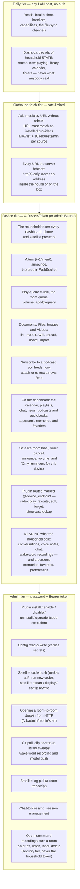

# Security & Privacy

Domovoi is a house guardian, so let's be straight about what it actually
guards — and what it doesn't. This page is the threat model in plain words,
what the admin password really protects, exactly what data lives where,
what leaves your network (and how to turn each thing off), and an honest
list of the hardening work that was **deliberately deferred** in v1.

Everything below is written against the shipped code, not aspiration. Where
v1 accepts a risk, it says so out loud.

Related: [ARCHITECTURE.md](ARCHITECTURE.md) for the process/port layout,
[FAQ.md](FAQ.md) for the short versions, and
[PLUGIN_DEVELOPMENT.md](PLUGIN_DEVELOPMENT.md) for the plugin runtime this
page keeps being blunt about.

---

## The threat model, in one paragraph

Domovoi assumes **your LAN is your household**. Anything on the network can
read what this Domovoi is — and a device the household enrolled can use the
daily features, talk to it, play music, announce to a room, the same way
anyone in your house can. Two credentials sit on top of the LAN: a
per-household **device token** (one shared secret every household client
presents — the dashboard, the app, the satellites — which those daily
actions require) and a single **admin tier** (one password, set on first
run) that gates the dangerous stuff: anything that executes code, reaches a
credential, or changes what the server or a satellite runs. There are no
per-user accounts, no roles, and — in v1 — no TLS. Domovoi is **not designed
to be exposed to the internet**. Don't port-forward 6369 or 6370. If a
hostile device is already inside your Wi-Fi, the honest answer is that it
can listen to unencrypted LAN traffic — including the household token as a
real client presents it — and then do anything on the daily tier; the admin
tier is what keeps it from going further.

## The tiers


```mermaid
flowchart TB
    subgraph daily["Daily tier — any LAN host, no auth"]
        d1["Reads: health, time, handlers,<br/>capabilities, the file-sync channels"]
        d2["Dashboard reads of household STATE:<br/>rooms, now-playing, library, calendar,<br/>timers — never what anybody said"]
    end
    subgraph fetch["Outbound-fetch tier — rate-limited"]
        f1["Add media by URL without admin:<br/>URL must match an installed provider's<br/>allowlist + 10 requests/min per source"]
        f2["Every URL the server fetches:<br/>http(s) only, never an address<br/>inside the house or on the box"]
    end
    subgraph device["Device tier — X-Device-Token (or admin Bearer)"]
        v1["The household token every dashboard, phone<br/>and satellite presents"]
        v2["A turn (/v1/intent), announce,<br/>the drop-in WebSocket"]
        v3["Play/queue music, the room queue,<br/>volume, add-by-query"]
        v4["Documents, Files, Images and Videos:<br/>list, read, SAVE, upload, move, import"]
        v5["Subscribe to a podcast, poll feeds now,<br/>attach or re-test a news feed"]
        v6["On the dashboard: the calendar, playlists,<br/>chat, news, podcasts and audiobooks,<br/>a person's memories and favorites"]
        v7["Satellite room label, timer cancel,<br/>announce, volume, and<br/>'Only reminders for this device'"]
        v8["Plugin routes marked @device_endpoint —<br/>radio: play, favorite, edit, forget,<br/>simulcast lookup"]
        v9["READING what the household said:<br/>conversations, voice notes, chat,<br/>wake-word recordings — and a person's<br/>memories, favorites, preferences"]
    end
    subgraph admin["Admin tier — password + Bearer token"]
        a1["Plugin install / enable / disable /<br/>uninstall / upgrade (code execution)"]
        a2["Config read & write (carries secrets)"]
        a3["Satellite code push (makes a Pi run new code),<br/>satellite restart / display / config rewrite"]
        a7["Opening a room-to-room drop-in from HTTP<br/>(/v1/admin/dropin/start)"]
        a4["Git pull, clip re-render, library sweeps,<br/>wake-word recording and model push"]
        a5["Satellite log pull (a room transcript)"]
        a6["Chat-tool resync, session management"]
        a8["Opt-in command recordings: turn a room<br/>on or off, listen, label, delete<br/>(security tier, never the household token)"]
    end
    daily --> fetch --> device --> admin
```

### Device tier (the household token)

One secret per install, minted at the first boot of either process into the
`household_device_tokens` table and mirrored to
`~/.domovoi/device-token.txt` (mode 0600, next to the setup code). Clients
send it as the `X-Device-Token` header; an admin Bearer always passes the
same gate, so an operator never needs both.

**By default it is an eight-word phrase**, hyphen-joined, drawn from the
same 256-word bank the setup code uses —
`acorn-maple-river-thistle-harbor-quartz-willow-ember`. That is **64 bits**,
the same strength as the setup code, chosen so a person can read the
household token out loud to somebody holding a phone instead of mailing 64
hex characters around. A generated phrase is *canonical*, and typing one
back is forgiving: case, spaces, underscores and repeated hyphens all
normalise to the one hyphenated lowercase form.

**An admin may choose their own instead** (Settings → Devices → Household
token → `set…`, or `POST /v1/admin/device-token`). The rule is **printable
ASCII, 0x20 through 0x7E, 12 to 128 characters**, stored verbatim with the
outer whitespace trimmed — `Maple Street, 1984!` is a valid household token.
A chosen token is matched **exactly**: it is not canonical, so its capitals
and punctuation carry their entropy and no re-spelling of it opens the door.

That alphabet used to be lowercase-and-hyphens, and the reason was never a
property of the token. It was the one transport that could not carry
anything else: the `domovoi.device-token.<token>` WebSocket subprotocol,
which RFC 6455 requires to be an RFC 9110 *token*. A browser handed a
subprotocol with a space in it throws inside `new WebSocket(...)` before a
byte is sent, and uvicorn answers such a handshake `400` before the
application is called at all — so it bound every client, not just browsers.
The token is now base64url-encoded into
`domovoi.device-token-b64.<base64url(token)>`, whose alphabet is a legal
token for any value, and the restriction is gone. The other transports never
needed it: a header value carries any printable ASCII (control characters
are what a header may not hold), and the `?device_token=` query is
percent-encoded.

**Why non-ASCII is still refused.** Not aesthetics. HTTP header bytes are
decoded as latin-1, so a UTF-8 token arrives mojibake'd and simply never
compares equal — it looks like a *wrong* token rather than a bad one, with
nothing in any log to say why. On the web→core hop it is worse: the HTTP
client raises an encoding error and the caller gets a 500 instead of a 401.
Refusing it at the point it is set is the only place the person can read the
reason.

**Wrong tokens cost time.** 64 bits is comfortable only because guessing is
priced: a source that presents wrong household tokens gets five free
attempts (a browser or phone still holding a rotated token fires several
requests in parallel, and none of those is a guess), and after that the same
exponential backoff the admin login uses — 1 s doubling to a 5-minute cap,
answered `429` with `Retry-After`. A correct token clears the counter; a
request that also carries a live admin Bearer is never charged, so the
device tier can never lock an admin out of the page that fixes it. The
throttle is per source and has **no aggregate ceiling**, deliberately:
unlike the admin login, this is the ordinary household surface, and a
household-wide 429 that any host on the LAN could trigger would be a worse
failure than the guessing it prevents. Every transport goes through the
same throttle, including the WebSocket subprotocol.

**What that means for a token you chose.** The backoff is the *only* thing
standing behind it. A generated phrase is 64 bits and no guesser reaches it;
a memorable one may be in the first million a wordlist tries, and while the
per-source ladder caps one address at roughly a dozen tries an hour, it
caps a /24 at about three thousand and nothing raises an alert. The 12
character floor does not fix that — it is a floor, not a strength test. Pick
something a wordlist has not seen, and know that this is a choice Domovoi
lets you make rather than one it checks.

**And it is stored in the clear.** The plaintext token is in Postgres, in
`~/.domovoi/device-token.txt`, in the settings page's DOM, in every paired
browser's `localStorage`, in the phone's DataStore — and, because media
loads carry it as `?device_token=`, in the server's own access log. Anyone
already signed in on a browser in the house can read it without re-entering
a password. **Do not reuse a password from anywhere else as the household
token.**

**Upgrading an existing install.** A Domovoi that was set up before the
phrase change still holds a 64-hex token, and it keeps working — hex is
canonical, so it validates by both paths, nothing is invalidated and no
client has to be re-paired. Only a **rotation** or a **set** issues a new
value, so moving is a deliberate act: `rotate` (a fresh phrase) or `set…` (a
token you choose) under Settings → Devices → Household token, then pair each
browser and phone again (an admin login re-pairs a browser by itself). An admin reads it from the
dashboard (`GET /api/auth/device-token`, or `GET /v1/admin/device-token` on
the core) to enrol a new phone, and rotates it from the `/rotate` sibling —
after which every household client has to be re-enrolled. It is rotated
automatically the moment first-run setup completes, so a token that was
readable during the open pre-setup window does not survive it. The gate
(`require_device`) keeps the pre-setup grace: a fresh install still works
before setup.

The ordinary actions now sit behind it: a text or voice turn
(`POST /v1/intent`), announcements and drop-in, playback and the room
queue, per-room volume, add-by-query. So do the media surfaces: reading
AND saving in the Documents folder — creating, uploading, and writing a
document, a spreadsheet or a drawing, each editor limited to the kinds of
file it actually opens so that a save can never quietly replace a PDF, a
photo or a spreadsheet with text — and browsing / downloading /
uploading / moving / importing across Files, Images and Videos. So do the
routes that make the server go and fetch something a caller chose —
podcast subscribe and poll, news feed attach and re-test.

The **dashboard's** ordinary mutations are on it too, which is what closed
the last of them: playing, queueing, tagging and uploading music; the
calendar; playlists; chat threads and messages; news topics, feeds and
favorites; podcast and audiobook listening; a person's memories, favorites
and preferences; a client registering or renaming itself; and the satellite
verbs the core keeps on this tier — room label, cancelling a timer,
announcing and setting the volume — plus a room's "Only reminders for this
device" setting (see [Timers and reminders](#timers-and-reminders-house-wide)).
The rest of the satellite drawer —
restart, the screen, the config push — is admin tier, because the core route
behind each of those is. Where the two hops disagreed, the call used to be
accepted here and refused one process later; now the first hop answers.

**Plugins can put a route on it too.** A plugin route decorated
`@device_endpoint` (`domovoi.sdk` / `domovoi.webkit`) answers to exactly
this gate — `require_device`, with the same `401` / cookie-only `403` /
`429` answers and the same pre-setup grace — in both processes, instead of
the admin default. The bundled radio plugin uses it for its everyday
mutations: play, favorite, the interval / stream-URL edit and unfavorite,
forget, and the simulcast lookup (web and core hop alike — the web hop
forwards the caller's household token). Its FCC bulk import stays admin.
Forget sits here because the core's nearest precedents do: unsubscribing
from a podcast drops that show's episode rows and deleting a news topic
drops its feed attachments, both device tier. Forget likewise drops the
station's song-detection log with it, but a station is one search away and
the log is a record of what played, not the kind of row whose loss costs
the household something it owns (a person, an audio file). A stream URL a
device sets goes through the outbound-URL check on the way in and again at
fetch time.

A client that presents nothing gets `401`; the dashboard cookie alone gets
`403`, because rendering a page is not the same as acting in a room. The web dashboard forwards whatever
the browser presented on every hop to the core, so signing in is enough
there; the Android app and the satellites carry the token itself.

**The drop-in socket.** The phone drop-in **WebSocket**
(`WS /v1/dropin/{room_id}`) is on this tier too, and is checked on the
UPGRADE rather than inside the handler: by the time a drop-in session
object exists it has already joined the room's live microphone, so a
caller without a credential is closed (`1008`) before one is built, and
the room never learns a call was attempted. A browser cannot set request
headers on a WebSocket, so that route — and only that route — also accepts
the token as `?token=`; every HTTP route takes the header, because a query
string ends up in access logs and `Referer` headers.

A credential says *who* is calling, not that the room agreed. That is what
`DROPIN_ACCEPT_MODE` is for: `auto` (the default) opens the target's
microphone as soon as a call is placed, `confirm` asks first when the call
was asked for out loud, and **`ring` asks for every caller** — spoken,
dashboard and phone alike. Under `ring` nothing is bridged until someone in
that room answers their own satellite, so a stolen or shared household token
cannot open a microphone by itself. Households that want consent on every
call should set it.

**Reads the browser fetches by URL.** An ``, a `<video src>` and a
`window.open` cannot set a header, so the READ half of this tier
(`require_device_read`) also accepts the dashboard's session cookie and the
same token as a `?device_token=` query parameter. Nothing that writes looks
at the query — a token in a URL lands in history and logs, which is a
reasonable price for rendering a thumbnail and not for changing a file.

**Reading what the household said is for paired devices only.** Every turn
anybody speaks to Domovoi is written down (`conversation_log`), and so is
what the house keeps about a person. Reading any of it back used to need
nothing but the LAN — while the two other places that carry the same
speech, the `/ws/state` push and the satellite log pull, were already
gated. The rule now (2026-09-26) is that household speech and personal
content are read by a **paired device** — one presenting the household
token, or an admin session — and by nothing else on the network:

* a room's conversations and voice notes (`GET /api/satellites/{room}/conversations`, `/notes`);
* a person's conversations, the voice notes that name them, their
  memories (the pending ones Domovoi extracted too), favorites and
  preferences (`GET /api/people/{id}/conversations`, `/notes`,
  `/memories`, `/favorites`, `/preferences`);
* the dashboard's text chat — the thread list (a title and the last-message
  snippet are message text), a thread's messages, and the images sent into
  it (`GET /api/chat/threads`, `/threads/{id}/messages`, `/uploads/{token}`);
* a recorded wake-word clip — somebody's voice saying the phrase
  (`GET /api/wake-words/{id}/clips/{name}/audio`).

They take the READ half of the device tier, `require_device_read`, the same
gate as the Documents, Files, Images and Videos reads: the household token
(header) or an admin Bearer, the dashboard's session cookie, or the
household token as `?device_token=`. The gate takes the query on every one
of these reads, as it does on every read of that tier, but the dashboard
only puts it in the two a browser fetches by URL (a chat image, a clip's
`<audio>`); its JSON reads send the header, so the token does not land in
a URL for them. No credential, a stale token or a wrong query token is
`401`, and the pre-setup grace still applies. They are device tier rather
than admin because the people reading them are the household — somebody
checking what they asked the kitchen this morning from their own phone —
and the household token is what every paired phone and browser already
holds; the satellite log pull stays an admin read, because it is a whole
room's raw log ring, not a history view. All of these are the web
process's own database reads, so there is no second hop to gate; the
core's own speech-carrying surfaces (a turn, the satellite stream, the
drop-in socket, the log pull) were gated already. The dashboard asks an
unpaired browser to pair when one of these is refused and shows the
history once it has; the Android app sends the token on every request
anyway.

**Left open, on purpose, pending a decision.** Next to that list sit reads
that carry no words anybody said, or that are household state, and they
still answer the LAN: the people roster (names, when each was last heard,
the free-text note on the row), a person's or a room's session list (times,
rooms and turn counts), voice-profile enrolment metadata (never an
embedding), timers and reminders (their countdowns, rooms and kinds, and
where a fired one was heard, for the last 10 minutes — but no longer a
reminder's WORDS: since 2026-09-30 every open timer read holds those back
from a caller without a household credential, rule M1, and the fire history
beyond Home's 10 minutes (and who stopped a timer where) likewise, rule F1, in
[Timers and reminders](#timers-and-reminders-house-wide); cancelling one is
device tier),
the calendar, a person's followed news topics and the stories
fetched for them, the wake-word clip list (names and quality numbers, no
audio), the voice denylist and the media request queue. Each is pinned in
`domovoi/tests/test_route_auth_matrix.py`, so moving one is a recorded
decision rather than a side effect. The dashboard's Home page, now the page
every browser lands on, renders several of them to an unpaired browser as
it stands: calendar titles and locations (a reminder shows only as
"reminder").

**What a device id means now.** Files writes still name a `device_id`, and
the admin block list (`files_device_blocks`) still matches on it or on the
device's registered name — but only requests that already carry the
household token (or an admin Bearer) reach that check at all. So an
unpaired device can't write regardless of what it calls itself, while
within the household the id stays self-asserted and the block stays
*household policy* rather than a security boundary, exactly as the room
queue's does.

The block covers the Documents folder through **both** doors into it.
`/api/files` and `/api/documents` write into the same directory
(`core:documents`), and since saving became a household action both are
device tier — so a rule only one of them kept would be a rule neither
kept, because a caller picks the door. The documents saves therefore call
the files module's own check rather than carrying a copy of it, and they
apply the same secret-shaped-name filter. One difference remains, and it
is a client limitation rather than a decision: `device_id` is **required**
on an `/api/files` write and **optional** on a documents save, because the
in-app editors and the Android Documents screen do not name a device on
those routes yet. A documents save that does name one is blocked exactly
as the files door would block it; a blocked device whose client omits the
field still saves. Requiring it is a client change first.

**How a client gets it.** The dashboard keeps the token in `localStorage`,
per server, and sends it on every request; a refusal that names the header
opens a *pair this browser* prompt (the phrase is typed or pasted once — the
browser stores it verbatim, bar the outer whitespace — and the refused
request is replayed), and an admin login pairs the browser without a prompt
by reading `GET /api/auth/device-token`. An admin sees the token
under **Settings → Devices → Household token**, with copy, `set…` and
rotate.
The Android app asks for it once under **Settings → Connection**, stores it
in `EncryptedSharedPreferences` (outside Android backups) and sends it on
every HTTP request, on `/ws/state` and on the drop-in call socket; a
refusal returns the app to that pairing screen. Rotating the token from
either surface invalidates the old one everywhere: every browser and phone
has to be paired again.

### Trusting a server before talking to it

Both clients discover Domovoi servers by sweeping the LAN for anything that
answers `/api/health`. Choosing one is consequential — the dashboard runs
that server's plugin scripts in its own origin and posts the admin password
to it at login — so choosing is a deliberate step: the picker shows the
address it found and asks *trust this server?* before anything is stored.
Until that confirmation nothing is persisted, no plugin JS is fetched or
executed, no credential is sent, and on Android no capability or plugin
route is loaded. Same-origin (the box that served the dashboard) is trusted
by construction. A **satellite** does verify its server cryptographically
— see "Server identity (which core a satellite belongs to)" below — but the
browser and the phone do not pin a key here yet: **Settings → About** shows
this install's fingerprint so a person can compare it by eye against the
one printed on a prepared card, and pinning it in the picker (with TLS)
stays on the hardening backlog.

### Which names the server answers to

Both processes refuse an HTTP request whose `Host` header is not a name
that can only mean this box on this LAN, with `400`, before routing. This
is the DNS-rebinding guard: a page on the public internet can point a name
it owns at `127.0.0.1`, and from the browser's point of view the result is
same-origin — so CORS never sees it, and nothing but the `Host` header can
tell the difference.

What passes: a private, loopback or link-local IP; a single-label name
(`localhost`, `beelink`, a container name — a bare label cannot be bought,
because public DNS names always contain a dot); anything under `.local`,
`.lan`, `.home.arpa`, `.internal`; and anything the operator lists in
`TRUSTED_HOSTS`. A request with no `Host` at all passes, because rebinding
needs a name. Set `TRUSTED_HOSTS` if you reach Domovoi through a name of
your own — a reverse proxy, a tailnet — or it will answer you with a 400.

WebSocket upgrades are judged on `Origin` instead, in the route: a page may
open a socket to any host it can reach, exempt from the same-origin policy,
and `Origin` is the only thing that says which page did. Both
`WS /v1/stream/{room_id}` and `WS /v1/dropin/{room_id}` refuse an `Origin`
outside the LAN regex — the same regex the web process enforces for CORS,
so a page that cannot call the REST API cannot open a socket either. An
**absent** `Origin` passes, and must: the satellites, the Android app and
every command-line client send none, and only a browser is bound by the
rule this enforces.

### The wake-word phrase never reaches a shell

Automatic wake-word training shells out to a command the operator writes
(`WAKE_WORD_TRAIN_COMMAND` — on Windows typically a `wsl …` or
`docker run …` wrapper), with the phrase substituted in. Two rules keep
the phrase an argument and nothing more:

* the template is split into tokens FIRST and each value is substituted
  inside a single token, so **a substituted value is always exactly one
  element of argv** — it cannot become several arguments, and cannot land
  ahead of an image name. The command is run with a list, never through a
  shell;
* a phrase must match `^[A-Za-z0-9 ,.'-]+$` — letters, digits, spaces and
  the punctuation that appears inside a spoken name. The dashboard route
  answers `422` for anything else, and the trainer re-checks every queued
  row before it runs, for rows that predate the bound.

Training stays off by default: it needs both `WAKE_WORD_TRAINER_ENABLED`
and a non-empty `WAKE_WORD_TRAIN_COMMAND`.

### How much a request may weigh

Both processes refuse a request body over 1 MiB with `413`, before it is
read. FastAPI buffers the whole body into memory before validation runs,
so without a cap one request decides how much memory the process uses,
however small the model it was going to be parsed into. A declared
`Content-Length` over the limit is refused without reading anything; a
body sent without one is counted as it streams and cut off the moment it
crosses. The upload routes — a music zip, a Piper voice, satellite media,
documents and files, a plugin zip — keep their own much larger ceilings
(`domovoi/transport_guard.py`), on top of the domain limits they already
enforced. `MAX_REQUEST_BYTES` moves the default.

Two smaller bounds go with it. `Intent.transcript` and `room_id` are
length-bounded, so a body that is not a spoken turn is refused by the
model instead of being carried into the router, the LLM prompt and
`intents_log`; a config push is bounded by key count. And both processes
run uvicorn with `--limit-concurrency`
(`MAX_CONCURRENT_CONNECTIONS`, default 128): over it uvicorn answers 503
rather than accepting work it has no memory for, because every satellite
WebSocket holds an utterance buffer and a frame buffer for as long as it
is open. Relatedly, a second connect for a room now **closes** the socket
it replaced (1001) instead of leaving it open and unread.

### Daily tier (LAN-trust)

The reads that tell a client what this Domovoi is and let a satellite sync
itself — health, time, handlers, capabilities, the sounds / satellite-code
/ wake-model channels, the dashboard's state snapshot — answer anything on
the LAN. So does everything on a fresh install, until first-run setup
completes: the pre-setup grace is what lets you set the thing up.

Acting in a room is one step up, on the device tier above, and so is every
ordinary mutation the dashboard makes: your household shouldn't log in to
ask for a song or add a calendar entry, but the ask should come from a
device the household enrolled. So is reading back anything the household
SAID — conversations, notes, chat, wake-word recordings — or what the house
keeps about a person (above). What is left on this tier is reads of
household state, the pre-setup grace and the kiosk below. The accepted risk is now narrower and
still real — one shared household secret, no per-device identity, and
anything holding it can do everything on that tier. Keep your Wi-Fi password good; use a
guest VLAN for devices you don't trust.

The video satellite's kiosk page rides this same tier **by design** — the
device renders it unattended, with no interactive login, so there is nobody
to hold a credential. Exactly what that leaves open, named rather than
implied:

| Open to any LAN client | What it gives away, or does |
|---|---|
| `GET /display.html?room=<room_id>` | The kiosk page itself. It is a page, not data — everything on it comes from the calls below. |
| `GET /api/music/now-playing` | What **every** room is playing right now: track, artist, album art path, elapsed seconds, and the room ids themselves. Not just the room in the query string. |
| `POST /api/music/pause/{room_id}` · `POST /api/music/resume/{room_id}` · `POST /api/music/stop/{room_id}` · `POST /api/music/skip/{room_id}` | Pauses, resumes, stops or skips that room's playback. The kiosk's transport row (play/pause, skip, stop), usable by anything on the network. |

That is the whole kiosk surface, and it is the accepted risk of the daily
tier: someone on your Wi-Fi can see what is playing and work the transport
controls. It is not a path to anything else — no write touches a file, a row
or a setting, and the four verbs only move the playhead in a room. Every
other dashboard mutation moved to the device tier; these stayed because the
screen they belong to has nobody in front of it to pair.

Two things narrow it even so. All four are writes, so they need the
`X-Requested-With` header like every other write, which keeps a page on
another site from triggering them from a browser you happen to have open.
And the kiosk's **live push** is not on this tier: `/ws/state` carries the
household's presence and calendar, so its handshake needs the device token
(below). A kiosk that has never been paired still renders and still polls
its reads; what it no longer gets is the push. Pair it once, from the
dashboard's Settings → Connection, and the socket connects like any other
household client.

**The speech latency summary is open too, and carries only numbers.**
`GET /v1/stats/latency` (and its dashboard proxy `GET /api/stats/latency`,
the "recent speech timings" line on the Models page) reports how long
recent voice turns took, per stage: per-stage counts and p50 / p95 / max
milliseconds, how many turns took each route (`fast`, `qa`, ...), and the
Whisper settings (model, device, compute type, CPU threads). It reads one
column, `intents_log.timings`, which the core fills with integers and the
Whisper settings, plus the row's route and time. The one text that column
can hold is opt-in: while the streaming fast lane runs in shadow mode
(`fastlane_mode`, off by default), a turn it would have acted on also
records `fastlane_text`, the closed command it heard ("pause the music"),
and the fast path it matched: its own hearing of the words whose Whisper
transcript the row's `transcript` column already holds, kept so a
disagreement with Whisper can be read later. Its log line on the Domovoi
server (`journalctl -u domovoi-core | grep fastlane`) names both the
lane's text and Whisper's transcript for those turns. The summary reads
the lane's counts and milliseconds and never those two keys. No
transcript, no reply, no person, no session and no presence tier is read,
so none can be returned; the `room` filter is an input, echoed back, and
never a list of rooms. What it does reveal is that turns happened, when
(by narrowing `since`) and in which room (by naming it). That is already
an open read: a room's session list (`GET /api/satellites/{room_id}/sessions`)
gives times and turn counts, and the people roster gives when each person
was last heard (both above, pinned open in
`domovoi/tests/test_route_auth_matrix.py`). This adds how long the machine
took, which is what a person tuning Whisper needs without holding a
credential, the same reasoning that keeps `/v1/health`'s `stt` state open.
The route-walk pins both routes open, so gating them is a recorded
decision.

**Device identity is self-asserted, and the room-queue blocklist depends on
it.** A browser or phone introduces itself with an id it generates locally
(`POST /api/devices/register`, itself device tier now), and the server takes
that at face value — one household token says the device belongs to the
house, not which device it is. So the queue and files blocklists (see the
table below) are
*household policy*: they apply where the dashboard and the app ask, they
reliably keep a known device out of a room's queue, and someone determined
can claim a different id. What changed is that the core's own queue routes
now want the household token too, so a blocked device can no longer simply
call port 6370 and skip the surface that asked. Binding a device id to a
per-device token belongs with the kiosk read tokens in the hardening
backlog. The same goes for the chat's message details: "sent from" names the
device id the sending client put on the message (kept only when it is a
well-formed id), which any household-token holder can set to another
device's.

**Links that come from outside are opened only when they are web links.**
Feed articles (News) and a provider plugin's now-playing `source_url` are
data the household did not write. The core stores an article link only when
it is an absolute `http(s)://` URL — anything else is dropped at ingest and
the story is kept without a link — and both clients re-check the scheme on
their own before acting: the dashboard renders a hyperlink only for
`http(s)`, and the Android app hands a link to the system browser only when
it is `http(s)`, never any other kind of intent.

### Outbound-fetch tier

Several features make the server fetch a **caller-chosen URL**: media
acquisition (`POST /v1/admin/music/add-by-url`), a podcast feed and its
episode files, a news feed, an internet radio stream (the browser proxy and
the song sampler), a model pull. A server that fetches what it is told to
is a server-side request-forgery surface — the thing it can reach that you
cannot is *everything else in your house*, plus its own admin endpoints on
localhost. Two rules apply.

**Who may ask** (`domovoi/admin_auth.py::check_outbound_fetch`, for
add-by-URL):

- An admin session passes outright.
- Without one, the URL must match an **installed media-provider plugin's
  allowlist** (its registered `url_matcher`), **and** the caller is limited
  to **10 URL requests per 60 seconds per source IP**.
- Anything else is refused.

Podcast subscribe/poll, news feed attach/re-test and the radio plugin's
station writes (favorite, play, a stream-URL edit, the simulcast lookup)
sit on the device tier; model pull, cancel and delete on the admin tier.

**Where the server will go** (`domovoi/net_safety.py`, used by every
fetcher — the podcast poller, the news fetcher, the radio stream proxy and
sampler, the model pull):

- `http` and `https` only. Not `file:`, not `concat:`, nothing else — the
  radio sampler additionally passes `-protocol_whitelist http,https,tcp,tls`
  to ffmpeg so the tool itself won't open anything else either.
- Every hostname is resolved, and the URL is refused when **any** address it
  resolves to is loopback, link-local (including `169.254.169.254`), RFC
  1918, CGNAT, an IPv6 ULA, multicast or unspecified. The shorthand
  spellings resolvers accept (`127.1`, `0x7f000001`, `2130706433`) and the
  IPv6 forms that wrap an IPv4 (`::ffff:10.0.0.1`, 6to4, NAT64) are read as
  the address they denote, not as text.
- Redirects are followed **one hop at a time** (five at most), each target
  re-checked before it is opened — a public URL cannot bounce the server
  into your LAN.
- Every fetcher caps how many bytes it will read, so a "feed" that is really
  a firehose stops instead of filling the disk.

Endpoints that only *store* a URL for later (subscribe to a feed, favorite a
station) apply the same rules, minus the "must resolve right now" part, so a
household that is offline can still save one; the fetch itself resolves and
re-checks. None of this replaces network segmentation — it is the server
declining to be your attacker's proxy.

**When the server is told to stay off the internet**
(`INTERNET_ACCESS=never`, the **No** answer in Settings → Internet — see
[The internet switch](#the-internet-switch-what-it-closes-and-what-it-cant)),
the same check refuses every URL whose host is not on this box or the house
network, **before** resolving it: under `never` a public name is never even
looked up, because a DNS query is egress too. "On the house network" is
judged from the URL as written (an IP literal in a private, loopback or
link-local range; `localhost`; a single-label name; a `.local`, `.lan`,
`.home.arpa`, `.internal`, `.localdomain` or `.localhost` name). An
`OUTBOUND_ALLOW_HOSTS` entry survives `never` only if it is local by that
same rule, so a public name in the allowlist cannot punch through. Saving a
URL for later still works.

**The one exception, and it is yours to grant** (`OUTBOUND_ALLOW_HOSTS`,
empty on every install unless you set it). Some households genuinely do
host something on the box or the LAN they want Domovoi to fetch — a feed
mirror, a self-hosted registry, a test harness serving its own fixtures.
List those endpoints, comma-separated, in your `.env`:

```
OUTBOUND_ALLOW_HOSTS=127.0.0.1:6391,feeds.home.arpa
```

What an entry does and does not buy:

- It is matched against the host **as written in the URL**, never against
  what a name resolves to. Allowlisting `127.0.0.1:6391` therefore does
  *not* allow `http://something-an-attacker-owns.example/` merely because
  its DNS points at `127.0.0.1` — the rebinding hole a resolved-address
  allowlist would open.
- The match is **exact** after lower-casing: no wildcards, no subdomains,
  no substrings. `feeds.home.arpa` does not cover
  `evil.feeds.home.arpa`, and `127.0.0.1` does not cover `127.0.0.10`.
  An IP written in a shorthand spelling (`127.1`) is read as the address
  it denotes, so it matches the same entry — it is the same endpoint.
- The **port** compared is the one in the URL, or 80/443 by scheme. An
  entry with a port opens only that port (`127.0.0.1:6391` leaves
  `127.0.0.1:6370`, Domovoi's own admin API, refused); an entry with no
  port opens every port on that host, which is a much bigger hammer —
  prefer `host:port`.
- It relaxes the address rules and nothing else. `http`/`https` only
  still holds, every redirect hop is still checked against the same list,
  and the byte caps still apply.

`OUTBOUND_ALLOW_HOSTS` is **server configuration**: it is read from the
environment or `.env` and is deliberately absent from the dashboard's
editable-settings registry, so no HTTP request — not even an
authenticated admin's — can add an entry to it. Changing it takes effect
without a restart, and the server logs a warning naming the endpoints it
will now fetch, so an allowlist is visible to anyone reading the log
after an incident.

### Admin tier

Everything that executes code or rewrites configuration. Details next.

### What the server publishes to the LAN

Only three kinds of port face the LAN: the core (`6370`), the dashboard
(`6369`) and each room's MPD **stream** port (`8050`, `8051`, …) that the
satellites fetch audio from. Everything else the stack runs — Postgres
(`6432`), Letta (`6283`), SearXNG (`6888`) and each room's MPD **control**
port (`6650`, `6651`, …) — is published on `127.0.0.1` only, so a device
on your Wi-Fi cannot open the database, drive the chat agent or control a
room's player directly; it has to go through the core or the dashboard
and whatever tier those apply. A per-room MPD container created before the
loopback bind existed is recreated on the core's next start (its data
volume is kept; that room's playback stops once).

### Uploads and dependencies

Browser uploads into the library (`POST /api/music/library/upload`) accept
zip archives; an archive is refused with `413` before anything is inflated
when it declares more than 5000 members, a member over 1 GiB, or more than
4 GiB in total. The third-party packages that parse what comes in over the
network (`starlette`, `python-multipart`, `requests`, `pillow`) carry
one-way version floors in `pyproject.toml`, and `requirements.lock` pins
the exact, hash-checked set a deployment installs — see
[CONTRIBUTING.md](CONTRIBUTING.md#development-setup).

## What the admin password actually gates

Verified against `domovoi/admin_auth.py`, `domovoi/auth.py`, and the route
declarations in `domovoi/main.py`, `domovoi/plugins_runtime/installer.py`,
and the web backend. The list is deliberately short — the point of the
admin tier is code execution and configuration, not day-to-day use.

| Surface | Endpoints | Behavior before first-run setup |
|---|---|---|
| **Plugin management** (install pipeline = code execution) | `POST /v1/plugins/install`, `/v1/plugins/install/{staged_id}/confirm`, `/v1/plugins/{slug}/enable`, `/disable`, `/uninstall`, `/upgrade` | **Fails closed** — 501 until an admin password exists. Local development uses the `domovoi plugin dev` CLI, which never crosses HTTP. |
| **Configuration** (values include plugin secrets, so *reads* are gated too) | Core: `GET/POST /v1/admin/config`. Dashboard: `GET/PATCH /api/config/editable` (which forwards your credentials to the core — both processes enforce the gate independently). | **Writes fail closed** — 501 until an admin password exists (a write can point the core at another database or change what it runs). Reads keep the pre-setup grace so a fresh install can finish setup. |
| **Service restart** (bounces `domovoi-core` + `domovoi-web`, or starts the root `domovoi-update.service` where it is installed) | Core: `POST /v1/admin/version/restart`. Dashboard: `POST /api/config/version/restart`. | **Fails closed** — 501 until setup. |
| **Satellite code push** (makes a Pi download and run fresh code) | Core: `POST /v1/admin/satellite/upgrade`. Dashboard: `POST /api/satellites/{room_id}/upgrade`. | **Fails closed** — 501 until setup. |
| **Satellite pairing reset / preseed / delete** (lets the next device re-pair as a room; mints a room's token; frees a room name) | Core: `DELETE /v1/admin/satellites/{room_id}/pairing`, `POST .../pairing/preseed`, `DELETE /v1/admin/satellites/{room_id}`. Dashboard: `POST /api/satellites/{room_id}/pairing/reset`, `POST /api/satellites/pending/{id}/adopt`, `DELETE /api/satellites/{room_id}`. | **Fails closed** — 501 until setup. |
| **Satellite media preparation** (builds the code and the first-boot scripts a Pi will run as root) | Dashboard: the whole `/api/satellites/media/*` router. Reads (`/status`, `/targets`, `/jobs`, `/jobs/{id}/download`, `/jobs/{id}/credentials`) take an admin **read** — the artifact is the code a satellite will run, `/jobs` lists the ids that name it, and `/targets` enumerates the drives plugged into this server. Writes (`/prepare`, `/cancel`, `/cache/refresh`) stay Bearer-only. | Pre-setup grace. The **downloadable zip carries no plaintext passwords**: `userconf.txt` holds the console password's hash, and the setup-AP key and console login are shown once in the dashboard from process memory. A card written directly to a **drive** still carries `domovoi/ap.json` and `domovoi/console.json` — stage 1 reads the first to raise its setup network, and anyone holding the card can read either anyway. |
| **Device token** (the household credential) | Core: `GET /v1/admin/device-token` (Bearer or cookie), `POST /v1/admin/device-token` (set a chosen one), `POST /v1/admin/device-token/rotate`. Dashboard: the same three at `/api/auth/device-token[/rotate]`. | **Fails closed** — 501 until setup (and the token is rotated when setup completes). Setting and rotating are Bearer-only; the cookie renders the read and nothing else. |
| **Chat-tool resync** (regenerates and uploads tool source to the chat agent) | `POST /v1/admin/chat/resync` | Pre-setup grace. |
| **Command recordings for tuning** (audio of what was said in a room an admin opted in; see [below](#command-recordings-for-tuning-opt-in-per-room)) | Dashboard: `PUT` / `DELETE /api/captures/rooms/{room_id}` (turn a room on; turn it off, which deletes everything it kept), `PATCH` / `DELETE /api/captures/clips/{room_id}/{capture_id}` (label, delete one), and the reads `GET /api/captures` and `GET /api/captures/clips/{room_id}/{capture_id}/audio`. | **Fails closed** — 501 until setup, reads included. Writes are Bearer-only; the cookie renders the list and the audio. The household token never reads these, unlike the rest of the household's speech. |
| **Shared screens** (marks a device, such as the kitchen tablet, as one the whole household uses) | Dashboard: `PATCH /api/devices/{device_id}/shared-screen`; the flag reads back on `GET /api/devices` and on the device's own `POST /api/devices/register`. | Pre-setup grace. Admin tier, not the device tier the device's own rename takes, so the tablet's own household token cannot switch it back to personal. **Presentational, not a boundary, and a thin one.** The dashboard leaves personal content off a shared screen: calendar titles and locations, a reminder's text on Home and in the timer alert cards, the problem detail on Home, and People, Chat, Files and News on every launcher. But most of what Home hides that way is an **open read** that anyone on the network can fetch with no credential at all (`GET /api/calendar/events`, `/api/health`, `/api/satellites`, `/api/plugins`). A reminder's words are the exception since 2026-09-30: every open timer read masks them for a caller without a household credential (rule M1, [Timers and reminders](#timers-and-reminders-house-wide)) — but the shared screen IS paired, so it receives them (and the `/ws/state` push carries them) and hides them only on screen. The pages dropped from the launchers still open by URL, and the tablet is paired, so it can read every device-tier page too (chat threads, files). Home also never masks a browser that can't register: an unpaired browser, **including a private window on the tablet itself**, gets the full Home. And the flag hangs off a **self-asserted device id** that the browser keeps in its own storage (`domovoi-client-id`). Clearing the tablet's site data, or registering under a new id, gives an unmarked device until an admin marks it again. A device that already holds the flag learns a change within about two minutes. The Android app applies the same masking to its own Home and launchers, from the same register answer, with the same limits: its device id lives in the app's own storage, an app that can't register (unpaired, on a claimed box) is never masked, and a web backend too old to send the flag is taken as "not shared". Enforcement would take a restricted display pairing of its own, which this is not. |
| **Room-queue device blocks** (takes queue editing away from a named device) | Dashboard: `POST /api/music/queue-blocks`, `DELETE /api/music/queue-blocks/{id}`; reads via `GET /api/music/queue-blocks` and `GET /api/devices`. | Pre-setup grace. Gated so a block can't be lifted from the device it was applied to — not because the block itself is a security boundary (it isn't; see the daily tier above). |
| **Documents: deleting one, or zipping a selection** (not saving one) | Dashboard: `POST /api/documents/delete` and `POST /api/documents/download-zip`. Everything else on that surface is **device tier**: the reads (`GET /api/documents`, `/text`, `/sheet`, `/raw`, `/export/*`, `/drawings/read`) AND the saves (`POST /api/documents/create`, `/upload`, `PUT /api/documents/text/{path}`, `PUT /api/documents/sheet/{path}`, `POST /api/documents/drawings/write`), and the same saves through `/api/files` when the target library is `core:documents`. | Pre-setup grace. Saving is a household action — a phone or a tablet writes a shopping list without the admin password (2026-09-24). Deleting is not, and neither is `/download-zip`: it is the one request that turns "can read the library" into "holds a copy of the library". |
| **File deletion and whole-directory downloads** (the verbs that destroy something, or hand back a tree in one request) | Dashboard: `POST /api/files/delete`, and `GET /api/files/download` when the path is a **directory** (the server-built zip). Browsing, downloading a single file, uploading, moving and importing under `/api/files`, and the `/api/images` / `/api/videos` serves, are **device tier**: a paired phone shouldn't need the admin password to drop a file into the music folder. | Pre-setup grace. |
| **Files device blocks** (takes uploading / moving / importing away from a named device; it can still browse and download) | Dashboard: `POST /api/files/device-blocks`, `DELETE /api/files/device-blocks/{id}`; reads via `GET /api/files/device-blocks`. The block also covers `/api/documents` saves — the same folder through the other door. The caller is identified from the request, not only from the body: body `device_id`, `X-Device-Id`, `?device_id=`, or the `domovoi-device-id` cookie the server sets on `POST /api/devices/register`. A browser is therefore covered without any client change; the Android app keeps no cookie jar and stays unidentified there until it sends the header. | Pre-setup grace. Same reasoning as the queue blocks: gated so it can't be lifted from the blocked device, household policy rather than a security boundary. |
| **Voices, greetings and wake words** (what every satellite says, in whose voice, and what it listens for; a Piper upload puts a model file on the server) | Dashboard: every `POST` / `PATCH` / `DELETE` under `/api/greetings`, `/api/voices` and `/api/wake-words` (including clip selection and deletion and the record / score / push proxies). Reads stay open. | Pre-setup grace. The core's own `/v1/admin/wake/*` and `/v1/admin/sounds/regenerate` stay daily tier (below); the dashboard is where the registry is edited, so that is where the gate sits. |
| **Deleting a person, a library track or a denylist entry** (the rows whose removal loses something the household cannot get back) | Dashboard: `DELETE /api/people/{id}` (cascades to that person's voice profiles), `DELETE /api/people/{id}/profiles/{profile_id}`, `DELETE /api/music/library/{track_id}` (with `?also_file=true` it unlinks the audio file too), `DELETE /api/denylist/{id}`. Listing and browsing them stays open. | Pre-setup grace. Same principle as file deletion above: delete is the verb that destroys something, so it answers to the operator even where the matching read does not. |
| **Satellite restart, screen and config push** (bounces the Pi's service, drives its panel, rewrites its `config.toml`) | Dashboard: `POST /api/satellites/{room_id}/restart`, `POST /api/satellites/{room_id}/display`, `PATCH /api/satellites/{room_id}/config`. The core routes behind them (`/v1/admin/satellite/restart`, `/display`, `/{room_id}/config`) carry the same tier. | Pre-setup grace. Both hops name the tier, so the refusal lands at the first one rather than after the dashboard has already accepted the call. |
| **Library sweeps and `git pull`** (long server-side jobs; one of them moves the code on disk) | Dashboard: `POST /api/music/library/reindex`, `POST /api/music/library/enrich`, `POST /api/config/version/pull`. The version *check* beside the pull is device tier — it fetches and reports, it never moves HEAD. | Pre-setup grace. |
| **Plugin mutations on the default tier** (every non-GET plugin route its author did not mark `@device_endpoint` or `@open_endpoint`) | Core: `/v1/plugins/<slug>/…`. Dashboard: `/api/plugins/<slug>/…`. For the bundled radio plugin that is the FCC bulk import (`POST /api/plugins/radio/fcc-import` and the core route it forwards to) — a long server-side job, like the library sweeps; its everyday mutations are device tier (above). | Pre-setup grace. |
| **Auth/session management** | `POST /api/auth/logout`, `DELETE /api/auth/sessions/{token_hash}`, `POST /api/auth/password` | n/a — these only exist once setup is done. |

The `admin` in a `/v1/admin/...` path means "used by the dashboard," not
"requires the admin password" — but none of those routes is open any more.
They split across the two tiers: announce, a turn, playback and the room
queue, per-room volume, the room label, a version check and a voice sample
take the household **device token**; wake-word recording and model push,
sound regeneration, the library sweeps, satellite restart / display / config,
the approvals, drop-in start, chat resync and `git pull` take the **admin**
tier; and the rows in the table above fail closed on top of that. The
dashboard's `/api/...` twins name the same tier as the core route each one
proxies to. `domovoi/tests/test_route_auth_matrix.py` walks both apps and
keeps the short list of deliberately open mutations honest.

### Writes answer only to this dashboard's own kind of request

Independently of the tiers, every `POST` / `PUT` / `PATCH` / `DELETE` under
`/api/` must carry an `X-Requested-With` header, or it is refused **403**
before the router sees it. That closes a gap the tiers leave open: a form
post, a multipart upload and a body-less POST are requests a browser will
send to this server from *any* page you happen to have open elsewhere,
without asking it first — so on a daily-tier route the side effect would
land before the server had a say, and a cookie would not be involved either
way. A header outside that set makes the browser ask first, and the asking
is something this server can refuse.

It is a backstop, not a gate — it answers "could a page on another origin
have caused this", not "may this caller do it" — so it sits underneath the
tiers above rather than replacing any of them. The dashboard, the Android
app and every plugin page send the header; so must any script or harness
that writes to this API (`docs/API_REFERENCE.md` §1.2).

The rows marked **fails closed** are the *security tier*
(`require_admin_security`): the same posture plugin management has always
had. Before setup the setup code protects *who becomes admin*; the security
tier makes sure nothing that changes what the server runs or trusts can
happen *meanwhile*. `python -m domovoi.main --reset-admin` returns the
install to the pre-setup state and therefore reopens only the daily surface.
`domovoi/tests/test_route_auth_matrix.py` walks every mutating route of both
processes and fails when one has no gate and is not allowlisted with a
reason, so a new route cannot quietly ship open.

### How the credential works

- **First run: the setup code.** On boot with no admin credential, the core
  writes an **8-word code** (256-word list, 64 bits of entropy) to
  `~/.domovoi/setup-code.txt` on the server (**mode 0600** — owner-readable
  only) **and prints it to the server console** — before any model loads,
  so a Whisper setting that can't load never keeps a fresh box from being
  claimed and fixed. `POST /api/auth/setup` requires that code before it
  will accept your chosen admin password —
  this is **proof of possession of the server machine**, and it closes the
  race where some other LAN host claims the admin tier before you do. The
  code is **valid for 24 hours** from when it was written: a restart inside
  that window re-uses the same code rather than invalidating the one you
  already wrote down; a restart after it prints a fresh one. The code file
  is deleted the moment setup completes.
- **The password** is hashed with **argon2id**; only the hash is stored (a
  single row in Postgres). Minimum 10 characters. **Changing it revokes
  every other session** — only the session that made the change stays
  logged in.
- **Sessions** are 256-bit bearer tokens; the database stores **only the
  sha256** of each token, with a **30-day sliding expiry** (using it renews
  it) under a **90-day absolute cap** (a session older than that is refused
  however recently it was used). You can list and revoke sessions from the
  dashboard settings.
- **Login is throttled** per source IP: exponential backoff starting at 1 s
  and doubling per consecutive failure, capped at 5 minutes. The attempt is
  counted **before** the password is verified, so concurrent attempts from
  one source cannot slip through together. Failed setup codes count against
  the same backoff. The throttle is in-memory (a server restart resets it —
  accepted: argon2id keeps offline guessing expensive, and the setup code is
  single-use). Dashboard callers are throttled by their own address: the
  core trusts `X-Forwarded-For` only from loopback, where the web process
  runs.
- **CSRF stance:** login also sets a `SameSite=Strict`, `HttpOnly` cookie —
  but the cookie can only *render* authenticated GET state. **Every
  mutation requires the `Authorization: Bearer` header** (the dashboard
  holds the token in JS memory). A cross-site POST carries nothing that
  authorizes it.
- **Forgot the password?** `python -m domovoi.main --reset-admin` on the
  server clears the credential and every session and prints a fresh setup
  code. Requires being at the machine — same proof-of-possession logic.

## Plugin trust model — read this before installing anything

This is the part where we are exactly as honest as the code is.

**Plugins are arbitrary Python running inside the Domovoi core process.**
There is no sandbox. The install confirmation screen shows you the trust
statement verbatim, and it means every word:

> "This plugin runs with full access to your Domovoi server. It can read
> and modify your library, database, configuration, and anything else this
> machine can reach. Only install plugins from publishers you trust."

What the install flow *does* do (verified in
`domovoi/plugins_runtime/installer.py`):

- **Two-step install.** Staging (zip validation with symlink/path-traversal
  rejection, manifest parse, an **inert pip dry-run** that resolves the full
  transitive dependency set without installing anything) is separated from
  **confirm**, which is when code actually lands. Nothing executes until you
  confirm.
- **The lockfile can only name distributions on the configured package
  index.** Every line is parsed as an exact `name==version` pin plus
  `--hash=` options; global pip options, direct URLs (`name @ https://…`,
  `file://…`, VCS specs) and local paths are refused with a `422` before
  pip runs. The trust screen shows where each resolved distribution would
  be fetched from and flags any origin outside the configured index.
- **The trust screen** shows: publisher, version, license, the manifest's
  declared permissions and warnings, **the satellite payload in its own
  panel** (the apt packages, the root post-install script by path, the
  pinned pips, and the file count and size — what `apply-payload` will run
  as root on every satellite), **every HTTP route the plugin moved off
  the admin gate**, in two separately headed lists — the routes anyone on
  the network can call (`@open_endpoint`) and the routes any paired
  household device can call (`@device_endpoint`) — found by scanning the
  staged source for both decorators (under their own names or a local
  alias), so neither list depends on the publisher's goodwill (a route
  carrying both is refused at staging), direct **and transitive** Python
  dependencies with the origin each resolves from, the handlers it
  registers, how many database migrations it ships, and the trust
  statement above. A package the scanner cannot parse is refused rather
  than previewed incompletely. At load, both processes hold every route
  that is actually off the admin tier to that same scan and refuse the
  plugin if one is missing from it: a marker set by hand, or applied by a
  call rather than a decorator, is a load error, never a route the screen
  did not show.
- **Downgrades require `force`** — installing an older version than what's
  present is refused by default, because it may reintroduce fixed
  vulnerabilities.
- **Database containment:** each plugin gets its own Postgres schema, and
  its migration files run **as a per-plugin `NOLOGIN` role** with the
  search path pinned to that schema — a migration cannot read or write
  core tables (an unqualified name never falls through to `public`, and
  the role holds no privilege there), cannot `COPY` to a file or program,
  alter the server, or create roles, whatever it says; a lint refuses the
  obvious attempts before Postgres has to. That confinement covers the
  install/upgrade step. The plugin's *runtime* code is still in-process,
  unsandboxed Python running as the application's database user — the
  boundary against malice remains the publisher you trust.
- **Plugin HTTP routes are admin-gated by default in both processes.** A
  plugin's routers on the core (`/v1/plugins/<slug>/…`) and on the web
  dashboard (`/api/plugins/<slug>/…`) sit behind the same rule
  (`domovoi.webkit.enforce_route_tier`, one body for both): every non-GET
  route requires an admin session (Bearer-only — the dashboard cookie
  alone answers `403`, no credential answers `401`) unless the plugin
  author put it on another tier. `@device_endpoint` moves it to the
  **device tier** — the household token or an admin Bearer, exactly the
  core's `require_device` — for daily household actions; `@open_endpoint`
  opens it to anyone, with no credential at all. Every route on either is
  listed on the trust screen under its own heading, so a plugin cannot
  ship a mutation the household's devices — let alone the LAN — can call
  unnoticed. The gate is a router dependency, which FastAPI runs for its
  own route classes only, so a plugin router carrying a plain Starlette
  `Route` (`router.add_route`), `Mount` or `Host` — which would answer
  with no tier at all, even while the plugin is disabled — is refused at
  load in both processes, nested routers included. So is any websocket
  route: the gate is HTTP-only (a Starlette `WebSocketRoute` skips it, and
  on `@router.websocket` it cannot even be called), so plugin websocket
  routes are not supported yet. The bundled
  radio plugin opens nothing to the whole LAN: its
  everyday mutations (play, favorite, edit, forget, simulcast lookup) are
  `@device_endpoint` and its FCC bulk import keeps the admin default.

And the crucial caveat: **the manifest's permission flags and warnings are
honesty devices, not enforcement.** A flag like `network = true` is the
publisher *declaring* what the plugin does so the trust screen can show
you; nothing stops a malicious plugin from doing things it didn't declare.
The trust decision is about the **publisher**, full stop. The bundled
`plugins/radio` plugin is published by Coders Farm and lives in this repo
where you can read every line — that's the standard to hold third-party
plugins to.

## Stored files are data, never pages of the dashboard

A file in a media library is content the household put there — and the
dashboard is served from the same origin as the routes that hand it back,
with the operator's session alongside. Two rules keep one from becoming
the other:

- **A document the browser would execute is downloaded, not rendered.**
  `GET /api/documents/raw/{path}` and `GET /api/images/raw` serve HTML,
  XHTML and SVG as `Content-Disposition: attachment` with
  `X-Content-Type-Options: nosniff` (believe the declared type, don't
  guess from the bytes) and `Content-Security-Policy: sandbox` (if it is
  rendered anyway, render it in an opaque origin). PDFs, pictures and
  everything else still open inline — that's what "open in a new tab" is
  for. The classifier is `web/backend/api/inline_serve.py`, and it looks
  at the extension as well as the media type, because a host with a thin
  mimetypes registry reports `application/octet-stream` for a `.html`.
- **Rendered markdown is sanitised before it reaches the page.** The
  document editor's preview runs `marked` output through
  `web/static/sanitize_html.js`, an allowlist-and-escape pass that keeps
  markdown's own elements, drops every `on*` attribute, drops
  `<script>`/`<style>`/`<iframe>` with their contents, and accepts only
  relative, `http(s)`, `mailto` and inline raster-image URLs in `href` /
  `src` (entity-decoded first, so `java&#115;cript:` is refused too).
  Without the sanitiser loaded there is no preview at all.
  `domovoi/tests/test_markdown_preview_sanitised.py` renders the real
  pipeline and asserts on what the preview would put in the page.

## Data at rest

All of it on hardware you own. Locations, verified against the code:

| Where | What |
|---|---|
| **Postgres** (`domovoi` DB, in Docker, published on `127.0.0.1:6432` only — unreachable from the LAN; password generated per install by `python -m domovoi.env_bootstrap`, rotation in [LINUX_HOST.md](LINUX_HOST.md#two-more-linux-notes)) | Every routed voice turn: one `intents_log` row and one `conversation_log` row — i.e. **transcripts of what your household says to Domovoi** live here; the dashboard reads them back to a paired device only (the household token or an admin session — see the device tier above). A spoken turn's `intents_log` row also carries its stage timings (`timings`: milliseconds and the Whisper settings, no text), which the open latency summary reads. Also: media play history (default 90-day retention), news items (default 90-day retention), plugin registry, admin credential hash + session token hashes, per-plugin schemas, and `command_capture_rooms` (which rooms an admin opted in to command recording, and since when — no audio). |
| **Postgres: timer history** (V018 `timer_fires`, `timer_fire_deliveries`, `timer_own_only_rooms`) | Every timer and reminder that went off: when it was set, due and fired, the room it was set in, its label and message, the line the origin room spoke (`base_text`) and, per room, whether and when it was announced there and the exact line spoken (`spoken_text`). Kept `timer_fire_retention_days` (default 7), pruned hourly by the core. No web route or push serializes `base_text` or `spoken_text`; the same words are spoken, and logged, on every satellite that announces them (the Pi rows below). Plus which rooms have "Only reminders for this device" on, and since when. See [Timers and reminders](#timers-and-reminders-house-wide). |
| **`~/.domovoi/` on the server** | `setup-code.txt` (only until setup completes; mode 0600), `device-token.txt` (the household device token; mode 0600), `logs/`, `plugins/<slug>.env` (**plugin config including secrets, in plain text** — protect this directory with filesystem permissions), `wake_clips/` (**recordings of your voice** made when you train a custom wake word; played back to paired devices only), `wake_models/` (trained `.onnx` models), `piper_voices/` (downloaded TTS models), and `captures/` (**recordings of commands spoken in a room an admin opted in**, with their transcripts; at most 14 days, admin-only — see the next section). |
| **Media directories on the server** | Your music (`~/Music` by default) and documents (`~/Documents` by default), plus flat podcast and audiobook directories under the config dir (`~/.domovoi/podcasts` and `~/.domovoi/audiobooks` by default; all paths configurable). |
| **`domovoi/.env` in the repo checkout** | Settings changed from the dashboard's Settings page, persisted as plain text — **including secrets** (e.g. `ACOUSTID_API_KEY`). Protect it like `~/.domovoi/plugins/`. |
| **`~/.domovoi/` on each Pi** | `config.toml`, synced sound clips, synced wake models, small state sidecars (`voice`, `wake`, last-synced version, and the `pairing_token` WS-auth secret — mode 0600), and a tarball backup of the previous satellite code kept for upgrade rollback. |
| **RAM on each Pi** (not on disk) | The satellite's last 10 MB of its own log output, which **includes a `heard: <transcript>` line for every utterance** and the text of every reply and announcement it spoke — since 2026-09-30 that is **every room's timers and reminders** it announced, a reminder's words included (see [Timers and reminders](#timers-and-reminders-house-wide)) — so it holds recent spoken content. Kept in memory only (a log ring is the write pattern that kills SD cards) and lost on restart. Readable through the dashboard's per-satellite **Logs** tab, gated at the same admin-read tier as a config read for exactly that reason. Journald on the Pi keeps its own durable copy, subject to your `systemd` retention. |
| **The Android app's private storage** (on each phone; excluded from cloud backup and device-to-device transfer by `dataExtractionRules`) | The saved servers and the household token for each, the timer alerts' alarm mirror (a reminder's words included, see [Timers and reminders](#timers-and-reminders-house-wide)), and since 2026-09-30 the app's own **problem log** (`files/diagnostics/`): the last 10 crashes, "not responding" closes and main-thread freezes on that phone, each with a trimmed stack trace and Android's description of the exit. A stack can carry an exception message, which may name the server's address. The log is never uploaded and never shown on the lock screen; the owner reads, copies, shares or clears it under Settings → About → Problem reports. |

Nothing is stored anywhere else. Backup story = back up Postgres, the
directory trees above, and `domovoi/.env` — see the
[FAQ's backup answer](FAQ.md#how-do-i-back-up-and-restore).

## Command recordings for tuning (opt-in per room)

To decide how early Domovoi may stop listening after someone finishes a
command, the end-of-turn options in the 2026-09-28 early-endpointing design
have to be measured against real household speech. Owner decision the same
day: collect it **opt-in per room**, admin only, 14 days. Everything below
is `domovoi/command_captures.py`, `web/backend/api/captures.py` and V016.

| | |
|---|---|
| **Off by default** | For every room, including rooms added later. A room records only while it has a row in `command_capture_rooms`, and only an admin can add one (the dashboard's Satellites drawer → *command recordings*, which asks for confirmation). The core also records nothing while no admin credential exists, so `--reset-admin` pauses every room until the server is claimed again. There is no configuration switch that turns it on. |
| **What is kept** | For each **wake-word or follow-up command** that reached the router: the full capture exactly as the satellite streamed it, up to where the core ended it early when it did (`<id>.wav`, 16 kHz mono), and a sidecar (`<id>.json`) with the room, time, trigger, length, why the capture ended (`server_endpoint` for an early commit, `no_speech_after_greeting` for an older satellite's capture that waited out the greeting's reply wait) and its frame counts, the room's listen settings, the final transcript, the handler and path it routed to, the stage timings, and later an admin's label. No person, session or voice embedding. |
| **What is never kept** | Wake-word **training clips** (their own pipeline, never routed). **Chat-mode** turns (open conversation, not commands; the design never ends those early). **Barge-ins** (the capture opens while the satellite is still talking, so it carries the reply's own audio). **Push-to-talk** (a button ends it, not silence). Any command captured **during a drop-in call**, judged over the whole capture: a call live when it opened, one that started while it was open, or one hung up before it closed (the speaker was playing the other room, whose people never opted in). A blank capture, a self-echo, a turn that was only the wake greeting coming back through the mic, or a turn whose speech-to-text is down. |
| **Where** | `COMMAND_CAPTURES_DIR`, default `~/.domovoi/captures/<room>/` on the Domovoi server; files `0600` in `0700` directories on Linux. **No web file route serves it**: the only reader is the admin API below. The core refuses to write at all (and the dashboard refuses to turn a room on) when the directory is inside, or around, a media library, the sounds / wake-model / wake-clip channels, the plugin directory, the repo, the home or config directory itself, and when the setting is not an absolute path (the core writes and the dashboard deletes, each from its own working directory). The Files surface refuses any path into `~/.domovoi` except its media subdirectories, even through a library rooted above it, and any path into `COMMAND_CAPTURES_DIR` wherever it points (a removable drive or a plugin's library root included); a folder listing, a folder zip and an import copy leave both out of what they walk. |
| **How long** | 14 days (`COMMAND_CAPTURE_RETENTION_DAYS` may shorten it, never lengthen it), swept hourly by the core's `command_capture_pruner` and, at most as often, on the write path too (so a core running without workers still forgets); recordings past it are hidden from the list and refused by the audio route immediately. Disk cap `COMMAND_CAPTURE_MAX_MB` (500 MB) for all rooms together, oldest first, enforced on every write. |
| **Who can read it** | An admin: `GET /api/captures` (list, with transcripts) and `GET /api/captures/clips/{room}/{id}/audio`, Bearer or the dashboard cookie, **501 before setup**. Not the household token and not `?device_token=` — the rest of the household's speech is readable by any paired device; this is not. Settings → *Recordings* plays, labels ("cut off too early" / "fine" / "waited too long") and deletes them. |
| **Who can see that it is on** | Everyone. The open satellites list carries `capture_commands` / `capture_since` (true exactly when the core would keep that room's commands: opted in and an admin credential exists, so a room `--reset-admin` paused reads as off), and the dashboard marks the room *recording commands for tuning* on its satellite card, in its drawer and on Home's room row. |
| **How it goes away** | Turning a room off deletes its row and then every recording it kept, in the same request (the core re-checks the opt-in after each write, and the pruner sweeps any room with files but no row, so a write that raced the opt-out does not survive it). Retiring a room does the same. An admin can delete one at a time. Deletion only ever touches capture-shaped names. Moving `COMMAND_CAPTURES_DIR` leaves the old directory to the operator. |
| **What it sends anywhere** | Nothing. The files stay on the Domovoi server; the log line for a kept recording carries the room, the id, the length and the end reason, never the words. |

## Timers and reminders (house-wide)

Owner decision 2026-09-30: when a timer or a reminder goes off, **every**
online satellite announces it ("From the garage: your 10 minute timer is
done."), and the phone app and every open dashboard say so too — because a
timer set in the garage was missed by someone who wasn't in the garage.
Everything below is `domovoi/timer_delivery.py` (the core),
`web/backend/timer_fires.py` and `web/backend/api/satellites.py` (the web)
and migration V018.

| | |
|---|---|
| **Timer history (V018)** | One `timer_fires` row per timer or reminder that went off (moved out of `timers` in the same transaction), and one `timer_fire_deliveries` row per room it was announced in: outcome (`spoken`, `interrupted`, `offline`, `busy_timeout`, …), a reason code (never speech), and the exact line spoken there. Kept 7 days (`timer_fire_retention_days`), then deleted with its deliveries. |
| **Who reads a reminder's words** | A caller with a household credential — the device token, an admin Bearer, the dashboard cookie, or the pre-setup grace (a paired shared screen holds the device token) — on every open timer read: `GET /api/timers` (and its `fires`), `GET /api/satellites/{room}/timers` and `GET /api/timers/fires`. The `/ws/state` push (`timers`, `timer_fires`) is device tier already and carries them too. **Rule M1:** anyone else gets every reminder, whatever room it was set in, with `message` and `label` null and `masked: true`. Until 2026-09-30 only reminders set with no room were masked, and an unauthenticated GET answered a room's reminder text. **Satellite sockets receive the words too:** an announcement is the line itself, as text (`response_start.text`) and as audio, sent to every room that announces it. |
| **Which satellites hear another room's words** | Only one whose hello matched its room's pairing token (or claimed an unpaired room with one). A socket the core accepted with **no** token — `SATELLITE_PAIRING_STRICT` off (the config default; fresh installs bootstrap it on, existing installs keep what they have) and a room name nobody paired — announces only the timers and reminders set in its own room; the core logs `room <x> has no pairing token; it announces only its own timers and reminders` once. Nor does such a room speak to the house: a timer or reminder set there is announced there only, and no room joins it later (while that room is connected when it goes off; one set there that goes off while it is offline, or is picked up after a core restart before it reconnects, follows the ordinary rule). The same holds when the pairing check itself could not run (a database error, strict off). **With strict pairing off, a LAN device that presents any token under a new room name is paired on trust and then hears every room's timers and reminders, words included, from then on, and up to 2 minutes of what already went off** (10 minutes after a core restart) — and that room shows in `heard_in` and on the dashboard's satellite list. Turn on `SATELLITE_PAIRING_STRICT=true` (every first pairing then waits for an admin's approval), as fresh installs already do — on an existing install, before this release's restart (the 2026-09-30 owner checklist in RELEASE_NOTES.md makes it a step). |
| **Who reads the fire history** (rule F1) | The whole of it — 7 days of when every timer and reminder went off, each room's outcome, reason code and finish time, and which room said "stop the timer" and when — only the same household credentials that read a reminder's words: the device token (the Android app, a paired shared screen), an admin Bearer, the dashboard cookie, or the pre-setup grace. That is exactly the tier the `/ws/state` handshake admits, so the `timer_fires` push (the last hour, whole) goes to nobody the HTTP read would cut down. `GET /api/timers/fires` classifies every caller (the answer tells a good token from a bad one, so a wrong token pays the device-token backoff) and says which view it gave in `window_sec`. Until 2026-09-30's follow-up (rule F1) the whole 7 days were an open read. |
| **What the open read still shows** | To a caller with no household credential — or a stale token, or a source throttled for guessing — `GET /api/timers/fires`, the `fires` in `GET /api/timers` and the per-room history the satellite drawer lists answer **only the last 10 minutes** (`window_sec: 600`), each fire cut to what Home's "done · garage" line and the alert card draw on an unpaired kitchen tablet: which timer or reminder (ids, kind, the room it was set in, when it was set, due and went off — all of which its running row showed openly), the rooms that heard it (`heard_in`) and the `summary` line ("heard in garage, kitchen · still announcing", "not heard in any room (garage offline)" — the open satellite list already says which rooms are offline), a reminder read as "reminder" (M1), and a plain timer's label ("pasta"), which its running row served openly until the moment it went off. **Held back from it:** each room's own row (`deliveries: []` — its outcome, where `interrupted` means someone started talking there and `busy_timeout` that a room was in a call; its live reason code, `in_call`, `recording`, `capturing`, `responding`; its finish time), who stopped it and when (`acked_by`, `acked_at`, and the summary's " · stopped in kitchen" — a log of which room somebody spoke in), `settled_at`, and anything older than 10 minutes. Home, the alert cards (a catch-up alerts only fires under 10 minutes old anyway) and the countdowns keep working on an unpaired tablet. |
| **What is never served** | No web route or push serializes the lines the core spoke (`base_text`, `spoken_text`). They are spoken, and logged at INFO, on each satellite that announces them (the Pi rows above), and they ride in the `core.timer_fired` event payload (`message`, `text`) to in-process plugin subscribers — admin-installed code that already has database access, so no wider than before. The core's two existing "timer fired" log lines are unchanged (the reminder one already carried `message=`); its new per-room delivery log line carries no message or label. |
| **On a shared screen** | A paired shared screen (the kitchen tablet an admin marked) receives the words and hides them on screen — on Home, in the dashboard's timer alert cards, in the satellite drawer's Timers tab and its "recently fired here" list, and in the phone app's notifications. Presentational, like the rest of the shared view (see the Shared screens row above). |
| **On the phone** | The Android app posts a notification that is `VISIBILITY_PRIVATE` with a public version saying only the kind and the room ("Reminder · garage"). Android shows that public version on the lock screen **only when the phone is set to hide sensitive notification content**; its default shows the whole notification there, a reminder's words included, and an app cannot force otherwise. A shared screen never carries the words, locked or not. The local alarm mirror keeps a reminder's words in the app's private storage, excluded from cloud backup and from device-to-device transfer (`dataExtractionRules`; `allowBackup=false` alone stops only the first from Android 12), and its alarms carry ids only. |
| **"Only reminders for this device"** (per satellite, default off) | A row in `timer_own_only_rooms` turns it on: that satellite then announces only the timers and reminders set on it; the room a timer was set in always announces its own. Read open (`GET /api/satellites/{room}/timer-announcements`, and `timers_own_only` on every roster row) — anyone in the house may see how a room behaves, like `capture_commands`. Written on the **device tier** (`PUT` with the household token or an admin Bearer, plus the `X-Requested-With` header every write needs; the dashboard cookie alone is `403`), like volume and the room label, because it only changes what a room *says* — on, the room says less; off, the default, it announces every room's timers. It is neither a privacy control (command recording, which records audio, is the admin security tier) nor device configuration (the satellite config push rewrites the Pi and is admin), and the Android app, which holds only the household token, carries the same switch. |
| **The dashboard's alert** | A card per fire in the corner of every open dashboard page, until dismissed (dismissals are per browser, kept in its own storage) or 30 minutes on. No browser notification and no sound: a plain-http LAN page is not a secure context, and Web Push would need a third-party push service. |
| **What it sends anywhere** | Nothing new. No Web Push, no FCM: the phone learns of a fire over its existing socket to the Domovoi server while the app is open, from a background check it makes to that same server about every 15 minutes while it is not (two reads with the household token, from an alarm, not a service), or from its own alarm. **The background check goes only over Wi-Fi or Ethernet**: it sends the household token, usually as plain http to the server's private address, and on mobile data — or on a network away from home that reuses the same address range — whoever answers at that address would collect the token with nobody looking. Off Wi-Fi it asks nothing (the timers already on the phone still ring). On a foreign Wi-Fi that reuses the home subnet it still asks, and the token goes to whatever holds that address there; the phone does not remember which network it was paired on. The open app itself talks to its saved server on whatever network it is on, as it always has. |

## Lyrics (household tier only)

Owner decision 2026-10-03: the players show the words of what is playing —
line by line when they are timed — and "play the song that goes …" finds a
song by them. Song lyrics are copyrighted text; the household keeps its own
copy for its own songs, and nobody else reads it. Everything below is
migration V021 (`track_lyrics`, the `track_lyrics_shown` view,
`track_lyric_lines`), the core's lyrics workers and
`web/backend/api/lyrics.py`.

| | |
|---|---|
| **Where they come from** | A `.lrc` next to the song (same base name, any case), then the lyrics inside the song file (its tags), then — only when switched on — LRCLIB (below). Reading the first two sends nothing anywhere. |
| **Who reads them** | The household tier only — the device token (`X-Device-Token` or `?device_token=`), an admin Bearer, the dashboard cookie, or the pre-setup grace: `GET /api/music/library/{id}/lyrics`, `GET /api/music/now-playing/{room}/lyrics` and the counts of `GET /api/music/lyrics/status`. A request with no credential, or a stale token, is `401` and reads nothing. Every answer is `Cache-Control: no-store`, and a refused viewer's dashboard shows no lyrics surface at all. |
| **Where they never appear** | On an open page: the open library, now-playing and cover reads carry no lyrics, and the kiosk display (`display.html`) never loads the lyrics view. On Home, in a toast, in a browser tab's title. On the realtime socket: its `lyrics.changed` push is a digest of counts and states, never a title or a line. In the core snapshot: its `lyrics` / `lyrics_index` keys are the workers' status only. In a log: the workers log ids, counts and timings, the routes log nothing about a song's words, and no error message or error body carries a line. The household's own spoken words in a voice turn ("play the song that goes …") are a transcript like any other turn's (see *Data at rest*); the lyric data Domovoi matches them against is not logged. |
| **What LRCLIB receives** | Only while "Synced lyrics from LRCLIB" is on (its default follows the internet answer: on for **Yes** and **Sometimes**, off for **No** and while unanswered; a hand-set value wins) and the server is online: for songs that have no timed lyrics of their own, each song's title, artist credit and primary performer, album and length in seconds, to lrclib.net, about one request a second. Nothing else — no file, no path, no account, no listening history. See the table below. |
| **What is written to your music folders** | With "Save lyrics as .lrc files" on (only while LRCLIB is), LRCLIB's TIMED lyrics are saved as a `.lrc` next to a song that has none, marked `[re:Domovoi]`. Domovoi never changes or deletes a `.lrc` it did not write — nor one it wrote that you have since edited or deleted — and never writes outside `MUSIC_DIR`. Plain-only lyrics stay in the database. |

## What leaves your network — and how to turn each thing off

Local-first is the default posture: **Whisper (STT), Ollama (both LLMs),
Piper (TTS), MPD, and the optional Letta chat agent all run on your
hardware and send nothing out.** One setting closes everything in this
table at once: **No, keep everything in the house** (`INTERNET_ACCESS=never`,
[below](#the-internet-switch-what-it-closes-and-what-it-cant)). On a server
that does use the internet, the complete list of things that *can* create
outbound traffic, each with its own off switch:

| Traffic | When | Off switch |
|---|---|---|
| **Connectivity probe** — a TCP connection with no payload to `CONNECTIVITY_PROBE_TARGET` (`1.1.1.1:443`) | Every 30 s | Under `never` it doesn't dial. Otherwise keep it on an internet address: it is how the core knows the line is down. |
| **Edge TTS** — response text is sent to Microsoft's cloud TTS service | **Only if you opt in.** The default engine is `piper` (`tts_engine = "piper"`), which is fully local, so out of the box replies are spoken on your hardware. Edge is never a fallback for Piper (`piper → system`), and an Edge voice is registered only when you choose Edge or the extra voices (`seed_voice_catalog`). A registered Edge voice's fixed clips (the network notice, the voice sample, the wake greetings) are rendered by Microsoft once each, and only while the internet is up; offline, Piper renders stand-ins. Switch to `edge` and every spoken response's text — which often echoes what you asked — transits a cloud service. | Leave `tts_engine` at `"piper"`. If you switch to `edge` for the nicer voices, know that this is the one thing the default config deliberately avoids. Under `never` Edge is not used at all. |
| **Piper voice download** — one-time fetch of a voice model from Hugging Face. The voices Domovoi offers come from a pinned revision and are checked against pinned SHA-256 digests; any other standard voice name is checked against the digests Hugging Face publishes for it. Nothing that fails the check is kept, the body is capped, and every redirect is re-checked | First use of a Piper voice you don't have locally | Pre-place the `.onnx` in `~/.domovoi/piper_voices/`; after that, nothing to fetch. |
| **Fast-lane model download** — one-time fetch of the streaming recognizer's model (103 MB) from the sherpa-onnx project's GitHub releases, checked against a pinned SHA-256 | Only if you set `fastlane_mode` to `shadow` (off by default) and the model isn't in `~/.domovoi/models/fastlane/` yet | Leave `fastlane_mode` off, or run `python -m domovoi.fast_lane fetch` once on a connected machine and copy `~/.domovoi/models/fastlane/` across. |
| **Whisper model download** — the configured model (and its CPU fallback) from Hugging Face | Only when the model isn't on disk yet: every load tries the local cache first | Download the models while online; under `never` the core also sets `HF_HUB_OFFLINE=1` for itself. |
| **News** — RSS feed fetches, plus SearXNG queries for feed discovery (the SearXNG container is local, but it forwards queries to public search engines) | Daily pre-fetch (default 5 a.m.) and when you ask for news | `news_enabled = false` (master switch); per-person topic fetch is separately opt-in (`news_auto_fetch`). |
| **Web answers** — "check that online", "double-check that", the weather: search queries through the local SearXNG container to public search engines. **The container also fetches on its own every time it starts**, with no query sent: the ClearURLs rule lists (rules1/rules2.clearurls.xyz, raw.githubusercontent.com), a Wikidata SPARQL query, and the radio-browser server list | While the `searxng` container runs. It follows the internet answer: started when **Yes** or **Sometimes** is saved (and by the dev scripts and the Linux update unit), stopped on **No** and at every core start while the answer is No (an answer set by hand in `.env` is never "saved") — which is why **No** stops it rather than only refusing searches; never started at boot | Answer **No**, or stop the container (`docker stop domovoi-searxng`); `DOMOVOI_MANAGE_SEARXNG=0` (process environment) stops Domovoi starting it. Under `never` no query is sent even if it runs, but its startup fetches would be, so leave it stopped. |
| **Podcasts** — the subscribed feeds and the episode files they point at; each show's artwork, fetched once by the server; a show's name to Apple's iTunes search when you subscribe by voice or use Discover | Only for shows you subscribed to, when the poller runs (on for the **Yes** answer, off otherwise) or you press "poll now"; the search only when you ask | `podcast_feed_poller_enabled = false`; unsubscribe from a show to stop fetching it. The browser and the phone load artwork from the server, never from the publisher. |
| **Library enricher** — audio fingerprints (Chromaprint → AcoustID) and metadata lookups (MusicBrainz) to identify/clean up untagged music files | Background, when unenriched tracks exist | `library_enricher_enabled = false`. Note: fingerprints of your files go out; the files themselves never do. |
| **MusicBrainz alias lookup** — artist names from your library are searched on musicbrainz.org for the spoken names people use for them ("Tec 9" for Tech N9ne), so a spoken request finds a stylized name. The names sent are the library's artist credits, **including the "Artist" part of an untagged file named "Artist - Title"** (a home recording "Grandma Edith - Happy Birthday" would send "Grandma Edith"). Only stage names are kept: legal names, a person's names sharing a word with one, non-English and non-Latin forms and, for a person, names that don't sound like the stage name are dropped and never stored; for a band (a MusicBrainz group) its other names are kept, which may include members' or family names ("The Farriss Brothers" for INXS) (`domovoi/workers/library_alias_fetch.py`) | **Only if you opt in** — off by default. Then one search per artist (a library of a few thousand tracks takes on the order of an hour and a half the first time), one request a second through the same paced client as every other MusicBrainz call, only while the connectivity probe reports online, and afterwards only for artists added to the library | On when the internet answer is **Yes** or **Sometimes**; set `music_alias_fetch_enabled` off (Settings → Configuration → Library → "Look up other names on MusicBrainz") to keep it off anyway; switching it off stops the fetch before its next request. A fetched name can be removed from a track's "also called" list by anyone and is never fetched back. |
| **LRCLIB synced lyrics** — for library songs with no timed lyrics of their own (no `.lrc` next to them, none in their tags), the song's **title, artist credit and primary performer, album and length in seconds** go to lrclib.net, which answers with its lyrics, timed when it has them (`domovoi/workers/lyrics_fetch.py`, `domovoi/clients/lrclib.py`; [Lyrics](#lyrics-household-tier-only) above) | **Only if you opt in** — on when the internet answer is **Yes** or **Sometimes**, off for **No** and while unanswered. Then about one request a second (several hours the first time for 5,000 songs, about a night, longer when LRCLIB asks it to slow down), only while the connectivity probe reports online; a song LRCLIB didn't have is asked about again after 4, 8 and then 16 weeks | Set `lyrics_lrclib_enabled` off (Settings → Configuration → Library → "Synced lyrics from LRCLIB") to keep it off anyway; switching it off stops the lookup before its next request. Lyrics in `.lrc` files and in the songs' own tags never need it. |
| **Satellite setup AP** — a portal-onboarded satellite hosts a WPA2 network with a per-device key until it is provisioned | Only while unprovisioned; it drops the moment credentials are accepted | The key is printed on the device. Plain HTTP over WPA2 is deliberate: a self-signed certificate would train customers through a security warning while typing their Wi-Fi password. The house PSK goes phone→device and never transits the server. The portal's server-address field takes a `ws://`/`wss://` address on an RFC 1918 range or a `.local` name only (the satellite hands its pairing token to whatever it dials), its form body is capped at 8 KB and refused with a 413 before it is read, and the confirmation page shows the resolved address. The network name is checked on both join paths (1-32 bytes, no control characters, no quote or brace) before it touches a root-owned configuration; the wpa_supplicant fallback (used only where NetworkManager is absent) writes `ssid=` as hex and `psk=` as the derived key, and never the passphrase. |
| **Satellite approval** — a portal-onboarded satellite waits for a human before it is paired | Every first connection from a device presenting a setup code | Type the satellite's six-digit code into the approval card. The dashboard never shows you the code — it is on the device, which is what ties the request on screen to the unit in the room. The server compares it and allows five attempts per room per five minutes. The first device to park holds that room name until someone approves or rejects it; a different device asking for the same name is refused as a conflict. This is what replaces trust-on-first-use for that path; `SATELLITE_PAIRING_STRICT` still governs tokenless connects. |
| **Version check / pull** — `git fetch`/`pull` against the GitHub repo | Only when an admin clicks check/update in the dashboard | Don't click it. Nothing runs automatically. Under `never` both buttons are greyed and the core answers with the turned-off reason without running git. The follow-up **restart** is admin-gated and can only work if you granted the sudoers line in [LINUX_HOST.md](LINUX_HOST.md). A plain restart bounces systemd units and reaches no network. With the update unit installed it also re-syncs Python dependencies from PyPI (and the PyTorch CPU index) when the pull changed them, and rebuilds the MPD image (Debian's package mirrors) when that changed. |
| **Media acquisition** — provider plugins fetching from external sources; add-by-URL fetches the URL you gave | When you ask for something the library doesn't have, or add by URL | Don't install provider plugins / uninstall them; add-by-URL is governed by the outbound-fetch tier above. |
| **Radio streams** — fetched by the room's music player (MPD container) or the dashboard's relay | While you're listening to an internet station (bundled radio plugin, or a plugin that plays a URL through `sdk.playback`). MPD also resumes whatever it had queued after its container restarts | Don't play internet radio; FM/SDR paths in the same plugin are local RF. Under `never` no internet URL is handed to MPD, a room playing one is stopped and internet entries are removed from every queue (at the switch and at every core start), and an open relay is cut off. |
| **Radio detectors and lookups** — ICY "now playing" polls of favorited internet stations, short clips of them to Shazam, station-directory searches (radio-browser.info), an FM favorite's call sign to find its simulcast, the FCC import | While favorited internet stations exist (detectors), and when you search, favorite FM or import | `RADIO_SAMPLER_ENABLED=false` / `RADIO_ICY_POLLER_ENABLED=false` in `~/.domovoi/plugins/radio.env`. Offline the sampler samples only house-network streams, against your own library. |
| **Video-satellite kiosk browser** — Chromium's own background traffic | Never: the kiosk is launched with `--disable-background-networking`, `--disable-component-update`, `--no-pings` and `--disable-domain-reliability` | Nothing to do. The page itself talks only to the Domovoi server. |
| **Wake-word base models** — one-time openWakeWord model download during satellite provisioning | Provisioning a Pi | One-time, on the Pi, at build time. |
| **Admin downloads** — Ollama model installs (the Ollama registry), plugin installs (GitHub, PyPI), and **Refresh caches** for satellite media (PyPI, Docker Hub, Debian's mirrors, GitHub) | Only when an admin starts one | Don't start them. Under `never` they are refused. |
| **Plugins** — a plugin's own requests | Whatever the plugin does; its install screen says | Requests made through the SDK's HTTP client (`sdk.http`, or the web host's `http()`) and streams played through `sdk.playback` are refused under `never`; a plugin that opens its own connections (raw HTTP, its own downloads, `docker pull`) is outside the switch. Settings → Internet lists every enabled plugin whose manifest asks for the network. |
| **Satellite plugin payloads** — a plugin's `[satellite]` system packages, installed by the satellite's root helper | When an enabled plugin declares `apt_packages` (none of the bundled ones do) | Under `never` the payload manifest marks each plugin `offline` and the helper installs from the satellite's local package caches only (`apt-get --no-download`); a satellite whose helper predates that leaves the apt work for later. |

Turn off Edge TTS, news, and the enricher, leave the MusicBrainz alias
lookup off, skip provider plugins, and
Domovoi's steady-state outbound traffic is **zero**, apart from the
connectivity probe (a TCP connection with no payload to
`CONNECTIVITY_PROBE_TARGET` every 30 s) and the radio plugin's detectors
while you have favorited internet stations. Answer **No** and it is zero,
probe included. The
[FAQ table](FAQ.md#what-touches-the-internet-and-how-do-i-turn-each-thing-off)
lists every outbound touchpoint, and [INTERNET.md](INTERNET.md) covers a
server that has internet, one that only sometimes does, and one that never
does.

### The internet switch: what it closes and what it can't

`INTERNET_ACCESS` (`always` | `sometimes` | `never`; Settings → Internet)
is read from the process environment first, then `domovoi/.env`, by both
the core and the web process, through one module (`domovoi/egress.py`).
An answer pinned in the environment is shown read-only in the dashboard,
so the two processes can never disagree. Unanswered means exactly the
behaviour before the switch existed.

**What `never` closes** — every way the server itself reaches past your
network:

- the connectivity probe (it stops dialing; the state reads "turned
  off");
- every fetch that goes through the outbound-URL check above: news and
  podcast feeds and episodes, podcast artwork, radio streams, ICY polls,
  add-by-URL, a model registry;
- the paths that never went through that check: SearXNG searches (the
  container is local, the engines it asks are not), Microsoft Edge speech,
  Piper and Whisper downloads (`HF_HUB_OFFLINE=1` is set for the core),
  the fast-lane model, the wake-word trainer's data, the library enricher
  (AcoustID, Shazam, MusicBrainz), the MusicBrainz name lookup, the
  LRCLIB lyrics lookup, Apple's iTunes search, the radio plugin's
  directory, simulcast and FCC lookups and its Shazam step,
  `git fetch` / `pull`, plugin downloads from GitHub
  (and PyPI: pip runs with `--no-index`), the satellite media cache
  refresh, Ollama model pulls from a public registry, building the
  music container image, and (Linux update unit) an update that would
  re-sync Python dependencies or rebuild that image, which is refused
  before anything is touched;
- internet streams in the rooms' music players: MPD fetches a queued URL
  itself, so none is queued (`sdk.playback.play_url` refuses it), and
  existing ones are stopped and removed from every queue when the answer
  becomes `never` and at every core start;
- transfers already running when the answer changes: the radio stream
  relay, a model pull and a podcast episode download stop;
- plugins' requests through the SDK's HTTP client (`sdk.http` in the core,
  the web host's `http()`), which refuse any non-local URL;
- the SearXNG container, which is stopped when the answer is saved and
  again at every core start (its startup fetches, above, would otherwise
  go out each time `restart: unless-stopped` brings it back).

**What `never` can't see:** a language model server (`OLLAMA_URL`) that
isn't on your network, or an Ollama cloud model (a name ending in
`-cloud`), which Settings → Internet warns about; and a plugin's own
connections that bypass the SDK.

A refusal is never recorded as "this is broken": no feed is marked
invalid, no episode failed, no track "no match", no station unreachable.
Switching the answer back picks everything up where it was.

**How a refusal looks:**

- an HTTP route that would reach the internet answers **`409`** with
  `{"detail": "internet access is turned off for this box (Settings → Internet)"}`
  and the header **`X-Domovoi-Refusal: internet-off`**, so a client can
  tell it from any other 409;
- the plugin installer keeps its own envelope: `422` with
  `detail.error.code` = `internet_off`;
- the version check and pull answer `{"ok": false, "error": <that reason>}` /
  `{"pulled": false, "error": <that reason>}` without running git;
- the voice says "I'm set to stay off the internet, so …";
- the dashboard greys the control with "needs internet · Settings →
  Internet" (greyed, not hidden, so the household can find it again).

**What it can't close**, because it isn't the server:

- **browsers and phones** — they reach Domovoi on your network, but a link
  someone opens, or a picture pasted into a document from a website, loads
  from wherever it points;
- **the satellites' operating system** (Raspberry Pi OS): time
  synchronisation with public NTP servers, and the package install a
  satellite runs on its second boot while it is being set up. The Domovoi
  client on it talks only to the server;
- **Docker Desktop, Ollama and the host operating system**, which check for
  their own updates;
- **a plugin that opens its own connections** instead of using the SDK's
  client (its install screen lists what it does).

For a house where nothing should reach out, block the server (and the
satellites, once set up) at the router as well.

## Server identity (which core a satellite belongs to)

Pairing, above, protects the **server** from a device pretending to be one
of your rooms. Server identity is the other direction: it protects the
**device** from a host pretending to be your core.

It matters because the satellite runs that core's code. A satellite whose
address is the `auto` sentinel sweeps its own /24 and keeps whatever
answers `GET /v1/health` like Domovoi; the core it settles on can then push
a self-upgrade, and a plugin payload whose `post_install` runs as root. The
per-file sha256 in the code manifest proves the bytes arrived intact — it
says nothing about who sent them, because the same host served the
manifest.

**The install has a key.** The core generates an Ed25519 key pair the first
time it needs one and keeps it at `~/.domovoi/server-identity.json`
(mode 0600). Its **fingerprint** — `SHA256:<base64 of sha256(public key)>`,
the shape ssh prints — is shown under **Settings → About** and is the
string you can compare by eye.

**A prepared card is baked with it.** Preparing satellite media writes the
public half to `domovoi/server-identity.json` on the boot partition and
records the fingerprint in `build-info.json`. First boot installs it
root-owned at `/etc/domovoi/server-identity.json`, and adoption copies the
fingerprint into `[satellite] server_fingerprint` in the device's
`config.toml`. The satellite user can read all of that and cannot forge the
root-owned copy.

**What the fingerprint then buys, on every boot and every reconnect:**

| Moment | Check |
|---|---|
| discovery sweep | a host is only a candidate if it signs a nonce this probe just invented, with the key that hashes to the pinned fingerprint |
| before each connect | the same challenge, again — an address written down months ago can be answered by something else today |
| code upgrade | `/v1/satellite-code/manifest.sig`, verified before a single body is fetched; a bad signature writes nothing |
| plugin payloads | `/v1/satellite-plugins/manifest.sig`, same rule — these are the files whose `post_install` runs as root |
| clock and zone | the root helper takes its time source from the root-owned pin, not from an argument the satellite user chose |

**A discovered address is not configuration.** It waits in
`~/.domovoi/pending-server.json` and is written into `config.toml` only once
the core answers `ready` — which happens only after someone approved the
device on the dashboard. A wrong answer during a sweep is no longer
permanent.

**Verify if known, not verify always.** A device prepared before any of
this has no fingerprint. It keeps working: it records the first identity it
meets in `~/.domovoi/server-fingerprint.json` and is held to that one
afterwards, and its code sync falls back to the unsigned manifest with a
warning in the journal. The core serves both the signed and the unsigned
manifest for exactly this reason. Baking the fingerprint in at prepare time
is what turns trust-on-first-use into real authentication from boot one —
so a satellite that matters should be prepared from the dashboard rather
than built by hand.

**What this is not.** Without TLS the channel is still plain HTTP on the
LAN: the identity proves *who* answered and that the code manifest is the
one your core published, not that nothing in between could read the
traffic. See the hardening backlog.

### The two identity files are not the same file

`~/.domovoi/server-identity.json` is a **core's private key**, mode 0600.
`~/.domovoi/server-fingerprint.json` is a **satellite's public record** of
which core it met. They live in the same directory and until now shared the
same name — harmless on a Pi, which has no core, and not harmless on a
developer box, an all-in-one install, or a container satellite running
beside a core, where one process's private key and another's trust-on-first-
use pin were one path. Nothing was destroyed only because the core's
document happens to carry a `fingerprint` field and the satellite writes its
record only when none exists.

Both sides now refuse the other's document rather than relying on that:

- the satellite ignores any record file containing a private key, and says
  so at ERROR rather than pinning itself to whatever core shares its disk;
- the satellite only ever *creates* its record (`O_EXCL`) — it never
  overwrites a file it did not write;
- the core refuses to generate a key over a public-only fingerprint
  document, because doing so would mint a new server identity and orphan
  every satellite image ever prepared from that install. `/v1/health` then
  reports no identity and the signed-manifest routes fail, which is the
  fail-closed direction; move the stray file aside to recover.

**Upgrading a satellite that is already pinned.** A device that recorded its
pin at the old path is migrated the first time it reads it: the public
fields (`fingerprint`, `public_key`, `algorithm`) are copied to
`server-fingerprint.json` and the old file is left exactly where it is. The
device stays pinned across the upgrade — silently becoming unpinned would
be the security regression the rename was meant to avoid. A satellite with
nothing recorded is unaffected.

`/etc/domovoi/server-identity.json`, the root-owned copy first boot installs
from the card, keeps its name: it is a different directory, root-owned, and
no core keeps a key there.

## Satellite pairing (WS auth)

The satellite WebSocket (`/v1/stream/{room_id}`) authenticates each device
with a **pairing token** — this closes the hole where any LAN host could
connect claiming to be one of your rooms (e.g. `kitchen`) and be treated as
that room's satellite, and via drop-in listen in on it.

**The model is lenient trust-on-first-use (TOFU).** Each satellite generates
a random per-device token on first boot (`secrets.token_hex(32)`, stored in
`~/.domovoi/pairing_token`, mode 0600) and sends it in its `hello` frame. The
server stores **only the sha256** of the token (in the `satellite_pairings`
table — the raw token never leaves the Pi) and binds the room to it the first
time it sees one. After that, the five cases are:

| `hello` presents | server has | outcome |
|---|---|---|
| a token | no pairing row | **PAIR** — claim the room for this token, accept |
| a token | matching hash | accept (bump `last_seen_at`) |
| a token | a *different* hash | **REFUSE** — impostor / wrong token; error frame + close |
| no token | a pairing row | **REFUSE** — a paired room requires its token |
| no token | no pairing row | accept (older/unpaired) **unless strict, below** |

So any room that has *ever* paired is protected against impersonation: a
tokenless impostor, or one with the wrong token, is refused before its `hello`
is honored — a warning is logged, an
`{"type":"error","reason":"pairing_rejected"}` frame is sent, and the socket
is closed. **No audio is ever relayed to it and it can never join a drop-in**,
so it cannot listen in or speak into the room. A room that has never paired
still accepts a tokenless connection, so **existing tokenless satellites keep
working with zero changes** — the default is zero-breakage.

**The first-connect race (the TOFU caveat).** With strict pairing OFF, the
*first* token wins, so there is a one-time window: for a room that has never
paired, whoever connects first — your real satellite or an attacker already
on your LAN who raced it — claims the room. This is the standard
trust-on-first-use trade: after the legitimate device pairs, the impostor is
locked out; but if an attacker pairs *first*, your real satellite is the one
refused (and you'd notice — the room won't work — and reset the pairing).
Pairing narrows the threat from "any LAN host, any time" to "an attacker who
is already on your LAN at the exact moment a room first pairs." On a trusted
home LAN that window is normally the moment you provision the Pi.

**Strict mode (the default for a new install).** `SATELLITE_PAIRING_STRICT`
is written as `true` into a FRESH `.env` (from `domovoi/.env.example`), and
is also editable from the dashboard's satellite Settings → Security
(restart-tier). It does two things:

* a tokenless `hello` is refused, for every room;
* **every** first pairing for an unpaired room is parked under *waiting for
  approval* — with or without a token, with or without a setup code. A
  device that brings no code is given one by the server and says it out
  loud. That closes the first-connect race completely: connecting first
  wins you a row on a dashboard, not a room.

An install that UPGRADES into this keeps whatever it already had: the
field default stays `false` and an existing `.env` is never rewritten,
because a household running hand-provisioned satellites would otherwise
find its fleet parked after a restart. Turn it on there once every
satellite has paired (or approve them one at a time — the code is on the
device).

**The hello gate.** Pairing is checked on the `hello` frame, so the server
does nothing for a room until an accepted `hello` has arrived: no MPD
container or `mpd_rooms` row, no entry on the Satellites page, no `ready`.
A socket that opens `/v1/stream/<room>` and then says nothing is closed
after `SATELLITE_HELLO_TIMEOUT_SEC` (default 5 s) with nothing created; one
that sends any other frame first is refused the same way. Without this,
any LAN host could mint rooms (and their MPD ports) by opening a bare
socket, or bump a live satellite out of its slot, without ever presenting
a token.

**Approval gates the microphone — at boot.** A satellite that no core has
ever accepted opens no capture stream, starts no mic thread, and never
loads the wake model: it answers no wake word at all, and says only its
approval code (F-V013). Read that claim exactly as written, because it is
a **boot-time** gate and the edges matter:

* The verdict lives in `~/.domovoi/approved` — `approved` or
  `not-approved`. The core is authoritative: an `awaiting_approval` answer
  writes `not-approved`, and re-provisioning a device writes it too, so a
  re-homed unit is deaf again on its next boot.
* **A file on an SD card is not a source of truth, and the gate does not
  treat it as one.** The record is written to a sibling and renamed over
  the old one, so a power cut mid-write leaves the previous verdict rather
  than half of the new one. A record that says neither word — torn,
  corrupt, unreadable — is read as *no evidence at all* and the microphone
  stays shut, unless the device also carries a receipt that only a
  core-accepted session can have produced. Fail closed on damage; fail
  open only where a receipt agrees.
* A device that is **already listening** when its core parks it (an admin
  pressing **Reset pairing** while it is up) keeps its microphone open for
  the rest of that boot. Nothing it hears can go anywhere — the core has
  closed the socket — but the wake word still answers until the unit
  restarts. Tearing capture down underneath a running wake loop is a
  hazard of its own and buys nothing that the closed socket has not
  already bought. **Reboot the unit (or restart `domovoi-satellite`) if
  you want it deaf immediately.** The one exception is a device whose
  refusal **cannot be written down** — a full or read-only config dir, or
  anything else that stops the record being replaced. There no restart
  would settle it, so capture is stopped on the spot instead, and that
  unit logs at ERROR and answers no wake word for the rest of the session.
  It is not bricked and needs no reflash: **approving the room again gives
  the microphone straight back**, because the `ready` frame that accepts a
  session is the core's acceptance and is obeyed exactly as its refusal
  was. Restarting the unit is the other way back, and on a device whose
  disk is still broken it lands wherever the record on that disk says.
* **Nothing in this gate needs a person at the device.** Every deaf state
  it can produce is healed either by one `ready` frame — approve the room
  on the dashboard — or by a restart the core can command remotely. A
  satellite whose config dir refuses writes cannot make a refusal survive a
  reboot, so it re-derives its answer at every boot and is re-shut the
  moment its core answers; that is noisy on purpose, and a card that
  refuses writes is worth replacing, but it never costs you the room.
* A satellite already installed when this landed had no record to read, so
  the client accepts the receipts the old code left — a synced-sha
  sidecar, a pending-upgrade marker, a dashboard-pushed wake word or voice
  — as proof that a core once accepted it, and writes the record once.
  None of those can exist on a parked device: the core refuses an unpaired
  room's `hello` before the socket carries anything it could act on.

**Re-pairing.** Re-flashing a Pi, swapping the device, or moving a room to
new hardware gives that room a new token that won't match — so the device is
refused until you clear the old pairing. **Reset pairing** from the dashboard
(Satellites → room → Overview → Reset pairing) deletes the room's pairing row
so the next connect re-pairs. That reset is **admin-gated** (Bearer-only,
`require_admin_mutation`) — it's a security operation, since it lets the next
device claim the room.

**Pre-seeded pairing (USB adoption).** The plug-in-and-adopt flow removes
the first-connect race entirely for adopted rooms: at adopt time the core
generates the room's token and stores its sha256 (`POST
/v1/admin/satellites/{room}/pairing/preseed`, admin-gated like the reset),
and the raw token is written once into the device's provision file — so the
device's very first `hello` matches as an already-paired room (case 2, not
a trust-on-first-use claim). This also works under strict mode. Trade-offs
to know: the Wi-Fi password and the raw token sit in cleartext on the FAT
gadget volume for the seconds between adopt and the device applying them
(consistent with the LAN-cleartext posture above — the device deletes the
file before ever re-exposing the volume, and destroys the whole image after
success); the raw token appears once in the preseed HTTP response on the
LAN (same exposure as every admin call until TLS lands); and neither secret
is ever logged on either side. A force re-adopt **rotates** the token, so
the previous device for that room stops matching — deliberate, and the UI
warns before doing it. The scanner treats a removable volume as a setup
volume only when its label is `DOMOVOI-SET` **and** it carries a parseable
`device-info.json` — on Linux the label is read from udev's `by-label`
entry or `lsblk`, so a stick that merely carries the file is not offered
for adoption (the `SATELLITE_ADOPTION_SCAN_DIRS` dev harness is the one
path that skips the label).

**Known limitation — connect-time disruption.** The pairing check runs on the
`hello` frame, but the socket is accepted and the room's in-memory session
slot is claimed a moment earlier, on connect (this ordering is load-bearing:
the server sends `ready` and becomes reachable for broadcasts immediately,
before the satellite has said anything). So an attacker who knows a room's id
can, by repeatedly connecting and being refused, briefly bump the real
satellite out of the broadcast registry — a nuisance denial-of-service on that
room's intercom/timer announcements until it reconnects. They still **cannot
eavesdrop or inject audio** (that needs a validated `hello`), so this is an
availability nuisance, not a confidentiality break. Closing it fully means
gating the session registration on the pairing check, which would change the
connect handshake; it's a candidate follow-up if the nuisance ever matters on
your network.

**Plugin payloads run as root on satellites.** A plugin declaring
`[satellite]` apt packages or a post-install script runs **arbitrary root
code on every satellite** (via the sudoers-allowlisted
`domovoi-apply-payload` helper). This is gated by the plugin's
`permissions.satellite_root` + a mandatory warnings entry surfaced at
install-confirm time — and the trust screen itself lists the packages,
the script and the payload size, not just the flag — transfer is
sha256-manifest-verified, and only
admin-enabled plugins' payloads flow — but there is **no sandbox**, by
design and named honestly. Treat "installed a plugin with
`satellite_root`" as "trusted its publisher with your satellites".

**The satellite service account — what it can and cannot do.** On a card
from media prep, the account the client runs as (`domovoi`) is **not in the
`sudo` group**, Pi OS's `010_pi-nopasswd` drop-in is masked by the
bootstrap, and its root access is exactly the lines in
`/etc/sudoers.d/domovoi-satellite`: `wpa_cli … reassociate`, `nmcli device
connect wlan0`, `systemctl --no-block restart` of its own two units,
`domovoi-apply-payload`, `domovoi-sync-time` and `xvf_host`. Every one of
those targets is a root-owned path the account cannot edit, and every
script root runs on the device (stage 1, stage 2 as
`/usr/local/sbin/domovoi-stage2`, the two helpers, `domovoi-status`) lives
outside the account's home. `domovoi-apply-payload` reads the request file
only for *which* plugin slugs to apply; it copies each slug's files out of
the account's mirror into a root-owned staging directory of its own,
skipping anything that is not a regular file, runs the post-install script
from there, and writes its log (`/var/log/domovoi-payload-apply.log`) and
state (`/var/lib/domovoi/plugin_payload_state.json`) to root-owned paths
it chose itself. `sudo -n true` as the service account fails. The client's
unit runs under `ProtectSystem=strict`: the file system is read-only to it
except `~/.domovoi`, `~/domovoi` and `/tmp` (`NoNewPrivileges` is
deliberately not set, nor anything that implies it — sudo has to gain
privileges for the helpers to work; `domovoi-apply-payload` re-runs itself
as a transient unit to get out of the read-only view before it touches
apt). The kiosk unit on a video satellite carries the same directive with
the home directory writable.

What that does **not** buy, stated plainly: a plugin with `satellite_root`
still runs root code, because that is what the permission means — the
account is prevented from *choosing* what root runs, not from *receiving*
it from the server it trusts. And `domovoi-provisioning.service` (root,
every boot until the unit is adopted, a no-op afterwards) still starts
`python -m satellite.provisioning_mode` from the account's own venv and
code tree; moving that onto a root-owned copy is the remaining item. The
console login media prep prints on the label is this same account: it
gives an operator a shell and the logs, not root. Root on a shipped unit
means the card in another machine, or a re-flash — and these guarantees
hold only for cards prepared after this change (an earlier Pi keeps its
`sudo` membership until it is re-prepped and re-flashed).

**This does not add encryption.** Pairing authenticates *which device is this
room*; it does not encrypt the audio. Combined with the deferred TLS item
below, satellite audio still crosses the LAN in the clear — the pairing token
itself is sent (and only its hash stored), so on a hostile LAN a passive
sniffer could capture a token in transit. Pairing raises the bar from "walk
up and impersonate any room" to "already-on-the-wire at pairing time or
sniffing the token," but the LAN is still the trust boundary.


### The state socket

`/ws/state` is the dashboard's live push channel, and what it pushes is the
household: presence (`people.last_seen`), calendar entries with their
titles, satellite and device details, what each room is playing. Reading it
needs a household credential on the **handshake**:

* `X-Device-Token` — the Android app and anything else that can set a
  header;
* an admin `Bearer`, or the dashboard's `SameSite=Strict` session cookie —
  this socket renders state and nothing more, which is the read tier's bar,
  and a page on another site cannot bring that cookie to the handshake;
* `Sec-WebSocket-Protocol: domovoi.device-token-b64.<base64url(token)>` —
  a browser can set no header on a WebSocket handshake, and a query string
  would print the token into every access log, so a paired-but-not-signed-in
  browser (a kiosk) offers it as a subprotocol instead. It is base64url
  with the padding stripped because RFC 6455 requires each element to be an
  RFC 9110 *token*, which a household token an admin chose need not be; the
  legacy `domovoi.device-token.<token>` spelling is still accepted for a
  browser on a cached bundle. The server echoes back exactly the element it
  chose, which is what keeps the browser from dropping the connection.

Anything else is refused: the socket is closed before it is accepted (the
server answers the upgrade **403**), so it is never registered with the
broadcaster and is pushed nothing at all. Before first-run setup there is
no token to hold and the socket keeps the same pre-setup grace as the rest
of the surface.

The choice here was to gate the socket rather than trim what it carries: a
client that belongs to the household sees exactly what it saw before, and
one that does not sees nothing, instead of everyone getting a redacted
stream that is still a presence feed.

## Response headers and cross-origin rules

Every response this process makes — the dashboard shell, the static
bundle, plugin assets, API JSON, and the refusals above — carries:

| Header | Value | What it buys |
|---|---|---|
| `Content-Security-Policy` | see below | Nothing may frame this page; no plugin or object embeds; no `<base>` rewriting every relative URL on it. |
| `X-Frame-Options` | `DENY` | The same, for anything that predates `frame-ancestors`. |
| `X-Content-Type-Options` | `nosniff` | A stored file served back from `/api/files/raw` is treated as the type the server declared, never guessed into a page. |
| `Referrer-Policy` | `no-referrer` | Media reads may carry the household token in the query string (`?device_token=`), and a referrer would hand that URL to whatever you click through to. |

The policy is `default-src 'self'` with `object-src`, `base-uri` and
`frame-ancestors` set to `'none'`, and three deliberate loosenings:

* `script-src` allows `'unsafe-inline'` and `'unsafe-eval'`. The dashboard
  compiles its own JSX in the browser (`@babel/standalone`) and runs a
  plugin's page code through `new Function`; without both, the bundle is a
  blank page. This is the cost of the zero-build frontend, and it is why
  the other directives are worth having.
* `connect-src` is open. The server switcher points one dashboard at
  *another* Domovoi on the LAN, and CSP cannot express "any RFC 1918 host"
  the way the CORS regex can.
* `img-src` / `media-src` are open, because a plugin page renders artwork
  from whatever service it fronts.

**CORS is pinned to this process's own port.** A LAN host (or `localhost`,
or an mDNS `.local` name) *on the web port* may make credentialed
cross-origin calls — that is the server switcher, and nothing else. The
previous rule allowed any port on a LAN host, and a port is not a site: a
page served by some other service on the same machine sat inside the
allowance and could read this API with the dashboard's cookie attached.

The plugin-install proxy also refuses a body over 64 MB (`413`) rather than
buffering it, since the core — not this process — is what decides whether
the caller may install anything.

## HARDENING BACKLOG — deferred in v1, on purpose

These are not oversights; they're documented scope decisions. Plain
statements of each, with the risk you accept by running v1:

### 1. No TLS on admin flows (or anything else)

All HTTP — including **first-run setup, admin login, and every
Bearer-authenticated request** — runs over **plain HTTP on the LAN**. The
session cookie is deliberately not marked `Secure` (it would never be sent).

**Risk accepted:** anyone who can capture packets on your network (a
compromised machine, a hostile Wi-Fi client, a bad AP) can read the admin
password as you set or enter it, and can lift a live bearer token and
replay it for its 30-day sliding lifetime. On a healthy WPA2/WPA3 home LAN
the capture bar is real but not high — a compromised laptop on the same
network clears it.

**Until it lands:** treat the admin password as LAN-visible-in-transit —
don't reuse a password you care about elsewhere. Note that a satellite
pairing token is likewise sniffable in transit on a hostile LAN even though
the server only stores its hash. Do admin work from a machine you trust on a
network segment you trust, and never expose either port past your router.

TLS is the top of the post-v1 hardening list. (Satellite pairing tokens,
previously deferred alongside it, shipped — see "Satellite pairing (WS auth)"
above.)

**The Android app's side of this.** The app accepts plain HTTP (and `ws://`)
only towards the home network — RFC 1918 addresses, loopback, link-local,
the emulator host, and names under `.local`, `.home.arpa`, `.internal`,
`.lan` and `.home`; any other server address must be `https://`, and a
plain-http address outside that set is refused before a connection is
attempted, with a message that says so. The platform half is
`android/app/src/main/res/xml/network_security_config.xml` (system trust
store only; the TOFU pin for the server certificate lands there when TLS
does); since Android's config cannot express an IP range, the whole rule is
enforced in `net/CleartextPolicy.kt` on the app's single HTTP client. The
app also opts out of device backups (`allowBackup="false"`), so nothing it
stores — server address, device id, and the pairing token once it exists —
is copied to a cloud or `adb` backup.

---

*If something here worries you, [FAQ.md](FAQ.md) has the shorter
reassurances and [TROUBLESHOOTING.md](TROUBLESHOOTING.md) the practical
fixes. If you find a vulnerability, please report it privately via GitHub
security advisories on the repo rather than a public issue.*
