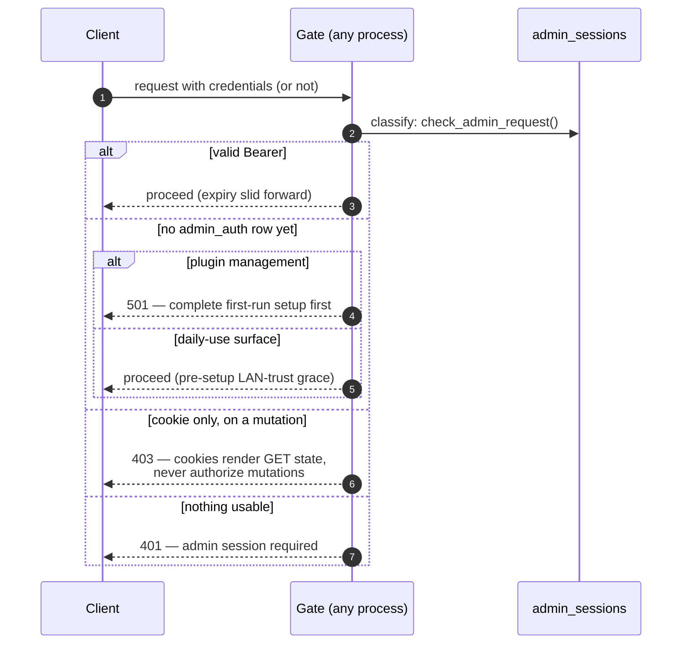

# Admin auth: setup, login, and gated requests

Domovoi's v1 admin model is deliberately small: **one admin password, claimed
on first run with a setup code that proves you own the server**, then bearer
tokens with a sliding expiry. It is shared by both processes — a token minted
by the web dashboard (:6369) authorizes gated routes on the core (:6370),
because both validate against the same `admin_auth` / `admin_sessions`
tables. Sources of truth: `domovoi/admin_auth.py`, `domovoi/auth.py`,
`web/backend/api/auth.py`. The broader posture is in
[../SECURITY_PRIVACY.md](../SECURITY_PRIVACY.md).

## First-run setup

```mermaid
sequenceDiagram
    autonumber
    participant Op as Operator
    participant C as Core :6370 (boot)
    participant FS as ~/.domovoi/setup-code.txt
    participant W as Web :6369
    participant PG as Postgres

    C->>PG: any admin_auth row?
    alt unclaimed
        C->>FS: write 8-word setup code (reused across restarts)
        C->>C: print the code to the console banner
    else claimed
        C->>FS: delete any stale code file
    end

    Op->>W: open dashboard → GET /api/auth/status
    W-->>Op: {setup_complete:false} → setup screen
    Op->>W: POST /api/auth/setup {setup_code, password}
    Note over W: same per-source backoff as login —<br/>a wrong code is never free; 409 once<br/>setup is already done
    W->>FS: constant-time compare against the file
    W->>PG: INSERT admin_auth (argon2id password hash)
    W->>PG: mint first session (label "setup")
    W->>FS: delete setup-code.txt
    W-->>Op: {token} + session cookie — logged in
```

The setup code is 8 words from a 256-word list (64 bits of entropy, plain
ASCII so it survives any console). Possessing it means you can read a file on
the server — that is the proof the claim step demands. `python -m
domovoi.main --reset-admin` clears the credential and all sessions and
regenerates the code.

## Login and the token model

```mermaid
sequenceDiagram
    autonumber
    participant U as Browser / Android
    participant W as Web :6369
    participant PG as Postgres

    U->>W: POST /api/auth/login {password, label}
    W->>W: per-source failed-login backoff<br/>(1 s doubling, 5 min cap → 429 + Retry-After)
    W->>PG: verify argon2id hash
    W->>PG: INSERT admin_sessions — 256-bit token,<br/>only its sha256 stored, expires in 30 days
    W-->>U: token (the only time it exists in the clear)<br/>+ SameSite=Strict cookie "domovoi_admin"
    Note over U: the cookie lets plain GET page loads render<br/>authenticated state; it NEVER authorizes a<br/>mutation — CSRF: a cross-site POST carries<br/>nothing that authorizes it
    U->>W: subsequent requests: Authorization: Bearer <token>
    W->>PG: sha256 lookup; sliding expiry refreshed on use
```

Sessions are listable and revocable (`GET /api/auth/sessions`,
`POST /api/auth/logout` revokes the calling session, Bearer-only), and the
password is changeable (`POST /api/auth/password`).

Deferred, documented hardening backlog for v1: TLS / fingerprint pinning and
satellite pairing tokens — v1 admin flows run over plain LAN HTTP.

## The three gates

Every protected endpoint uses one of three dependencies. They differ only in
what they accept and what happens **before setup has ever run**:

| Gate | Accepts | Pre-setup behavior | Used by |
|---|---|---|---|
| `require_admin` (`domovoi/auth.py`) | Bearer only | **Fails closed — 501 "auth not configured"** | Plugin management (install/confirm/enable/disable/uninstall/upgrade). Installing a plugin is code execution, so there is no grace period. Local dev uses the `domovoi plugin dev` CLI, which never crosses HTTP. |
| `require_admin_mutation` | Bearer only | LAN-trust grace (allowed) | Risky daily-use mutations (config writes, satellite ops, …) — a fresh clone works before setup, and the moment a password exists the gate is real. |
| `require_admin_read` | Bearer **or** cookie | LAN-trust grace | Gated GETs whose responses carry secrets (e.g. config reads) — the cookie may render state, never mutate. |



The same default-DENY stance extends to plugin HTTP routes: every non-GET
route a plugin mounts under `/v1/plugins/<slug>/…` requires an admin session
unless the plugin author explicitly opted the endpoint out — and every
opt-out is listed on the install preview
([plugin-lifecycle.md](plugin-lifecycle.md)).
