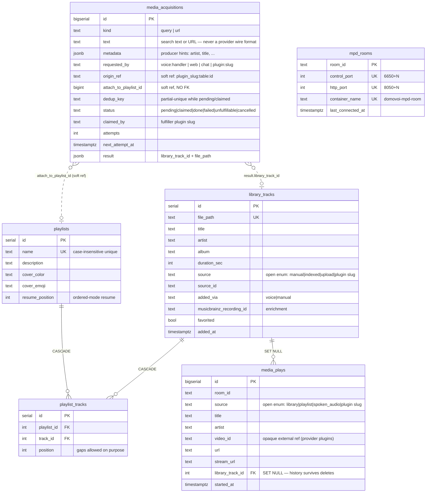
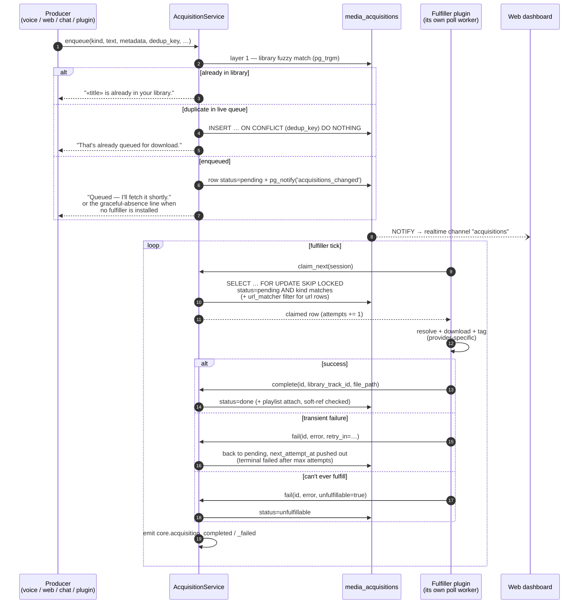

# Media: library, playlists, MPD, and the acquisition queue

How Domovoi stores music, plays it in a room, and obtains new media. Sources
of truth: `domovoi/db/migrations/V001__baseline.sql` (tables),
`domovoi/mpd_provisioner.py`, `domovoi/acquisitions.py`,
`domovoi/streaming.py` (the music handshake), `domovoi/now_playing.py`.

## Data model



Things the shapes encode deliberately:

* **Open enums.** `library_tracks.source` and `media_plays.source` carry no
  CHECK — provider plugins register their own slug in the in-process
  `registered_values` registry and stamp it without a core migration.
* **Soft refs across the acquisition boundary.** A queued acquisition may
  outlive the playlist it was meant to feed; `attach_to_playlist_id` has no
  FK, and the completion path re-checks the playlist and skips the attach
  with a log if it vanished.
* **History survives deletion.** `media_plays.library_track_id` is
  `ON DELETE SET NULL`, so "what played in the kitchen last night" keeps
  answering after a track is removed.
* **`mpd_rooms` is the provisioner's source of truth** — which room owns
  which host-port pair and container, surviving restarts. Port allocation is
  `max + 1` from the bases (control 6650, http-stream 8050), serialized by a
  Postgres advisory lock.

## Playing a song in a room

Every satellite room gets its own MPD daemon (docker container
`domovoi-mpd-<room>`, lazily created on the room's first WebSocket connect),
so queues, current track, and volume are independent per room. The Pi plays
music by pulling the room's MPD http stream with `mpg123`.

```mermaid
sequenceDiagram
    autonumber
    participant Pi as Satellite Pi
    participant S as Core (StreamSession)
    participant M as MusicHandler
    participant MPD as Room MPD container
    participant NP as Now-playing registry

    Pi->>S: "play <song>" (utterance frames)
    S->>M: route() → fast path (band 300, greedy ^play)
    Note over M: local library match first; a local miss<br/>cascades to a streaming-search-provider<br/>capability if one is installed
    M->>MPD: queue track, leave PAUSED against the<br/>always-on silence stream
    M->>NP: stamp(room, source, {stream_url, title})
    M-->>S: Response {music_action:"start",<br/>music_stream_url}
    S-->>Pi: response_start + TTS ("Playing …") + response_end
    S-->>Pi: music_start {stream_url}
    Note over S: arms the music_ready fallback timer<br/>(music_prepare_fallback_sec)
    Pi->>Pi: spawn mpg123, prime buffer against<br/>MPD's silence stream
    Pi->>S: music_ready
    S->>MPD: resume()
    Note over Pi: song frames land in an already-primed<br/>buffer — no first-second stutter.<br/>Satellites that never send music_ready<br/>still get music via the fallback resume.
    S->>S: record media_plays row (source, title, room)
```

Around that happy path:

* **Wake capture kills the Pi's player**, so after a non-music turn ("what
  time is it?" mid-song) the server auto-resends `music_start` from its
  `resumable_music` memory — unless the response carries `expect_followup`,
  in which case resume is suppressed for one turn so the player can't
  saturate the mic while the Pi listens for the reply.
* **"Stop"** sends `music_stop`, clears the room's resumable entry and its
  now-playing stamp.
* **The playback-state sweeper** (a core poll worker) clears now-playing
  stamps whose room's MPD no longer plays the stamped stream, so a stale
  card can't outlive reality.

## Acquiring media

"Get this into my library" is a durable queue, not an RPC — the full design
rationale is in
[../ARCHITECTURE.md](../ARCHITECTURE.md#media-acquisition-queue-domovoiacquisitionspy).



The bus events are the fast path; a plugin correlating completions back to
its own rows pairs the subscription with a periodic
`completed_for_origin(origin_ref_prefix=…)` reconciliation sweep — the bus is
latency, the sweep is truth.

The bundled [radio plugin](../../plugins/radio/) exercises the whole chain:
passive song detection on a tuned station enqueues `query`-kind acquisitions
with rich metadata, and its dashboard page rides the `acquisitions` realtime
channel.
