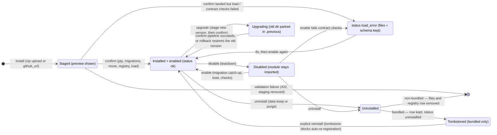

# Plugin lifecycle

How a plugin moves through install → enable → disable → upgrade → uninstall,
and what the two-phase install pipeline actually does. Source of truth:
`domovoi/plugins_runtime/installer.py`, `loader.py`, `registry.py`,
`migrations.py`. The plugin author's guide is
[../PLUGIN_DEVELOPMENT.md](../PLUGIN_DEVELOPMENT.md); the runtime's class
model is [plugins-runtime.md](plugins-runtime.md).

Every mutating endpoint below requires an admin Bearer session
(`domovoi.auth.require_admin`) and **fails closed with 501 until first-run
setup has created an admin password** — installing a plugin is code
execution, so there is no pre-setup grace here (see [auth.md](auth.md)).
Local development uses the `domovoi plugin dev` CLI instead, which never
crosses HTTP.

## States

A plugin's persisted state lives in the `plugins` registry table: `enabled`
(bool) + `status` (`ok` | `degraded` | `load_error` | `uninstalled`) +
`install_source` (`bundled` | `zip` | `github` | `dev`). Every mutation fires
`pg_notify('plugins_changed', <slug>)` in the same transaction, which is how
the dashboard updates live.



The lifecycle endpoints, verbatim from `installer.py`:
`POST /v1/plugins/install` (stage), `POST /v1/plugins/install/{staged_id}/confirm`,
`POST /v1/plugins/{slug}/enable`, `POST /v1/plugins/{slug}/disable`,
`POST /v1/plugins/{slug}/uninstall` (body `{"data": "keep"|"purge"}`),
`POST /v1/plugins/{slug}/upgrade` (stages; confirmed via the shared confirm
endpoint).

Uninstall takes a data policy: **`keep`** (default) leaves the
`plugin_<slug>` Postgres schema and `~/.domovoi/plugins/data/<slug>/` in
place — a later reinstall runs migration *catch-up* against the kept schema —
while **`purge`** drops the schema and deletes the data dir. Pinned Python
dependencies are pip-uninstalled only if this plugin newly installed them and
no other installed plugin declares the same distribution.

## The two-phase install pipeline

Two phases so the trust warning is unskippable: **stage** validates
everything and returns a preview; nothing irreversible happens until
**confirm**. A GitHub URL install downloads the repo zip (size-capped,
streaming) and funnels into the same pipeline.

```mermaid
sequenceDiagram
    autonumber
    participant U as Admin (dashboard)
    participant API as Core :6370<br/>plugins-admin router
    participant ST as Stage (Phase A)
    participant PG as Postgres
    participant L as Loader

    U->>API: POST /v1/plugins/install (zip or {github_url})
    API->>ST: stage_zip(data)
    Note over ST: zip safety: entry/size caps, no symlinks,<br/>no absolute paths / "..", reserved names
    Note over ST: parse + validate domovoi-plugin.toml<br/>and directory layout
    Note over ST: SQL-lint every migration file<br/>(no CREATE SCHEMA/EXTENSION, no public. DDL,<br/>no foreign plugin_* refs)
    Note over ST: web-entry import hygiene (AST tripwire:<br/>webkit + stdlib + declared deps only)
    ST->>PG: slug collision / orphan-schema check
    Note over ST: pip dry-run in a throwaway subprocess<br/>(--require-hashes --only-binary=:all: —<br/>no build backend runs before the trust screen)
    Note over ST: sha256-hash the staged tree; 128-bit staged_id
    API-->>U: {staged_id, preview}
    Note over U: preview shows publisher, permissions +<br/>warnings, requirements (direct + transitive),<br/>handlers/bands, migration count,<br/>and the trust statement

    U->>API: POST /v1/plugins/install/{staged_id}/confirm
    API->>ST: re-hash staged tree (TOCTOU close) — abort if changed
    API->>API: real pip install (pinned + hashed lockfile)
    API->>PG: apply plugin migrations — prod then _test<br/>(fresh install: both-or-neither)
    API->>API: move staging → ~/.domovoi/plugins/installed/{slug}
    API->>PG: registry insert (or bundled-tombstone revival)<br/>+ pg_notify('plugins_changed')
    API->>L: load_plugin(slug, dir, manifest)
    Note over L: import entry module, register(ctx),<br/>run install-time contract checks<br/>(manifest ↔ code cross-check)
    L-->>API: ok — or load_error (kept for inspection,<br/>enabled=false, NOT rolled back)
    API->>API: chat-tool resync (non-fatal)
    API-->>U: {installed:true, loaded:true, status:"ok"}
```

**Rollback matrix, in one sentence each:** any failure through the
registry-insert step rolls back everything it did (delete registry row,
remove moved files, drop the schema *only if it was brand new this install* —
a kept schema from an earlier `keep` uninstall carries user data and always
survives — and pip-uninstall newly installed dists). A failure at the load /
contract-check step does **not** roll back: the plugin lands as
`status="load_error"`, disabled, files and schema kept for inspection.

## Enable, disable, upgrade

* **Enable** re-runs migration catch-up on both DBs (a newer version may have
  been copied in while disabled), sets `enabled=true`, loads, and re-runs
  contract checks. A load failure leaves `status="load_error"`.
* **Disable** unloads (full teardown of handlers, workers, subscriptions,
  capabilities, mounted routes → 404) and sets `enabled=false`. **Python
  modules are never truly unloaded** — enable re-runs `register()` against a
  fresh context, but *code changes need a core restart*. The dev loop for
  that is `domovoi plugin dev`.
* **Upgrade** is the same two-phase flow (`POST /v1/plugins/{slug}/upgrade`
  stages; the shared confirm endpoint commits). Guards:
  * same slug required; same version refused;
  * **downgrades** need `force=true` — and are refused outright, force or
    not, if the migration ledger is ahead of what the older version ships
    (migrations never run backwards);
  * on a failed upgrade the old install dir (parked in
    `~/.domovoi/plugins/.previous/`), registry row, and — if it was enabled —
    the running old version are restored. Migrations that already applied
    **stay applied**, logged loudly: a plugin's previous version must be
    one-version backward compatible with its own schema.
* **Dev-mode plugins** (`install_source="dev"`) refuse the upgrade endpoint —
  just restart the core.

Bundled plugins (like `plugins/radio`, publisher Coders Farm) auto-register
at boot from the repo's `plugins/` directory — unless a tombstone row says
the user uninstalled them, which sticks until an explicit reinstall.
