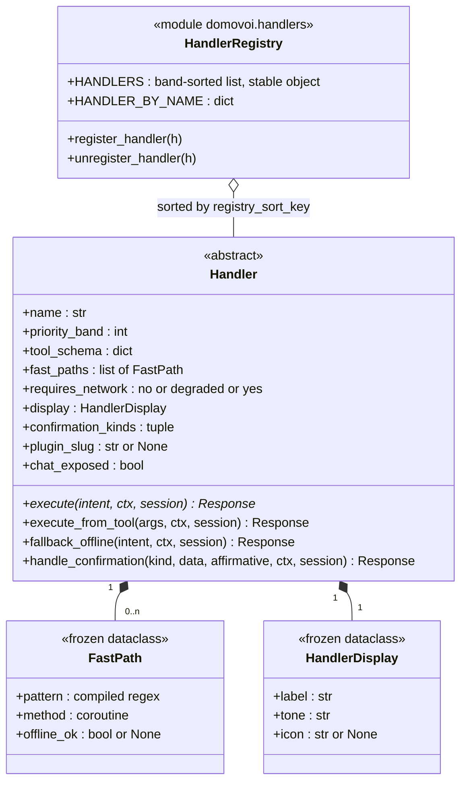
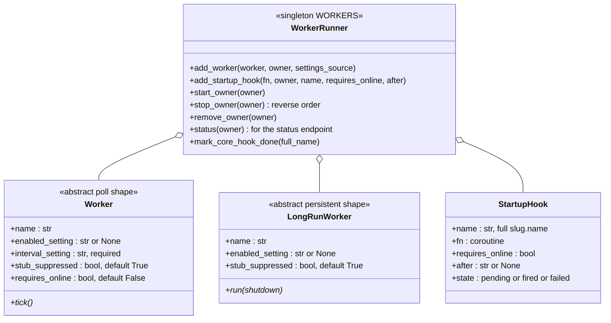
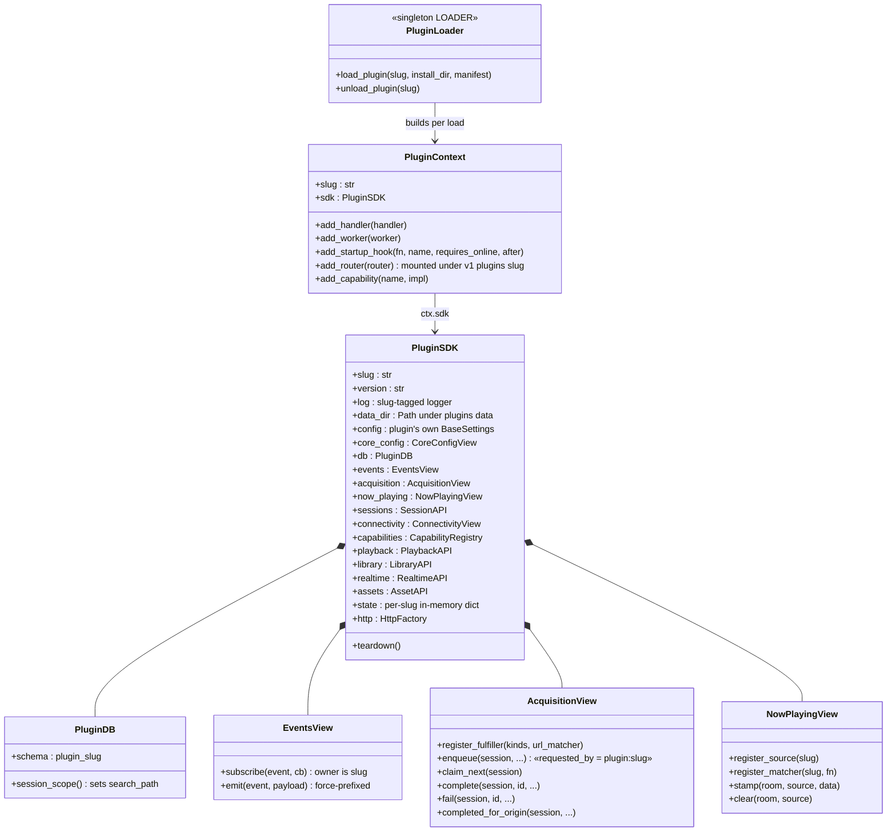

# Plugin runtime: the class model

The types a plugin author actually touches, and the core singletons behind
them. Sources of truth: `domovoi/handlers/base.py`, `domovoi/workers/base.py`,
`domovoi/plugins_runtime/workers.py`, `domovoi/plugins_runtime/loader.py`,
`domovoi/sdk/facade.py`. The lifecycle those classes live inside is
[plugin-lifecycle.md](plugin-lifecycle.md); the walkthrough for authors is
[../PLUGIN_DEVELOPMENT.md](../PLUGIN_DEVELOPMENT.md).

## Handlers — the voice plane

Core and plugin handlers implement the exact same ABC. Dispatch order is
ascending `priority_band` with a deterministic tie-break
(core-before-plugin, then plugin slug, then name) — never registration order.

Contract notes, all enforced by tests or install-time contract checks:

* `name` is a **stable identifier** — it lands in `intents_log` /
  `conversation_log` and must never be renamed cosmetically; `display.label`
  is the thing you rename.
* `priority_band` is required, no default. Plugins may use 100–999; any
  unanchored `(.+)$` fast path must sit in 900–999.
* `offline_ok` on a `FastPath` is only meaningful for
  `requires_network="degraded"` handlers (`None` = works offline; `False` =
  auto-fallback offline). For `"no"`/`"yes"` handlers it must stay `None`.
* `confirmation_kinds` are namespaced (`core.<kind>` / `<slug>.<kind>`); the
  mediated pending API (`domovoi/confirmations.py`) refuses to park a kind
  the handler doesn't declare, and the router re-checks at dispatch.
* `chat_exposed` opts a handler's tool into conversational chat mode via the
  Letta proxy-tool bridge (requires a usable `tool_schema` +
  `execute_from_tool`).

## Workers — the background plane

The runner owns everything a worker author would otherwise get wrong once:
the `asyncio.wait_for(stop.wait(), interval)` poll loop (interval re-read
from settings every tick, so 'hot' config edits apply live), catching a
raising `tick()` without killing the loop, the long-run crash policy
(restart with 1 s → 60 s exponential backoff, reset after 10 minutes
healthy), reverse-order shutdown, `USE_STUBS` suppression, and
connectivity-gated startup hooks (fire on the first
`core.connectivity_changed → online` if offline at boot).

## The SDK facade and the loader

A plugin's `register(ctx)` receives a `PluginContext`; the SDK facade hangs
off it as `ctx.sdk`. Everything registered through either is recorded against
the slug — that is what makes disable/uninstall a clean teardown.

Behind the views sit the process-wide singletons: `EVENTS` (the bus),
`CAPABILITIES` (capability registry), `ACQUISITIONS` (the acquisition
service), `NOW_PLAYING` (now-playing registry), `WORKERS` (worker runner) —
all described in [../ARCHITECTURE.md](../ARCHITECTURE.md#6-the-extension-seams).

Loader guarantees worth naming:

* **Import order:** `load_plugin` asserts `bootstrap.dlls_registered` before
  importing any plugin module — the Windows NVIDIA-DLL bootstrap must have
  run first, and a startup refactor that breaks that fails loudly at boot.
* **Contract checks at load** (`domovoi/plugins_runtime/contracts.py`): the
  manifest is a *cross-checked declaration* — code is authoritative, drift
  fails the load. Checks cover handler validity (bands in range, greedy
  unanchored patterns only in 900+), manifest ↔ registered-code drift
  (handlers, workers, capabilities), `consumes` satisfaction, a dry-run of
  the core collision corpus ("what time is it" must still route to `clock`
  after your plugin registers), and an import-time budget (< 10 s, plus a
  best-effort "don't initialize CUDA at import" check).
* **HTTP mounting:** plugin routers mount at `/v1/plugins/<slug>/…` behind an
  enable gate (disabled ⇒ 404, router object reused on re-enable) and a
  default-DENY auth gate — every non-GET route requires an admin session
  unless the author opted out with `@open_endpoint` (each opt-out is listed
  on the install preview).
* **Teardown** (`unload_plugin` → `PluginSDK.teardown()` + owner-keyed
  deregistration): handlers out of the registry, workers stopped in reverse
  order, event subscriptions dropped, capabilities and now-playing sources
  (and live stamps) unregistered, open-enum values released, routes gated
  off. Python modules stay imported — code changes need a core restart.
