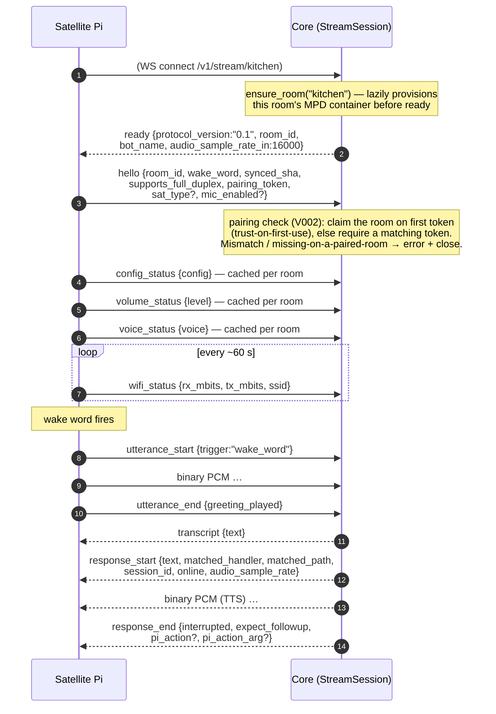

# Satellite wire protocol (v0.1)

The satellite ↔ core contract on `WS /v1/stream/{room_id}` — bidirectional,
mixed text (JSON control frames) + binary (raw PCM). This page mirrors the
authoritative contract comment at the top of `domovoi/streaming.py`; if the
two ever disagree, the code comment wins.

**Audio format, both directions:** 16 kHz mono int16 little-endian PCM for
capture. The server declares the actual TTS sample rate per response in
`response_start` (edge ≈ 24 kHz, piper ≈ 22 kHz, system varies); clients
resample if their playback device can't take it directly.

**Ownership:** the Pi owns wake-word detection, VAD, noise gate, and barge-in
detection. The server owns STT, intent routing, TTS, and the response
lifecycle.

## Connect and a normal turn



## Client → server frames

| Frame | Payload | Meaning |
|---|---|---|
| `hello` | `room_id`, `wake_word`, `synced_sha`, `supports_full_duplex`, `pairing_token`, `sat_type?`, `mic_enabled?` | First frame after connect. `supports_full_duplex` reports on-chip AEC (XVF3800 true, 2-Mic HAT false) — the server refuses drop-ins for rooms that can't capture while playing. `synced_sha` is the code-version label from the Pi's last satellite-code sync, used to flag out-of-date satellites on the dashboard. `pairing_token` (optional) is the Pi's per-device WS-auth secret (`~/.domovoi/pairing_token`); the server stores only its sha256 and binds the room to it **trust-on-first-use** — see [Pairing (WS auth)](#pairing-ws-auth) below. `sat_type` (optional, `"voice"`\|`"video"`, default voice) declares the satellite kind; when explicitly present it's also persisted to the `satellites` table so offline rooms keep their type. `mic_enabled` (optional, default true) reports whether the voice-input stack runs — false on mic-less video builds; the server then refuses wake-recording/drop-in/chat for the room. |
| `utterance_start` | `trigger: "wake_word" \| "barge_in" \| "push_to_talk" \| "followup" \| "wake_clip"` | Begins an utterance; cancels any in-flight response. `wake_clip` marks a wake-word **training clip** (dashboard-initiated recording mode): the following PCM is saved as a positive clip WAV, never transcribed or routed. |
| `utterance_end` | `greeting_played` | Ends the utterance; the server transcribes and routes (or saves the clip). `greeting_played` tells the server to strip a wake greeting that bled past the AEC. |
| `barge_in` | — | Sent during TTS playback; cancels the in-flight response task. |
| `noisy_capture` | — | The Pi's noise-gate auto-tune found the capture unusably loud and bailed. The server answers with a stock apology TTS instead of transcribing. |
| `wifi_status` | `rx_mbits`, `tx_mbits`, `ssid` | Periodic link-rate self-report (60 s default), cached per room for the "how's your wifi?" diagnostic. |
| `volume_status` | `level` (0–100) | Current hardware output volume, on connect and after each `set_volume`. Lets relative "turn it up" work against the real level. |
| `voice_status` | `voice` | Which registered voice this room speaks in, on connect and after `set_voice`. |
| `config_status` | `config` (flat `section.key` map) | The Pi's effective editable config, on connect — feeds the dashboard's per-satellite Settings tab. Cleared on disconnect. |
| `display_status` | `on`, `kiosk_alive`, `brightness` (0–100 \| null), `idle_mode` | **Video satellites only.** Screen power state, kiosk-browser liveness, backlight percent (null when the hardware exposes none), and the configured idle behavior. Sent after connect, after each applied `set_display`, and when the kiosk watcher observes a liveness flip. Cached per room; cleared on disconnect. |
| `music_ready` | — | The Pi's player subprocess has primed against MPD's always-on silence stream; the server resumes MPD so song frames land in a primed buffer (kills the first-second stutter). Older satellites that never send it still get music via a fallback timer. |
| `dropin_end` | — | Pi-side end of an active drop-in call (hardware button / client hang-up). The *spoken* "hang up" instead routes as a normal utterance. |
| `chat_end` | — | Pi-side exit of conversational chat mode (e.g. a non-AEC board refusing `chat_start`). Clears the mode server-side. |
| `ping` | — | Keep-alive probe; answered with `pong`. |
| *binary* | raw PCM | Normally meaningful only between `utterance_start`/`utterance_end`. **During a drop-in** the Pi streams every mic frame continuously (no framing) and the server relays each frame verbatim to the peer room — except while an utterance is active (a mid-call wake command like "hang up"), which is captured for STT instead. |

## Server → client frames

| Frame | Payload | Meaning |
|---|---|---|
| `ready` | `protocol_version:"0.1"`, `room_id`, `bot_name`, `audio_sample_rate_in:16000` | Handshake complete. |
| `transcript` | `text` | What Whisper heard, before routing. |
| `response_start` | `text`, `matched_handler`, `matched_path`, `session_id`, `online`, `audio_sample_rate` | A spoken response begins; PCM follows at the announced rate. |
| `response_end` | `interrupted`, `expect_followup`, `pi_action?`, `pi_action_arg?` | Response finished (or was cut off). `expect_followup` asks the Pi to capture the user's reply without a fresh wake word. `pi_action` requests a Pi-local side effect after playback drains: `reassociate_wifi`, `set_voice` (arg = voice name), or `restart`. |
| `set_volume` | `level` (0–100) | Set the Pi's hardware output volume. Sent **before** `response_start` so the spoken confirmation plays at the new level. Scales both TTS and music. |
| `music_start` | `stream_url` | Start the Pi's music player against the room's MPD http stream. Arms the `music_ready` handshake. |
| `music_stop` | — | Stop music playback. |
| `sounds_changed` | — | Greeting/canned clips were re-rendered; the Pi re-syncs its sound cache. |
| `start_wake_recording` | `wake_word_id`, `slug`, `clip_seconds`, `target_count` | Enter wake-word clip-recording mode: suspend the wake loop, capture positive clips framed with `trigger:"wake_clip"`. |
| `stop_wake_recording` | — | Leave clip-recording mode early (dashboard Stop). |
| `set_wake_word` | `slug` | Push a trained model: the Pi writes the slug to its wake sidecar (`~/.domovoi/wake`), syncs the model from `/v1/wake-models`, and self-restarts. The slug is simultaneously the model file stem, the effective wake word, and the openWakeWord prediction key. |
| `wake_models_changed` | — | Served wake models changed; the Pi re-syncs its `~/.domovoi/wake_models` cache. |
| `set_config` | `changes` (flat `section.key` map) | Push dashboard-edited config: the Pi merges into `config.toml` (preserving comments), validates, writes a `.bak`, and self-restarts. |
| `set_display` | `action: "on" \| "off" \| "restart_kiosk"` | **Video satellites only** (the admin endpoint refuses other rooms with `409`). Switch the panel's power via the configured `[display] power_method` (wlopm → xset → backlight under `auto`), or bounce `domovoi-kiosk.service`. The Pi applies and re-reports via `display_status`. |
| `restart` | — | Ask the satellite to restart its own systemd service (`domovoi-satellite.service`), draining TTS playback first. |
| `upgrade` | `expected_sha`, `manifest_path`, `files_base`, `reconnect_timeout_sec` | Self-serve code sync: tarball the current tree (rollback backup), mirror the manifest (per-file sha256 verification), record `expected_sha`, restart. If the Pi doesn't reconnect within the timeout, its on-Pi watchdog rolls back to the tarball. |
| `dropin_start` | `peer_room`, `peer_label`, `audio_sample_rate:16000`, `full_duplex` | Enter open-mic mode: stream every mic frame (unframed) for relay and play inbound binary PCM straight through at **16 kHz** (not the last TTS rate). The wake loop keeps running so "hang up" works. |
| `dropin_end` | `reason` | Exit open-mic mode; restore the wake loop and any suppressed music. |
| `chat_start` | — | Enter conversational chat mode: the Pi loops normal STT→reply turns **without re-waking** between them. No peer relay — each utterance routes to the Letta agent. Requires an AEC board; a non-AEC Pi must refuse (send `chat_end`). |
| `chat_end` | `reason` | Exit chat mode; restore the wake loop. |
| `error` | `message`, `reason?` | Something went wrong; paired with a terminal `response_end` when a response task fails so the Pi's mic never stays parked. Carries `reason:"pairing_rejected"` when the `hello` pairing check refuses the connection (the socket is then closed). |
| `pong` | — | Reply to `ping`. |
| *binary* | raw PCM | TTS audio at `audio_sample_rate`. During a drop-in: live 16 kHz relay audio from the peer room. |

> `music_start` / `music_stop` are emitted by the music-coordination code
> (`domovoi/streaming.py`, post-response) rather than listed in the module's
> header contract comment — they are part of the live protocol all the same.

## Drop-in (open-mic relay) lifecycle

```mermaid
sequenceDiagram
    participant A as Pi A (initiator)
    participant S as Core
    participant B as Pi B (target)

    A->>S: "drop in on the office" (normal routed utterance)
    Note over S: DropInHandler pairs the two StreamSessions,<br/>writes a dropin_calls audit row.<br/>Refused if either room lacks AEC<br/>(supports_full_duplex=false).
    S-->>A: dropin_start {peer_room:"office", audio_sample_rate:16000}
    S-->>B: dropin_start {peer_room:"kitchen", …}
    par continuous relay
        A->>S: binary mic PCM (unframed)
        S-->>B: relayed verbatim
    and the other direction
        B->>S: binary mic PCM
        S-->>A: relayed
    end
    Note over S: near-silent frames are gated (relay noise gate)<br/>and don't reset the silence-timeout watchdog.<br/>Relayed audio is NEVER persisted.
    A->>S: utterance_start … "hang up" … utterance_end
    Note over S: a mid-call wake command is captured for STT<br/>instead of relayed; DropInHandler ends the call
    S-->>A: dropin_end {reason}
    S-->>B: dropin_end {reason}
```

## Connection lifecycle notes

* **Keep-alives:** uvicorn pings each Pi every 10 s (5 s pong timeout), so a
  silently dead WS surfaces as a disconnect within ~15 s and the stale
  session is evicted.
* **One session per room:** a second connect for the same `room_id`
  overwrites the first (reconnects stay functional; only the newest
  connection receives broadcasts). Cached per-room state (wifi, volume,
  voice, config, AEC flag, synced SHA) is cleared on disconnect and
  re-reported on reconnect.
* **MPD provisioning** happens before `ready` so the first music command
  can't race a slow first-boot `docker run`. Failures are non-fatal — the
  room just has no music until fixed.

## Pairing (WS auth)

The `hello` frame's optional `pairing_token` authenticates *which device is
this room* (V002), closing the hole where any LAN host could connect as an
existing room and be treated as its satellite. The model is **lenient
trust-on-first-use**; the server stores only the token's sha256 (in
`satellite_pairings`) and applies five cases when a `hello` is processed:

| `hello` presents | server has | outcome |
|---|---|---|
| a token | no pairing row | **PAIR** — claim the room for this token, accept |
| a token | matching hash | accept, bump `last_seen_at` |
| a token | a different hash | **REFUSE** — `error{reason:"pairing_rejected"}`, close |
| no token | a pairing row | **REFUSE** — a paired room requires its token |
| no token | no pairing row | accept (older/unpaired) unless `SATELLITE_PAIRING_STRICT` |

`SATELLITE_PAIRING_STRICT` (default `false`) turns the last row into a
refusal — a token is then required for **every** room. A refusal sends the
error frame (if the socket is still open) and closes the connection without
provisioning or relaying anything. Resetting a room's pairing (admin-gated
`DELETE /v1/admin/satellites/{room_id}/pairing`) deletes the row so the next
connect re-pairs — needed after re-flashing a Pi or moving a room to new
hardware. Full model + the first-connect race caveat:
[../SECURITY_PRIVACY.md](../SECURITY_PRIVACY.md#satellite-pairing-ws-auth).

See [voice-turn.md](voice-turn.md) for what happens between `utterance_end`
and `response_start`, and [../SATELLITE_HARDWARE.md](../SATELLITE_HARDWARE.md)
for the supported boards.
