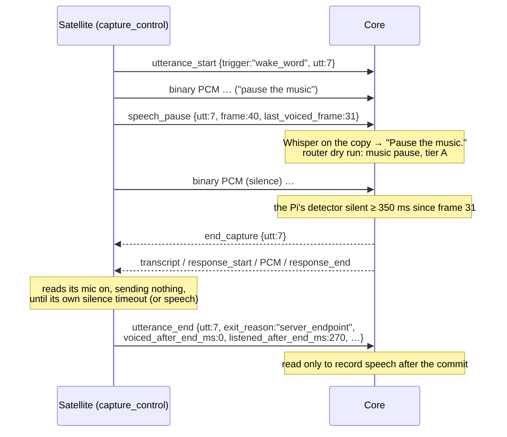

# Satellite wire protocol (v0.1)

The satellite ↔ core contract on `WS /v1/stream/{room_id}` — bidirectional,
mixed text (JSON control frames) + binary (raw PCM). This page mirrors the
authoritative contract comment at the top of `domovoi/streaming.py`; if the
two ever disagree, the code comment wins.

**Audio format, both directions:** 16 kHz mono int16 little-endian PCM for
capture. The server declares the actual TTS sample rate per response in
`response_start` (edge ≈ 24 kHz, piper ≈ 22 kHz, system varies); clients
resample if their playback device can't take it directly.

**Ownership:** the Pi owns wake-word detection, VAD, noise gate, and barge-in
detection. The server owns STT, intent routing, TTS, and the response
lifecycle.

## Connect and a normal turn

```mermaid
sequenceDiagram
    autonumber
    participant Pi as Satellite Pi
    participant S as Core (StreamSession)

    Pi->>S: (WS connect /v1/stream/kitchen)
    Note over S: hello gate — nothing is provisioned, registered<br/>or acknowledged until an accepted hello arrives;<br/>no hello within SATELLITE_HELLO_TIMEOUT_SEC (5 s) → close
    Pi->>S: hello {room_id, wake_word, synced_sha,<br/>supports_full_duplex, pairing_token,<br/>sat_type?, mic_enabled?, speech_pause?,<br/>capture_control?, announce_after_session_end?}
    Note over S: pairing check (V002): claim the room on first token<br/>(trust-on-first-use), else require a matching token.<br/>Mismatch / missing-on-a-paired-room → error + close.
    Note over S: ensure_room("kitchen") — lazily provisions<br/>this room's MPD container, then registers the session
    S-->>Pi: ready {protocol_version:"0.1", room_id,<br/>bot_name, audio_sample_rate_in:16000, features}
    Pi->>S: config_status {config}          — cached per room
    Pi->>S: volume_status {level}           — cached per room
    Pi->>S: voice_status {voice}            — cached per room

    loop every ~60 s
        Pi->>S: wifi_status {rx_mbits, tx_mbits, ssid}
    end

    Note over Pi: wake word fires
    Note over Pi: acknowledge ([wake] ack_mode): greeting or chime<br/>plays to the end, mic audio under it dropped
    Pi->>S: utterance_start {trigger:"wake_word", utt}
    Pi->>S: binary PCM …
    Pi->>S: speech_pause {utt, frame, last_voiced_frame} (features only)
    Note over S: copy the buffer, start Whisper on it<br/>(then the voice embedding)
    Pi->>S: binary PCM (the rest of the silence) …
    Pi->>S: utterance_end {greeting_played, greeting_clip, ack_before_capture,<br/>utt, frames, last_voiced_frame, exit_reason, voiced_frames, ...}
    Note over S: last voiced frame inside the copy → use its transcript,<br/>otherwise transcribe the whole buffer
    S-->>Pi: transcript {text}
    S-->>Pi: response_start {text, matched_handler, matched_path,<br/>session_id, online, audio_sample_rate}
    S-->>Pi: binary PCM (TTS) …
    S-->>Pi: response_end {interrupted, expect_followup,<br/>pi_action?, pi_action_arg?}
```

## Client → server frames

| Frame | Payload | Meaning |
|---|---|---|
| `hello` | `room_id`, `wake_word`, `synced_sha`, `supports_full_duplex`, `pairing_token`, `sat_type?`, `mic_enabled?` | **Must be the first frame.** The server creates and sends nothing for the room — no MPD provisioning, no `active_sessions` entry, no `ready` — until a `hello` has passed the pairing check; a socket that sends no `hello` within `SATELLITE_HELLO_TIMEOUT_SEC` (default 5 s), or sends any other frame first (`error{reason:"hello_required"}`), is closed with code 1008 and leaves no room behind. `supports_full_duplex` reports on-chip AEC (XVF3800 true, 2-Mic HAT false) — the server refuses drop-ins for rooms that can't capture while playing. `synced_sha` is the code-version label from the Pi's last satellite-code sync, used to flag out-of-date satellites on the dashboard. `pairing_token` (optional) is the Pi's per-device WS-auth secret (`~/.domovoi/pairing_token`); the server stores only its sha256 and binds the room to it **trust-on-first-use** — see [Pairing (WS auth)](#pairing-ws-auth) below. `sat_type` (optional, `"voice"`\|`"video"`, default voice) declares the satellite kind; when explicitly present it's also persisted to the `satellites` table so offline rooms keep their type. `mic_enabled` (optional, default true) reports whether the voice-input stack runs — false on mic-less video builds; the server then refuses wake-recording/drop-in/chat for the room. `speech_pause` (optional, default false) says this client reports its own pauses (`speech_pause` / `speech_resume`) and each capture's last voiced frame whenever `ready.features` lists `"speech_pause"`; the server then uses those instead of judging pauses from the audio. `capture_control` (optional, default false) says this client stops a capture on `end_capture` — only then is it ever ended early ([Early commit](#early-commit)); a Pi sends its `[listen] early_commit` setting here. `announce_after_session_end` (optional, default false) says a `response_start` clears the client's barge-in drop (`stop_playback`), so an announcement that arrives after a reconnect or a failed turn plays; the server cannot hear whether audio played, so for a client without it (satellite code from before 06f486b) it logs one WARNING per connection that timer and reminder announcements there will be silent until the satellite is upgraded. |
| `utterance_start` | `trigger: "wake_word" \| "barge_in" \| "push_to_talk" \| "followup" \| "wake_clip"`, `utt?`, `backlog_ms?`, `wake_ms?` | Begins an utterance; cancels any in-flight response. `backlog_ms` / `wake_ms`: the [capture clock](#the-capture-clock). `wake_clip` marks a wake-word **training clip** (dashboard-initiated recording mode): the following PCM is saved as a positive clip WAV, never transcribed or routed. `utt` (optional) is the client's own number for this capture, increasing per connection; the capture's hints and its `utterance_end` repeat it, so a message about an older capture is recognisably stale. |
| `utterance_end` | `greeting_played`, `greeting_clip?`, `ack_before_capture?`, `utt?`, `frames?`, `last_voiced_frame?`, `exit_reason?`, `voiced_frames?`, `trailing_silent_frames?`, `silence_limit_frames?`, `sat_ms?`, `backlog_ms?` | Ends the utterance; the server transcribes and routes (or saves the clip). `greeting_played` tells the server to strip a wake greeting that bled past the AEC, and to drop a turn whose transcript is nothing but that greeting. `greeting_clip` (optional, sent with `greeting_played`) names the clip that played (`greet_<hash>.mp3`), so the server matches only that line; without it the whole enabled greeting bank is used. `ack_before_capture` (optional, sent only as `true`) says the wake acknowledgement — greeting or chime — played to its end BEFORE this capture opened, and the Pi dropped what its mic heard meanwhile (see [The wake acknowledgement](#the-wake-acknowledgement)): the server still strips a leading greeting copy (the safety net for an echo tail) but never drops the turn as greeting-only, since such a capture cannot hold the whole greeting. `frames` (30 ms frames this capture sent), `last_voiced_frame` (0-based index of the last one the Pi's detector called speech) and `exit_reason` (`vad_silence_after_speech` \| `max_record_seconds` \| `shutdown` \| `server_endpoint`) let the server tell exactly whether a transcript it started at a pause covers everything said (see [Speculative transcription](#speculative-transcription)). An older satellite, which plays the greeting over its capture, may also send `no_speech_after_greeting`: a capture that heard voice only under the greeting and then waited out its `[greeting] reply_wait`, with a null `last_voiced_frame`. `voiced_frames`, `trailing_silent_frames` (the silent run it ended on) and `silence_limit_frames` (the run that ends one) complete the counts. Numbers only; with the reason, the core keeps them solely in the sidecar of an **opted-in room's command recording** (see SECURITY_PRIVACY.md). On a `server_endpoint` exit a satellite from 2026-09-30 on adds `voiced_after_end_ms` and `listened_after_end_ms`: it kept reading its mic, sending nothing, until its own silence timeout would have ended the capture (or the reply's audio may be playing), and says when speech came back after its last frame (0: it didn't) and how long it listened — see [Early commit](#early-commit). An older server ignores them all: they are new fields on an existing frame, which is safe both ways. A new frame TYPE would not be: an older core answers an unknown type with `error`, which the satellite treats as the end of the turn. |
| `speech_pause` | `utt`, `frame`, `last_voiced_frame`, `greeting_played`, `greeting_clip?`, `ack_before_capture?`, `sat_ms?`, `backlog_ms?` | **Only when `ready.features` lists `"speech_pause"`.** The capture has had 8 silent frames (240 ms; the Pi's `[listen] speech_pause_ms`, 90-600 in whole frames) after speech: `frame` is how many frames it has sent, `last_voiced_frame` the last voiced one. Once per silence run. The server may start transcribing. `greeting_played` / `greeting_clip` / `ack_before_capture` as in `utterance_end`: the early-commit check screens the copy for the greeting the way the turn will. |
| `speech_resume` | `utt`, `frame`, `sat_ms?`, `backlog_ms?` | **Only when `ready.features` lists `"speech_pause"`.** Speech came back after a reported pause. Sent *before* the audio of the frame that resumed it (`frame` is the frames sent before it), so every frame the server receives while a pause stands is one the Pi called silence — the early-commit hold is counted on exactly that. |
| `barge_in` | — | Sent during TTS playback; cancels the in-flight response task. |
| `noisy_capture` | — | The Pi's noise-gate auto-tune found the capture unusably loud and bailed. The server answers with a stock apology TTS instead of transcribing. |
| `wifi_status` | `rx_mbits`, `tx_mbits`, `ssid` | Periodic link-rate self-report (60 s default), cached per room for the "how's your wifi?" diagnostic. |
| `volume_status` | `level` (0–100) | Current hardware output volume, on connect and after each `set_volume`. Lets relative "turn it up" work against the real level. |
| `voice_status` | `voice` | Which registered voice this room speaks in, on connect and after `set_voice`. |
| `config_status` | `config` (flat `section.key` map) | The Pi's effective editable config, on connect — feeds the dashboard's per-satellite Settings tab. Cleared on disconnect. |
| `display_status` | `on`, `kiosk_alive`, `brightness` (0–100 \| null), `idle_mode` | **Video satellites only.** Screen power state, kiosk-browser liveness, backlight percent (null when the hardware exposes none), and the configured idle behavior. Sent after connect, after each applied `set_display`, and when the kiosk watcher observes a liveness flip. Cached per room; cleared on disconnect. |
| `music_ready` | — | The Pi's player subprocess has primed against MPD's always-on silence stream; the server resumes MPD so song frames land in a primed buffer (kills the first-second stutter). Older satellites that never send it still get music via a fallback timer. |
| `dropin_end` | — | Pi-side end of an active drop-in call (hardware button / client hang-up). The *spoken* "hang up" instead routes as a normal utterance. |
| `chat_end` | — | Pi-side exit of conversational chat mode (e.g. a non-AEC board refusing `chat_start`). Clears the mode server-side. |
| `ping` | — | Keep-alive probe; answered with `pong`. |
| *binary* | raw PCM | Normally meaningful only between `utterance_start`/`utterance_end`. **During a drop-in** the Pi streams every mic frame continuously (no framing) and the server relays each frame verbatim to the peer room — except while an utterance is active (a mid-call wake command like "hang up"), which is captured for STT instead. |

## Server → client frames

| Frame | Payload | Meaning |
|---|---|---|
| `ready` | `protocol_version:"0.1"`, `room_id`, `bot_name`, `audio_sample_rate_in:16000`, `features` | Handshake complete — sent only **after** the `hello` passed the pairing check and the room's MPD daemon was provisioned. A socket that never says `hello` never receives it. `features` lists the message types this server understands beyond 0.1 (`["speech_pause", "end_capture"]`); see [Adding to the protocol](#adding-to-the-protocol). |
| `end_capture` | `utt` | **Only to a client whose `hello` declared `capture_control`.** Stop the capture numbered `utt` now: the server has heard a whole command and is answering it ([Early commit](#early-commit)). A client ignores one whose `utt` is not the capture it is running — a late `end_capture` must not end the next (follow-up) capture. It still sends `utterance_end` with `exit_reason:"server_endpoint"`, which the server reads only to record speech that came after it stopped listening (a client from 2026-09-30 on listens on for that first, sending nothing), and it skips the noisy-capture check on that exit. An older satellite ignores the type. |
| `transcript` | `text` | What Whisper heard, before routing. |
| `response_start` | `text`, `matched_handler`, `matched_path`, `session_id`, `online`, `audio_sample_rate` | A spoken response begins; PCM follows at the announced rate. |
| `response_end` | `interrupted`, `expect_followup`, `pi_action?`, `pi_action_arg?` | Response finished (or was cut off). `expect_followup` asks the Pi to capture the user's reply without a fresh wake word. `pi_action` requests a Pi-local side effect after playback drains: `reassociate_wifi`, `set_voice` (arg = voice name), or `restart`. |
| `set_volume` | `level` (0–100) | Set the Pi's hardware output volume. Sent **before** `response_start` so the spoken confirmation plays at the new level. Scales both TTS and music. |
| `music_start` | `stream_url` | Start the Pi's music player against the room's MPD http stream. Arms the `music_ready` handshake. |
| `music_stop` | — | Stop music playback. |
| `sounds_changed` | — | Greeting/canned clips were re-rendered; the Pi re-syncs its sound cache. |
| `start_wake_recording` | `wake_word_id`, `slug`, `clip_seconds`, `target_count` | Enter wake-word clip-recording mode: suspend the wake loop, capture positive clips framed with `trigger:"wake_clip"`. |
| `stop_wake_recording` | — | Leave clip-recording mode early (dashboard Stop). |
| `set_wake_word` | `slug` | Push a trained model: the Pi writes the slug to its wake sidecar (`~/.domovoi/wake`), syncs the model from `/v1/wake-models`, and self-restarts. The slug is simultaneously the model file stem, the effective wake word, and the openWakeWord prediction key. |
| `wake_models_changed` | — | Served wake models changed; the Pi re-syncs its `~/.domovoi/wake_models` cache. |
| `set_config` | `changes` (flat `section.key` map) | Push dashboard-edited config: the Pi merges into `config.toml` (preserving comments), validates, writes a `.bak`, and self-restarts. |
| `set_display` | `action: "on" \| "off" \| "restart_kiosk"` | **Video satellites only** (the admin endpoint refuses other rooms with `409`). Switch the panel's power via the configured `[display] power_method` (wlopm → xset → backlight under `auto`), or bounce `domovoi-kiosk.service`. The Pi applies and re-reports via `display_status`. |
| `restart` | — | Ask the satellite to restart its own systemd service (`domovoi-satellite.service`), draining TTS playback first. |
| `upgrade` | `expected_sha`, `manifest_path`, `files_base`, `reconnect_timeout_sec` | Self-serve code sync: tarball the current tree (rollback backup), mirror the manifest (per-file sha256 verification), record `expected_sha`, restart. If the Pi doesn't reconnect within the timeout, its on-Pi watchdog rolls back to the tarball. |
| `dropin_start` | `peer_room`, `peer_label`, `audio_sample_rate:16000`, `full_duplex` | Enter open-mic mode: stream every mic frame (unframed) for relay and play inbound binary PCM straight through at **16 kHz** (not the last TTS rate). The wake loop keeps running so "hang up" works. |
| `dropin_end` | `reason` | Exit open-mic mode; restore the wake loop and any suppressed music. |
| `chat_start` | — | Enter conversational chat mode: the Pi loops normal STT→reply turns **without re-waking** between them. No peer relay — each utterance routes to the Letta agent. Requires an AEC board; a non-AEC Pi must refuse (send `chat_end`). |
| `chat_end` | `reason` | Exit chat mode; restore the wake loop. |
| `error` | `message`, `reason?` | Something went wrong; paired with a terminal `response_end` when a response task fails so the Pi's mic never stays parked. Carries `reason:"pairing_rejected"` when the `hello` pairing check refuses the connection, or `reason:"hello_required"` when the first frame was not a `hello` (the socket is then closed either way). |
| `pong` | — | Reply to `ping`. |
| *binary* | raw PCM | TTS audio at `audio_sample_rate`. During a drop-in: live 16 kHz relay audio from the peer room. |

> `music_start` / `music_stop` are emitted by the music-coordination code
> (`domovoi/streaming.py`, post-response) rather than listed in the module's
> header contract comment — they are part of the live protocol all the same.

## Adding to the protocol

Both sides must keep working against the other's older version:

* **New fields on an existing message** need nothing: every handler on both
  sides reads the keys it knows and ignores the rest (the core's `hello`
  and `utterance_start` branches, the Pi's `ready` branch).
* **A new server → client message type** is safe: an older satellite logs
  an unknown type at debug level and carries on.
* **A new client → server message type is NOT safe on its own.** An older
  server answers any unknown type with `error`, and the satellite treats
  `error` as the end of the turn (it releases the mic, flashes the ring and
  drops playback). So a satellite sends a new type only when the server's
  `ready.features` lists it — and forgets the list when the session ends,
  because the next server may be older.

## Speculative transcription

The Pi ends a capture only after `listen.silence_timeout` (1.2 s by default)
of silence, but its frames reach the server as they are spoken. At the first
~240 ms pause after speech the server copies the buffer and starts Whisper
on the copy (and, once the transcript is out, the voice embedding); at
`utterance_end` it uses that
transcript **if and only if** the Pi's last voiced frame is inside the copy.

* The pause: the Pi's own `speech_pause` when it sends one; otherwise the
  server judges it from the frames' loudness against the utterance's own
  speech level (`domovoi/endpointing.py`, `LevelPauseDetector`). This only
  decides *when* to start — a wrong guess costs a wasted decode.
* Whether the copy covers everything: exact frame accounting. A new Pi says
  which frame was its last voiced one in `utterance_end`; for an older one
  the server works it out from the `listen.silence_timeout` it reported in
  `config_status` — its capture loop ends exactly `silence_limit` frames
  after its last voiced frame, so the index is `frames - silence_limit - 1`
  (not for a capture that hit `max_record_seconds`). A satellite that
  reports neither gets no speculative transcript.
* Speech after the copy: the copy is dropped, and the next pause takes a
  new one once the running decode finishes — a room never has two Whisper
  calls in flight. A new `utterance_start` or a `noisy_capture` discards
  the copy. At most three copies per utterance.
* Whichever transcript is used goes through the same greeting strip,
  greeting-only drop, self-echo guard and blank-capture guard.

`speculative_stt_enabled=false` turns it off. The turn's timing row says
whether it was used (`stt_reused`) and what it cost (`speculative_ms`).

### The capture clock

Whether that transcript started when it should have is on the turn too.
A satellite stamps the messages it already sends with fields an older
server ignores: `utterance_start` carries `backlog_ms` (mic audio it had
captured and not yet read when it opened the capture: how far behind the
room it starts) and, after a wake word, `wake_ms` (the wake word to this
message, the acknowledgement included); `speech_pause`, `speech_resume`
and `utterance_end` carry `sat_ms` (since that `utterance_start`, on the
Pi's monotonic clock) and `backlog_ms` again. The server adds what only it
can see: each frame's arrival against the pace the audio was spoken at,
the pause's arrival, and when the decode started and how long it waited
for the room's decoder (an earlier copy's decode or voice embedding). The turn's `intents_log.timings` row keeps the
numbers (`turn_timings.CAPTURE_TIMING_KEYS`) and `GET /v1/stats/latency`
summarizes them under `capture_timing`. `decode_start_ms` — the decode's
start after the last voiced frame — is the one to watch: about the pause
length (240 ms) when nothing is late. When it isn't, `sat_*_backlog_ms`
points at the satellite, `frame_lag_*_ms` / `pause_net_ms` at the network,
`decode_wait_ms` / `pause_to_decode_ms` at the server. Arrivals are
stamped in the server's receive loop, so a stall of the server's event
loop shows up as `frame_lag_*_ms` / `pause_net_ms` too: when every room
lags at the same moments, it is the server, not the network.

## Early commit

When the early transcript is a whole, closed command, the rest of the
silence buys nothing, so the server ends the capture itself:

```mermaid
sequenceDiagram
    participant Pi as Satellite (capture_control)
    participant S as Core
    Pi->>S: utterance_start {trigger:"wake_word", utt:7}
    Pi->>S: binary PCM … ("pause the music")
    Pi->>S: speech_pause {utt:7, frame:40, last_voiced_frame:31}
    Note over S: Whisper on the copy → "Pause the music."<br/>router dry run: music pause, tier A
    Pi->>S: binary PCM (silence) …
    Note over S: the Pi's detector silent ≥ 350 ms since frame 31
    S-->>Pi: end_capture {utt:7}
    S-->>Pi: transcript / response_start / PCM / response_end
    Note over Pi: reads its mic on, sending nothing,<br/>until its own silence timeout (or speech)
    Pi->>S: utterance_end {utt:7, exit_reason:"server_endpoint",<br/>voiced_after_end_ms:0, listened_after_end_ms:270, …}
    Note over S: read only to record speech after the commit
```

All of these must hold:

1. The client declared `capture_control` **and** reports its pauses
   (`speech_pause`) — the hold is measured on its own detector, frame for
   frame. Any other client is never sent `end_capture` (it would keep
   capturing while the reply plays).
2. The trigger is `wake_word` or `followup` — never `chat`, `barge_in`,
   `wake_clip` or a command in the middle of a drop-in.
3. The transcript fully matches, by the router's own dry run
   (`router.plan_route`: normalization, the parked yes/no confirmation,
   filler strip, band order — nothing dispatched), a fast path that opted
   in with `FastPath.early_commit`, or is a whole yes/no answer to a parked
   question; no sentence punctuation inside it, not trailing off, not
   ending on a word no command ends on (`domovoi/early_commit.py`). Not in
   chat mode. On a turn that played the wake greeting the copy is first
   screened for it exactly as the turn will be (`greeting_clip` from the
   `speech_pause`): a copy that is nothing but the greeting never commits —
   unless the `speech_pause` also says `ack_before_capture`, when the copy
   cannot be the greeting alone (below).
4. The Pi's last voiced frame is inside the transcribed copy, and it has
   been silent since for the hold: tier A `early_commit_hold_a_ms` (350 ms;
   closed phrases — pause, stop the music, volume up/down, next song, timer
   status), tier B `early_commit_hold_b_ms` (650 ms; timers and reminders
   with a duration, `volume N`, the clock, calculations, and **every
   one-word command**).

Whatever is said after the hold is lost — "set a timer for ten minutes …
for the pasta" gets no label. Tiers are core-only (a plugin's is ignored)
and are checked in CI against a corpus of real commands: a tier-A command
may never be a shorter prefix of a different fast-path command; a
continuation that turns it into a question for the language model
("pause the music … in the kitchen") is the accepted cost, and the
known ones ("what time is it … in Tokyo") are kept to tier B
(`domovoi/tests/test_early_commit.py`). `early_commit_enabled=false`
stops it everywhere, `early_commit_tier_b=false` keeps it to tier A, and a
satellite's `[listen] early_commit=false` stops it for that room. The
server logs every early commit, and a warning when the late
`utterance_end` shows the person was still talking. The frames already on
their way when the satellite stopped only cover its first 30-90 ms
(`post_commit_voiced_ms` on the turn's timing row), so a satellite from
2026-09-30 on keeps reading its mic after the capture — sending nothing —
until its own silence timeout would have ended it, and reports
`voiced_after_end_ms` (when speech came back, 0 when it didn't) and
`listened_after_end_ms`. It stops early once the reply's audio may be
playing, so its own voice isn't taken for the person's. The server
records them past its own stop as `post_commit_resume_ms` /
`post_commit_listened_ms`; `GET /v1/stats/latency` counts `cut_in` and
`watched` under `early_commit`. From an older satellite `cut_in` is a
lower bound.

## The wake acknowledgement

A satellite acknowledges its wake word BEFORE it opens the capture, the
way its `[wake] ack_mode` says: `greeting` (a clip from the greeting bank,
the default), `chime` (a 0.24 s chime made on the Pi) or `none` (the LED
alone). The player runs to its end — mpg123 or aplay, capped at 4 s and
1.5 s — while the Pi drops every mic frame it takes in, then drops 210 ms
more for the output path and the room, and only then sends
`utterance_start` and the capture. Nothing said over the acknowledgement
reaches the server. When music was playing the greeting is skipped (the
chime is not); follow-up, barge-in, chat, drop-in and wake-clip captures
never have one.

What the capture reports about it, on `speech_pause` and `utterance_end`:

| Acknowledgement | `greeting_played` | `greeting_clip` | `ack_before_capture` |
|---|---|---|---|
| spoken greeting | `true` | the clip | `true` |
| chime | `false` | — | `true` |
| none, or skipped (music, no clips, no player) | `false` | — | — |
| an older satellite's greeting, played over the capture | `true` | the clip | — |

The server strips a leading greeting copy from any `greeting_played`
transcript — for a greeting that played first, that is the safety net for
an echo tail that outlasted the drain, and its clause-boundary rule keeps
it off a sentence that merely begins like a greeting. It drops a turn that
is nothing but the greeting, and holds back an early commit on such a
copy, only when `ack_before_capture` is absent: a capture that opened
after the greeting cannot be the greeting alone, and a "Yes." in it is the
person answering. An older server ignores `ack_before_capture` and screens
the way it always did.

## Drop-in (open-mic relay) lifecycle

```mermaid
sequenceDiagram
    participant A as Pi A (initiator)
    participant S as Core
    participant B as Pi B (target)

    A->>S: "drop in on the office" (normal routed utterance)
    Note over S: DropInHandler pairs the two StreamSessions,<br/>writes a dropin_calls audit row.<br/>Refused if either room lacks AEC<br/>(supports_full_duplex=false).
    S-->>A: dropin_start {peer_room:"office", audio_sample_rate:16000}
    S-->>B: dropin_start {peer_room:"kitchen", …}
    par continuous relay
        A->>S: binary mic PCM (unframed)
        S-->>B: relayed verbatim
    and the other direction
        B->>S: binary mic PCM
        S-->>A: relayed
    end
    Note over S: near-silent frames are gated (relay noise gate)<br/>and don't reset the silence-timeout watchdog.<br/>Relayed audio is NEVER persisted.
    A->>S: utterance_start … "hang up" … utterance_end
    Note over S: a mid-call wake command is captured for STT<br/>instead of relayed; DropInHandler ends the call
    S-->>A: dropin_end {reason}
    S-->>B: dropin_end {reason}
```

## Connection lifecycle notes

* **Keep-alives:** uvicorn pings each Pi every 10 s (5 s pong timeout), so a
  silently dead WS surfaces as a disconnect within ~15 s and the stale
  session is evicted.
* **One session per room:** a second connect for the same `room_id`
  overwrites the first (reconnects stay functional; only the newest
  connection receives broadcasts). Cached per-room state (wifi, volume,
  voice, config, AEC flag, synced SHA) is cleared on disconnect and
  re-reported on reconnect.
* **Hello gate:** the bare WebSocket handshake creates nothing. The
  server waits for the client's first frame, which must be a `hello`, and
  runs the pairing check on it before it provisions, registers, or
  acknowledges the room. A socket that sends nothing within
  `SATELLITE_HELLO_TIMEOUT_SEC` (default 5 s), sends another frame
  first, or fails pairing is closed (1008) without an `mpd_rooms` row,
  an `active_sessions` entry, or a `ready` — so a LAN probe can neither
  mint rooms nor evict a live satellite.
* **MPD provisioning** happens after the accepted `hello` and before
  `ready`, so the first music command can't race a slow first-boot
  `docker run`. Failures are non-fatal — the room just has no music
  until fixed.

## Pairing (WS auth)

The `hello` frame's optional `pairing_token` authenticates *which device is
this room* (V002), closing the hole where any LAN host could connect as an
existing room and be treated as its satellite. The model is **lenient
trust-on-first-use**; the server stores only the token's sha256 (in
`satellite_pairings`) and applies five cases when a `hello` is processed:

| `hello` presents | server has | outcome |
|---|---|---|
| a token | no pairing row | **PAIR** — claim the room for this token, accept |
| a token | matching hash | accept, bump `last_seen_at` |
| a token | a different hash | **REFUSE** — `error{reason:"pairing_rejected"}`, close |
| no token | a pairing row | **REFUSE** — a paired room requires its token |
| no token | no pairing row | accept (older/unpaired) unless `SATELLITE_PAIRING_STRICT` |

`SATELLITE_PAIRING_STRICT` (default `false`) turns the last row into a
refusal — a token is then required for **every** room. A refusal sends the
error frame (if the socket is still open) and closes the connection without
provisioning or relaying anything. Resetting a room's pairing (admin-gated
`DELETE /v1/admin/satellites/{room_id}/pairing`) deletes the row so the next
connect re-pairs — needed after re-flashing a Pi or moving a room to new
hardware. Full model + the first-connect race caveat:
[../SECURITY_PRIVACY.md](../SECURITY_PRIVACY.md#satellite-pairing-ws-auth).

See [voice-turn.md](voice-turn.md) for what happens between `utterance_end`
and `response_start`, and [../SATELLITE_HARDWARE.md](../SATELLITE_HARDWARE.md)
for the supported boards.
