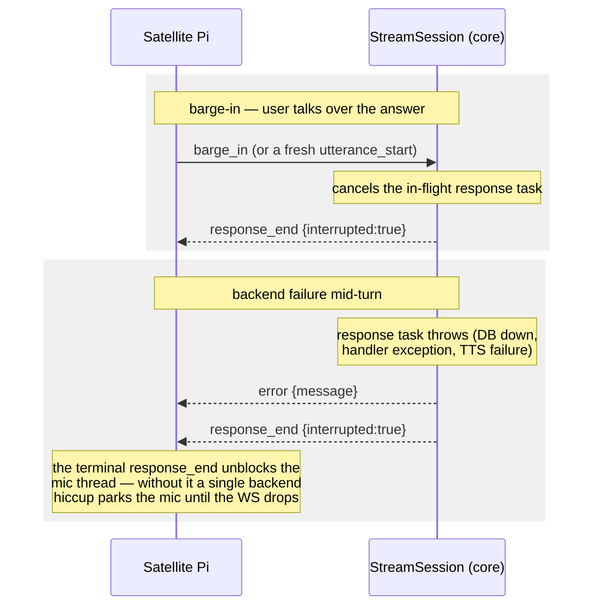

# A voice turn, end to end

What happens between "hey, Domovoi…" in the kitchen and a spoken answer from
the same speaker. The division of labor is fixed: **the Pi owns wake-word
detection, VAD, the noise gate, and barge-in detection; the server owns STT,
intent routing, TTS, and the response lifecycle.**

Sources of truth: `domovoi/streaming.py` (`StreamSession._process_utterance`),
`domovoi/router.py` (`route`), `domovoi/clients/tts.py`. Frame-level details of
the wire protocol are in [satellite-protocol.md](satellite-protocol.md);
routing bands and stages are in
[../ARCHITECTURE.md](../ARCHITECTURE.md#2-the-voice-turn-pipeline).

## The happy path

```mermaid
sequenceDiagram
    autonumber
    participant Pi as Satellite Pi<br/>(room "kitchen")
    participant WS as StreamSession<br/>(core :6370)
    participant STT as Whisper client<br/>(CUDA, in-process)
    participant VID as Voice identifier
    participant R as Router<br/>(domovoi/router.py)
    participant H as Matched handler
    participant DB as Postgres
    participant TTS as TTS chain<br/>edge → piper → system

    Note over Pi: wake word detected<br/>(openWakeWord, on-Pi)
    Pi->>WS: utterance_start {trigger:"wake_word"}
    Pi->>WS: binary PCM (16 kHz mono int16, streamed)
    Pi->>WS: utterance_end {greeting_played}
    Note over WS: receive loop spawns a response task<br/>and keeps draining the socket<br/>(so a barge_in still lands)

    WS->>STT: transcribe(pcm)
    STT-->>WS: transcript
    Note over WS: if greeting_played, strip a wake greeting<br/>that bled past the AEC
    WS-->>Pi: transcript {text}

    WS->>VID: identify(pcm)
    VID-->>WS: person_id, presence_tier, embedding (best-effort)

    Note over WS: chat-mode check: if the session is in<br/>conversational mode, bypass the router<br/>entirely (Letta turn) — not shown here

    WS->>R: route(intent, ctx, session)
    Note over R: stages: pending-confirmation →<br/>filler strip → fast paths (band order,<br/>offline gate) → LLM tool-call →<br/>auto-search → volatile gate → QA
    R->>H: fast-path method(match, ctx, session)
    H-->>R: Response {text, music_action?, expect_followup?}
    R->>DB: _persist_turn: intents_log +<br/>conversation_log + session recent_turns
    R-->>WS: Response

    WS->>TTS: synthesize(sentence 1)
    TTS-->>WS: WAV → PCM + sample rate
    WS-->>Pi: response_start {text, matched_handler,<br/>audio_sample_rate}
    par stream current sentence
        WS-->>Pi: binary PCM chunks
    and synthesize next sentence
        WS->>TTS: synthesize(sentence 2) — pipelined
    end
    Note over WS: a sentence rendered by a fallback engine<br/>at a different rate is resampled to the<br/>announced rate
    WS-->>Pi: response_end {interrupted:false,<br/>expect_followup, pi_action?}
    Note over Pi: plays audio; if expect_followup,<br/>captures the reply without a fresh wake word
```

## Barge-in and error handling

Two properties keep the Pi's microphone from wedging:



`expect_followup` and `pi_action` are both **skipped when interrupted** — if
the user cut the question off, Domovoi never asked it, so it shouldn't listen
for an answer or fire a side effect.

## Notes worth knowing

* **Transcript normalization.** The router lowercases, strips terminal
  punctuation, and (after the yes/no confirmation pre-empt) strips leading
  filler ("please", "can you…"), so anchored fast-path regexes match natural
  phrasings. The LLM tool-call and QA paths deliberately see the **raw**
  transcript.
* **Per-room voice.** The TTS voice is resolved per turn: a handler's
  `voice_override` wins, else the voice the room reports speaking in
  (`voice_status` frame), else the registry default.
* **Music coordination** rides the same turn. A `music_action="start"`
  response sends `music_start {stream_url}` and arms the `music_ready`
  handshake; music suppressed by wake capture auto-resumes after a non-music
  turn; `expect_followup` suppresses resume for one turn so the respawned
  player can't saturate the mic while the Pi is listening for the reply.
  Details in [media-and-library.md](media-and-library.md).
* **Utterance cap.** Audio buffering stops at 60 s of PCM per utterance;
  overflow is dropped with a log rather than growing without bound.
* **Unknown-voice buffering.** When the speaker is unknown (and not
  denylisted), the turn's embedding is buffered so a later "that was Sarah"
  introduction can enroll them — see the third-party-introduction hooks in
  `domovoi/handlers/voice_profile.py`.
