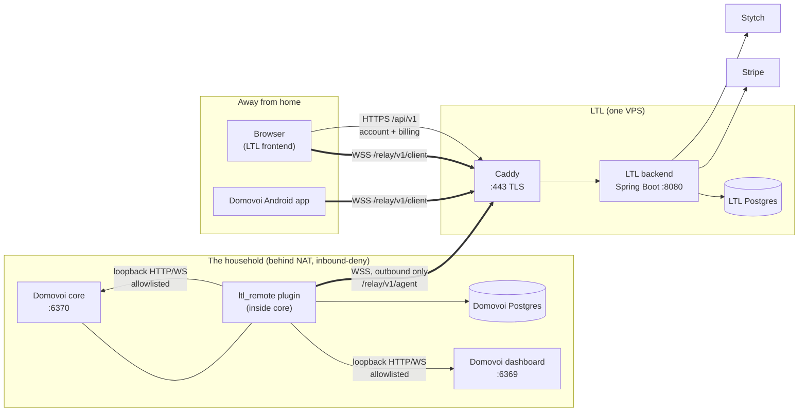
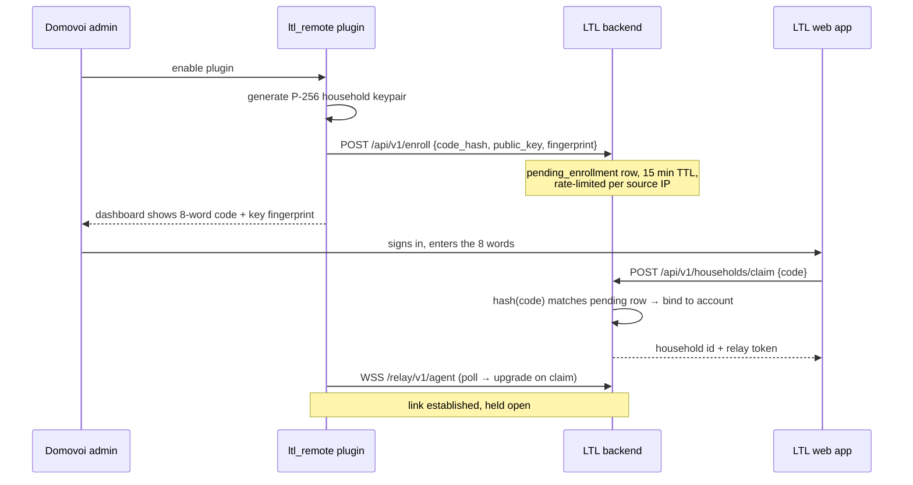
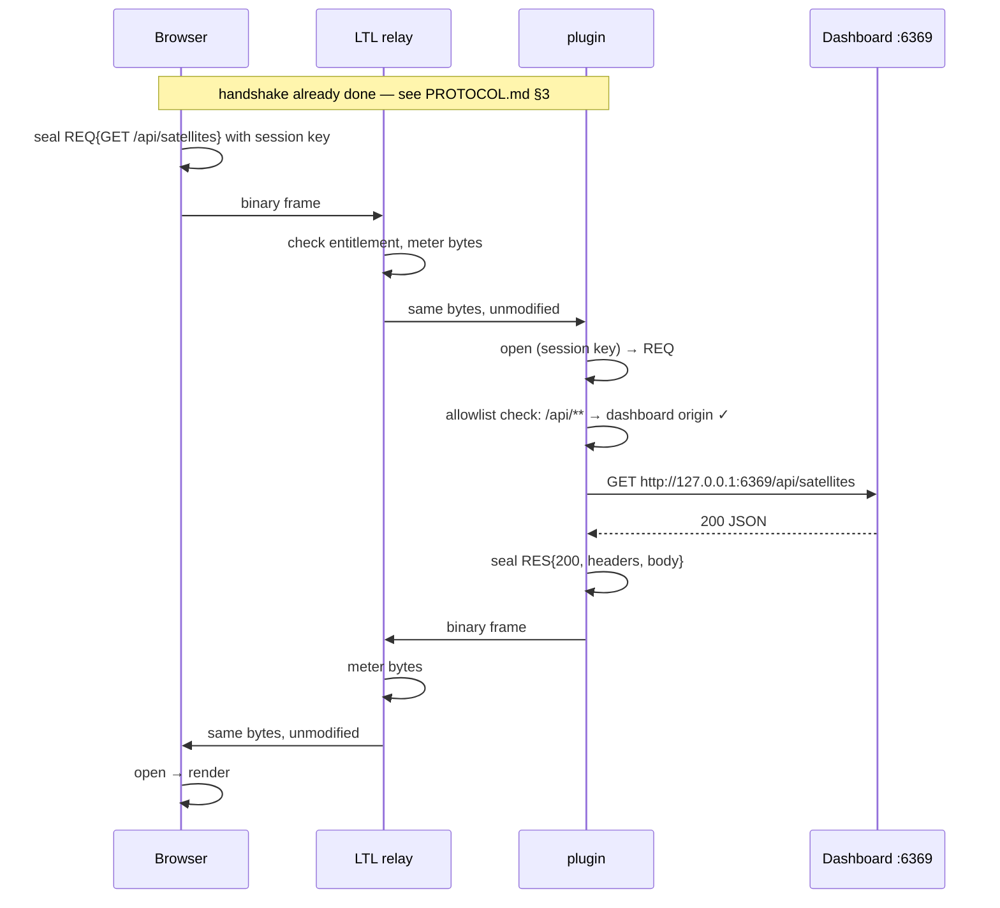

# LTL Remote — Architecture

How the three pieces fit together, what runs where, and what a single
remote request actually does.

Related: [PROTOCOL.md](PROTOCOL.md) for the wire format ·
[SECURITY.md](SECURITY.md) for the threat model ·
[BILLING.md](BILLING.md) for plans and metering ·
[Domovoi architecture](../../docs/ARCHITECTURE.md) for the house side.

---

## 1. Processes



| Process | Port | What it is |
|---|---|---|
| **Domovoi core** | 6370 | Unchanged. The plugin registers into it like any other. |
| **Domovoi dashboard** | 6369 | Unchanged. The plugin adds a *Remote Access* page to it. |
| **LTL backend** | 8080 | One Spring Boot process serving both the control plane (`/api/v1/**`, `/api/webhooks/**`) and the relay data plane (`/relay/v1/**`). Java 21 virtual threads make holding thousands of idle household sockets cheap in one JVM. |
| **Caddy** | 443 | TLS termination, automatic certificates, static hosting for `ltl-frontend/`. |
| **LTL Postgres** | 5432 | Internal to the compose network; never published to the host. |

The control plane and the relay live in **one deployable** on purpose. At
this scale a second service buys operational cost and buys nothing else;
the package split (`relay/` vs `controllers/`) is drawn so that pulling
the relay into its own process later is a build-file change, not a
rewrite.

## 2. The three identities

Keeping these distinct is what makes the security model work. They are
deliberately not the same thing.

| Identity | Issued by | Proves | Lives |
|---|---|---|---|
| **LTL account** | Stytch, via the LTL backend | "This person pays the bill." | LTL Postgres |
| **Household key** | The plugin, at enable time | "This is the Domovoi server in that house." | `~/.domovoi/plugins/data/ltl_remote/` — private half never transmitted |
| **Device key** | The client (browser or app) | "This is a device the household admin approved." | Browser IndexedDB (non-extractable) / Android Keystore |

An LTL account gets you **routing**. A device key gets you **entry**. LTL
issues the first and cannot issue the second — device approval happens on
the household's own dashboard, against the household's own database.

## 3. Linking a household



The code is generated **on the home server** and hashed before it ever
reaches LTL, so a database dump of `pending_enrollments` cannot be
replayed into a claim. Codes are eight words from Domovoi's existing
256-word list — 64 bits of entropy, same idiom as the first-run setup
code an admin has already seen once.

## 4. One remote request, end to end

You are on cellular, you open `app.lazythumblabs.com/remote`, and you
click *Satellites*.



The relay's entire job is the two "same bytes, unmodified" arrows plus
counting them. It has no key material for the session and cannot obtain
one: the session key is derived from a Diffie-Hellman the relay does not
participate in.

## 5. What the plugin will proxy

The plugin is not a general-purpose proxy, and refusing to become one is
a security requirement, not a nicety. Every inbound request is checked
against a static allowlist before any local socket is opened:

| Prefix | Local origin | Notes |
|---|---|---|
| `/api/**` | dashboard `127.0.0.1:6369` | The dashboard's own REST surface |
| `/ws/state` | dashboard `127.0.0.1:6369` | Live-state WebSocket |
| `/plugins/**`, `/static/**` | dashboard `127.0.0.1:6369` | Plugin pages and assets |
| `/v1/**` | core `127.0.0.1:6370` | Core API, including admin actions |
| `/v1/stream/**` | core `127.0.0.1:6370` | WebSocket — the seam phone voice will use |
| `/media/**` | dashboard `127.0.0.1:6369` | Streamed with chunked framing, never buffered whole |

Anything else is refused by the plugin with a sealed 403 that never
touches a local socket. The two origins are settings, but they are
validated to be loopback or a private-range address, so a
misconfiguration cannot turn the household's Domovoi server into an open
proxy onto the public internet.

Note the consequence, stated plainly: `/v1/**` includes Domovoi's admin
endpoints. A remote device that the household approved can do what a LAN
device can do, including plugin installation — which is code execution.
That is the intended product ("my dashboard, from anywhere"), and it is
why device approval is a deliberate local act with a fingerprint to
compare. [SECURITY.md](SECURITY.md) does not soften this.

## 6. Component layout

### `plugin-ltl-remote/`

```
domovoi_plugin_ltl_remote/
├── core.py          register(ctx) — config, handler, workers, router
├── settings.py      LTL_* settings + FieldSpecs for the Settings page
├── crypto.py        P-256 ECDH, HKDF, AES-GCM, fingerprints  (pure, no I/O)
├── framing.py       frame encode/decode                      (pure, no I/O)
├── pairing.py       word-list codes, enrollment state machine
├── local_proxy.py   the allowlist + loopback HTTP/WS forwarder
├── link.py          the relay connection, sessions, dispatch
├── handlers/remote.py   voice: "is remote access on?" (band 265)
└── workers/         link (longrun) + reaper (poll)
```

`crypto.py` and `framing.py` are pure functions over bytes with no
network and no database, which is what makes the protocol testable
without standing anything up. Both ends of the protocol have a test that
runs the *same* vectors.

### `ltl-backend/`

Mirrors the Scooped layout so it reads as one codebase to anyone who
works on both:

```
com.lazythumblabs.ltl
├── config/         security chain, WebSocket registration, OpenAPI
├── filters/        JwtAuthFilter (bearer header or session cookie)
├── controllers/    api/v1/** REST + webhooks/stripe
├── dto/            request/ and response/ (ApiResponse<T> envelope)
├── entities/       JPA entities, snake_case columns, no Lombok
├── repositories/   Spring Data JPA interfaces
├── services/       business logic; Stripe, Stytch, entitlements, metering
├── relay/          the WebSocket data plane
└── util/           word list, code hashing, byte counting
```

### `ltl-frontend/`

Static pages served by Caddy, one ES module per page, one hand-written
stylesheet. The interesting file is `js/e2e.js`, which is the browser
half of [PROTOCOL.md](PROTOCOL.md) and the mirror image of the plugin's
`crypto.py`.

## 7. Failure behavior

| Failure | What happens |
|---|---|
| LTL is down | The plugin retries with exponential backoff and jitter. Nothing on the LAN is affected — Domovoi does not depend on the link for anything local. |
| The household is offline | The relay marks the household `offline`; clients get a clear "your house is not reachable" screen rather than a hang. |
| Subscription lapses | The relay refuses new agent and client connections with an explicit reason code and closes existing ones at the end of the grace period. Local Domovoi is untouched. |
| Byte cap reached | New streams are refused with `QUOTA_EXCEEDED`; in-flight streams finish. Control traffic stays allowed so the dashboard can still tell you why. |
| Plugin disabled | The link closes cleanly through the plugin's `on_disable` teardown; the household stays claimed, so re-enabling does not re-pair. |
| Relay restarts | Both ends reconnect and perform a fresh handshake. Session keys are never persisted, so a restart is not a key-management event. |
