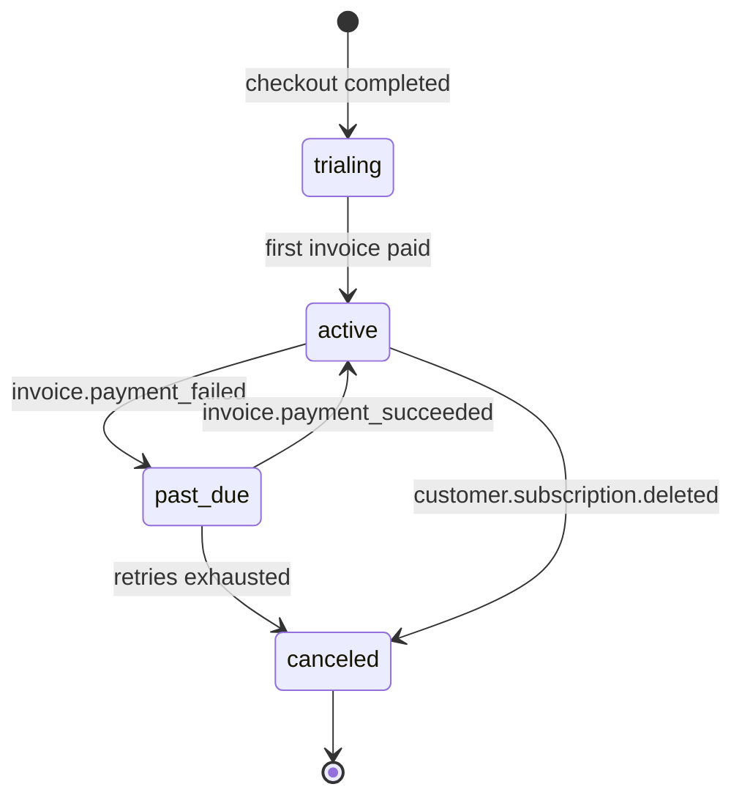

# LTL Remote — plans, entitlements, and metering

Stripe is the payment provider, reached through a `BillingProvider`
interface so the whole subscription model is testable without keys and a
second provider stays possible. Stripe usage follows the pattern already
proven in Scooped: a `StripeService` wrapping the SDK, and a webhook
controller at `/api/webhooks/stripe` that verifies the signature and
mutates local state.

---

## 1. Plans

Plans are **rows**, not enum constants, so pricing can change without a
deploy. `plans` carries the Stripe price id, the byte allowance, and the
limits; `subscriptions` links an account to a plan through a Stripe
subscription.

| Code | Intent | Monthly bytes | Devices | Households |
|---|---|---|---|---|
| `free` | Prove the tunnel works before paying | 2 GiB | 2 | 1 |
| `home` | The normal household | 100 GiB | 10 | 1 |
| `home_plus` | Heavy remote media use, or two properties | 500 GiB | 25 | 3 |

The byte allowance is the meaningful axis because relaying bytes is the
only real marginal cost. Dashboard control traffic is trivial; streaming
an album from your library while commuting is not.

## 2. Entitlement resolution

One service answers one question — *may this household do this right
now* — and everything else calls it:

```
Entitlement resolve(householdId):
    subscription   → status, plan, current_period_end, grace_until
    usage          → bytes_used in the current period
    → {active, plan, bytesUsed, bytesLimit, deviceLimit, reason}
```

The relay consults it at three moments: when an agent connects, when a
client link opens, and when a period's byte counter crosses its limit.
Nothing else is allowed to reason about subscription state, so there is
exactly one place where "is this customer paid up" is decided.

## 3. Lifecycle



`past_due` starts a **grace period** (default 7 days, a setting). During
grace the tunnel keeps working and the dashboard shows a banner; after
it, agent and client connections are refused with
`SUBSCRIPTION_INACTIVE`. Nothing about the household's local Domovoi is
affected at any point — losing remote access must never mean losing your
house.

## 4. Webhook events handled

| Event | Effect |
|---|---|
| `checkout.session.completed` | Bind the Stripe customer and subscription to the account; activate |
| `customer.subscription.updated` | Sync status, plan, `cancel_at_period_end`, `current_period_end`; roll the usage period on renewal |
| `customer.subscription.deleted` | Mark canceled; schedule link teardown |
| `invoice.payment_succeeded` | Clear `past_due`; clear grace |
| `invoice.payment_failed` | Enter `past_due`; set `grace_until` |

Webhooks are idempotent by `event.id`: every processed id is recorded and
a repeat is acknowledged without re-applying. Stripe retries, and a
retried `subscription.deleted` must not cancel a subscription the
customer has since restarted.

## 5. Metering

The relay counts payload bytes in both directions per link and flushes
per-household deltas on a fixed cadence rather than per frame, because a
database write per frame would cost more than the bytes it counts.

* In-memory counters, flushed every 30 s and on link close.
* `usage_periods` is one row per household per billing period, with the
  running total.
* The plugin receives a `quota` control frame on connect and after each
  flush that crosses a 10% boundary, so the Domovoi dashboard can show
  usage without polling LTL.
* At 100%, new streams are refused with `QUOTA_EXCEEDED` while in-flight
  streams finish and control traffic stays allowed — a customer at their
  cap must still be able to reach the page that explains why.

Counting happens at the relay because it is the party that pays for the
bytes, and it is the only counter both endpoints can verify against their
own totals if they ever disagree.

## 6. Checkout and portal

Checkout is Stripe Checkout; subscription management is the Stripe
Customer Portal. Neither card data nor payment method details ever reach
LTL, which keeps PCI scope where it belongs and removes an entire class
of forms from the frontend.

## 7. Testing without Stripe

`BillingProvider` has two implementations: `StripeBillingProvider` and
`FakeBillingProvider`. The fake is selected when `stripe.secret.key` is
absent, which means the whole stack — checkout redirect, webhook
handling, entitlement transitions, grace periods, quota enforcement —
runs end to end in local development and in tests with no Stripe account
at all.
